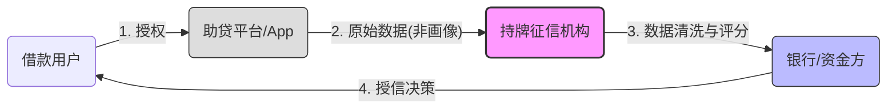
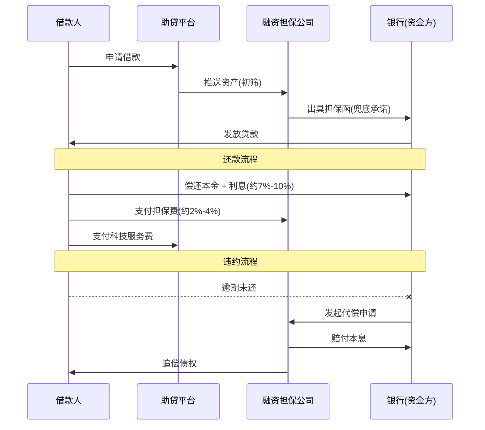
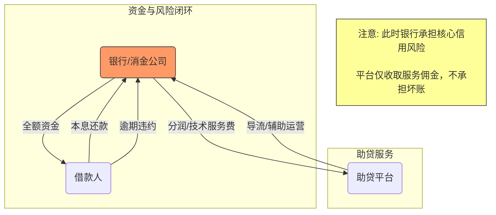

# The Logic of Compliant Lending and Credit Architecture

> 原始文件：The Logic of Compliant Lending and Credit Arch.html

为了更直观地说明“融担”、“助贷”和“征信”在合规架构下的协作关系，我为你绘制了三张核心逻辑图。这些图表展示了资金、数据和风险在不同模式下的流转差异。

### 图解一：合规基石——“断直连”后的数据流向图

这是所有助贷业务必须遵循的底层数据架构。根据《征信业务管理办法》，平台不得直接向金融机构提供个人信用画像，必须通过持牌征信机构（如百行、朴道）进行“清洗”和“传输” 。

- **核心变化**：征信机构成为了数据流动的“总阀门”和合法性管道，平台失去了对风控数据的直接控制权。

---

### 图解二：融担模式（担保增信）—— 风险兜底结构

这是目前中小银行最主流的合作模式。核心在于引入融资担保公司来锁定义务。2025年的新规要求，所有费用（含担保费）加总不得超过年化24% 。

- 

**角色关键点**：

- 

**融担公司**：是风险的“吸纳者”。如果坏账率爆表，融担公司最先倒闭。

- 

**银行**：是“旱涝保收”的资金提供方，赚取固定收益 。

---

### 图解三：分润模式（轻资产）—— 风险共担/银行自营结构

这是监管鼓励的未来方向。平台不提供兜底，银行必须具备“自主风控”能力。

- 

**角色关键点**：

- 

**平台**：回归纯粹的“技术服务商”角色，不需重资产的担保牌照，但对获客质量要求极高。

- 

**银行**：必须自己拥有核心风控模型，能够独立判断用户好坏，盈亏自负 。

### 总结：2025年的关键变化

在2025年，这三张图的关系更加紧密且紧张：

- 

**费率天花板**：在融担模式中，`银行利息 + 担保费 + 平台服务费` 被强制锁定在 **24%** 以内 。由于银行资金成本刚性（约7%-10%）和坏账成本存在，**融担公司和平台的利润空间被极大压缩**。

- 

**双重合规**：既要满足**数据**上的“断直连”（图1），又要满足**资金**上的“利率封顶”（图2），导致大量尾部融担公司和劣质助贷平台正在退出市场 。