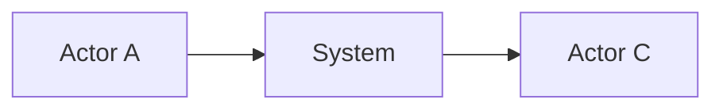
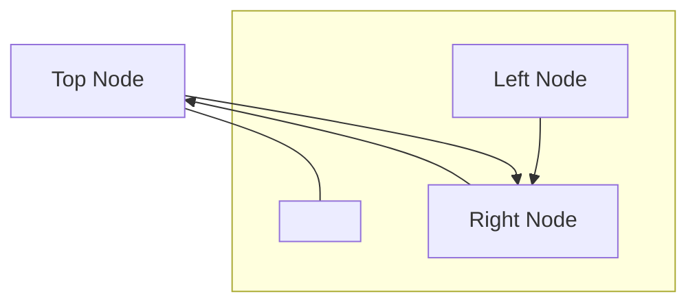
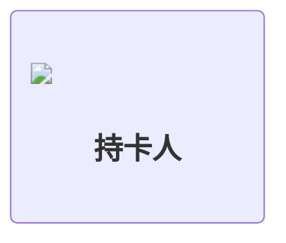
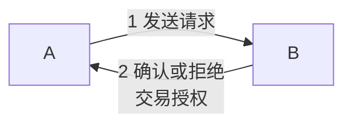
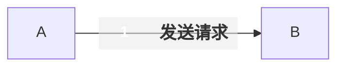
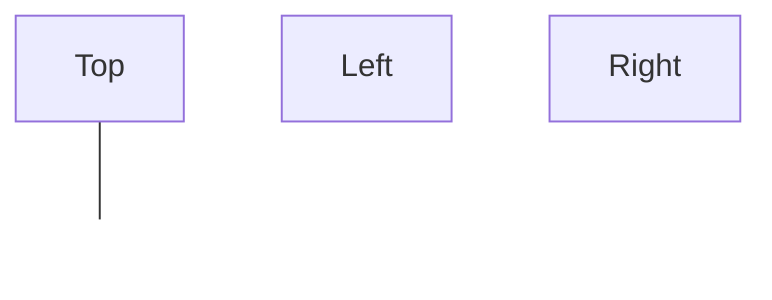

# Mermaid From Image Patterns

## Quick Decision Checklist

Use Mermaid when:
- the source is mainly nodes, edges, steps, and groups
- approximate visual fidelity is acceptable
- the diagram must stay editable as code

Use SVG instead when:
- exact spacing matters
- labels must sit at precise coordinates
- the image includes illustration-heavy composition
- Mermaid keeps fighting the layout after 2-3 structural attempts

## Pattern 1: Start from topology

Add styling only after the shape is correct.

## Pattern 2: Triangle layout

Use this when the source has one node above and two nodes below.

Notes:
- Make `Gap` transparent with `classDef`.
- Put detailed art inside `` labels, not in plain text.

## Pattern 3: Local SVG node

Use this instead of emoji or icon fonts when visual stability matters.

## Pattern 4: Stable numbered edge label

Use this as the default. Keep the text short. Long edge labels distort spacing.

## Pattern 5: High-risk HTML edge label

Use this only if the renderer has already shown that rich HTML on links renders reliably.

Failure mode:
- some Mermaid renderers show the text but drop the badge
- some renderers drop the whole rich label on the line
- debugging is slower than falling back to plain text

## Pattern 6: Concept node with fixed content baked into SVG

If a node contains logos, a title, and several lines of explanatory text, create one SVG that already contains the full composition and embed it as a single image.

Reason:
- Mermaid respects the HTML box size but does not give fine-grained control over internal composition.
- Baking the internal composition into SVG keeps the outer graph editable while fixing the inner artwork.

## Pattern 7: Transparent spacer node

Use this when Mermaid needs a central anchor for the row beneath or above another node.

## Common Failure Modes

### Icons disappear

Likely causes:
- Font Awesome CSS is not loaded
- the renderer strips HTML or `foreignObject`
- the environment blocks external assets

Safer fallback:
- use local SVG with ``

### A node becomes a tall side panel

Likely causes:
- too much text inside the node HTML
- width is too narrow for the content
- Mermaid placed the node in a direction that magnifies its height

Fixes:
- switch graph direction
- shorten text
- bake the whole panel into SVG

### The graph becomes a horizontal line instead of a triangle

Likely causes:
- using `flowchart LR` for a `top + bottom row` composition
- relying only on invisible links

Fixes:
- switch to `flowchart TB`
- use a bottom `subgraph` with `direction LR`
- connect the top node to a spacer node, not directly to both bottom nodes

### Numbers or labels do not appear on the line

Likely causes:
- using rich HTML in the edge label
- the renderer handles node HTML but not link HTML consistently

Fixes:
- switch the edge label to plain text first
- keep the number at the beginning of the label
- only keep ` ` if the label truly needs two lines
