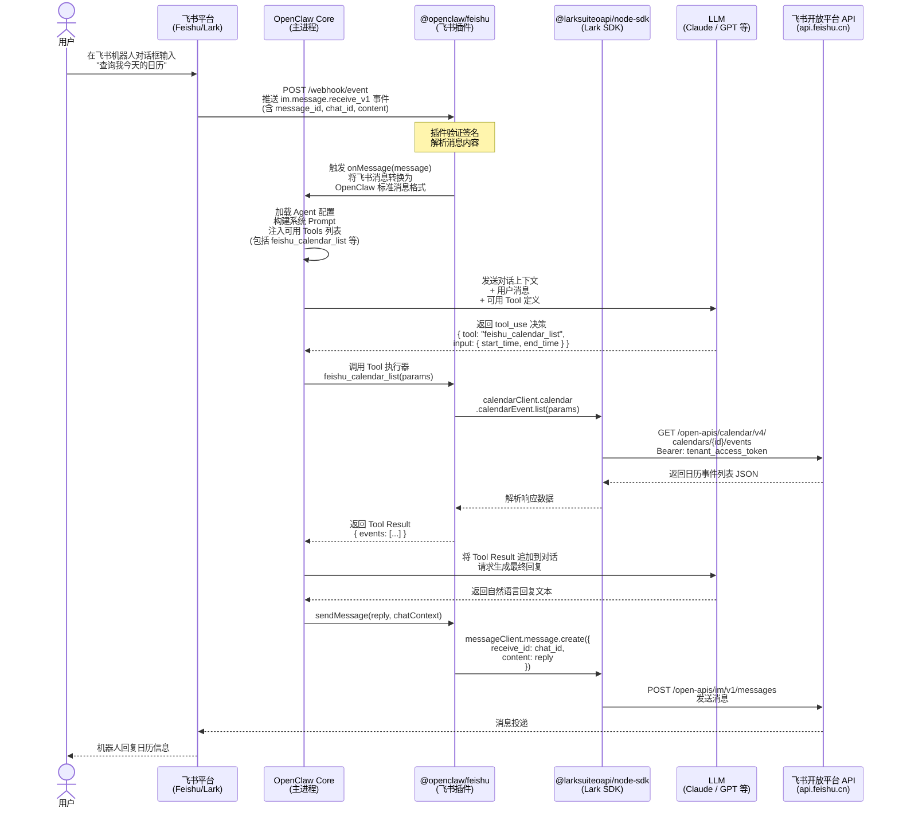

## 1. Node 版本冲突导致安装失败

在新的 Ubuntu 下，通过 Homebrew 安装了 Gemini CLI，依赖了 Node 24+，导致安装 OpenClaw 失败。

**报错原因：**
- `make not found` — 未安装编译工具
- Node 25.6.1 版本过新 — `@discordjs/opus` 没有对应 node-v141 ABI 的预编译二进制

**修复步骤：**

**Step 1 — 安装编译工具**
```bash
sudo apt-get install -y build-essential python3
```

**Step 2 — 切换到 Node LTS（Node 22）**

Homebrew 的 Node 25 是 bleeding edge 版本，会导致原生模块失败，改用稳定 LTS：

```bash
# 通过 nvm 安装 Node 22（推荐）
curl -o- https://raw.githubusercontent.com/nvm-sh/nvm/v0.40.1/install.sh | bash
source ~/.bashrc

nvm install 22
nvm use 22
node --version  # 应显示 v22.x.x
```

**Step 3 — 重新安装 OpenClaw**
```bash
npm install -g openclaw
```

> **原因说明：** `@discordjs/opus@0.10.0` 只有特定 Node ABI 版本的预编译二进制，Node 25 超出了该范围，Node 22 LTS 是 OpenClaw 构建和测试所针对的版本。

---

## 2. Feishu Plugin 冲突导致安装失败

配置飞书 Plugin 时，OpenClaw 自带的 Plugin 与安装行为冲突。
- OpenClaw config 显示需要安装 plugin，但安装失败
- `/home/openclaw/.nvm/versions/node/v22.22.0/lib/node_modules/openclaw/extensions` 中已存在飞书 plugin
- `~/.openclaw/extensions` 下试图再次安装，导致失败

**报错信息：**
```
feishu failed to load from .../extensions/feishu/index.ts:
Error: Cannot find module '@larksuiteoapi/node-sdk'
Require stack:
- .../extensions/feishu/src/client.ts
```

**修复方法：**

bundled plugin 缺少 npm 依赖，直接安装到 openclaw 的 node_modules：

```bash
cd ~/.nvm/versions/node/v22.22.0/lib/node_modules/openclaw
npm install @larksuiteoapi/node-sdk
```

**验证：**
```bash
openclaw plugins info @openclaw/feishu
openclaw plugins enable @openclaw/feishu
openclaw plugins list
openclaw gateway restart
```

---

## 3. OpenClaw 飞书机器人交互逻辑分析



---

## 4. 给 OpenClaw Feishu Plugin 添加日历功能

### A. 一次性授权完整流程

> 只需在服务器上执行一次。完成后，插件会自动用本地的 `refresh_token` 换取 `user_access_token`，无需再次操作。

#### 1. 飞书开放平台配置

**开通日历权限（用户身份）**

在应用权限里开启以下 scope：

- `calendar:calendar`
- `calendar:calendar.acl:create`
- `calendar:calendar.acl:delete`
- `calendar:calendar.acl:read`
- `calendar:calendar.free_busy:read`
- `calendar:calendar:create`
- `calendar:calendar:delete`
- `calendar:calendar:read`
- `calendar:calendar:readonly`
- `calendar:calendar:subscribe`
- `calendar:calendar:update`

**配置 OAuth 重定向 URL**

```
https://feishu-oauth.magicefire.com/feishu/oauth/callback
```

---

#### 2. 修复服务器 DNS（若 curl 报 "Could not resolve host"）

**现象：** `dig`/`nslookup` 能解析，但 `curl` 报 `Could not resolve host`

**环境：** Netplan + NetworkManager（活跃连接：Wired connection 1 / ens18）

```bash
# 临时救急（立即生效）
sudo resolvectl dns ens18 1.1.1.1 8.8.8.8
sudo resolvectl flush-caches

# 持久修复（重启不丢）
sudo nmcli con mod "Wired connection 1" ipv4.ignore-auto-dns yes
sudo nmcli con mod "Wired connection 1" ipv4.dns "1.1.1.1 8.8.8.8"
sudo nmcli con mod "Wired connection 1" ipv4.dns-priority 10
sudo nmcli con down "Wired connection 1" && sudo nmcli con up "Wired connection 1"
sudo resolvectl flush-caches

# 验证
getent ahosts feishu-oauth.magicefire.com
curl -I "https://feishu-oauth.magicefire.com/feishu/oauth/callback?code=TEST&state=1"
```

---

#### 3. 搭建 Cloudflare Tunnel（让飞书回调打到本机）

目标：让飞书 OAuth 重定向到 `https://feishu-oauth.magicefire.com/feishu/oauth/callback`，流量经 Tunnel 转发到本机 `127.0.0.1:8787`。

**Step 1 — 启动本地回调服务**

```shell
cat > /tmp/feishu-oauth-callback.js <<'JS'
const http = require('http');
const url = require('url');

const port = 8787;
http.createServer((req, res) => {
  const u = url.parse(req.url, true);
  if (u.pathname !== '/feishu/oauth/callback') {
    res.writeHead(404); res.end('not found'); return;
  }
  const { code, state, error, error_description } = u.query;
  res.writeHead(200, { 'Content-Type': 'text/plain; charset=utf-8' });
  res.end(
    error
      ? `OAuth error: ${error}\n${error_description || ''}\n`
      : `OK. You can close this window.\n\ncode=${code}\nstate=${state}\n`
  );
  console.log('OAuth callback:', u.query);
}).listen(port, '127.0.0.1', () => {
  console.log(`Listening on http://127.0.0.1:${port}/feishu/oauth/callback`);
});
JS

node /tmp/feishu-oauth-callback.js
```

**Step 2 — 创建命名 Tunnel 并绑定域名**

```bash
cloudflared login
cloudflared tunnel create feishu-oauth
cloudflared tunnel route dns feishu-oauth feishu-oauth.magicefire.com
dig +short feishu-oauth.magicefire.com  # 验证 DNS
```

**Step 3 — 配置 ingress**（将 `TUNNEL_ID` 替换为上一步输出的 UUID）

```yaml
# ~/.cloudflared/config.yml
tunnel: TUNNEL_ID
credentials-file: /home/openclaw/.cloudflared/TUNNEL_ID.json

ingress:
  - hostname: feishu-oauth.magicefire.com
    service: http://127.0.0.1:8787
  - service: http_status:404
```

**Step 4 — 运行 Tunnel 并自测**

```bash
cloudflared tunnel run feishu-oauth

# 自测回调链路（应返回 200）
curl -sS -i "https://feishu-oauth.magicefire.com/feishu/oauth/callback?code=TEST&state=1" | head -n 20
```

> **常见坑：**
> - `record already exists`：去 Cloudflare 控制台删除同名记录后重跑
> - curl 仍报解析失败：DNS 必须设为 **Proxied（橙云）**，灰云不生效

---

#### 4. 执行 OAuth 授权 & 写入 refresh_token

**推荐：用授权脚本（自动打开浏览器 + 输出 refresh_token）**

```bash
python3 /home/openclaw/.openclaw/workspace/feishu_user_oauth.py
```

**备用：手动获取**（适合调试或脚本不可用时）

在浏览器打开以下 URL 完成授权，飞书将携带 `code` 重定向到回调地址：

```
https://open.feishu.cn/open-apis/authen/v1/authorize
  ?app_id=cli_a912b7cb0ab8dcbd
  &redirect_uri=https%3A%2F%2Ffeishu-oauth.magicefire.com%2Ffeishu%2Foauth%2Fcallback
  &scope=calendar%3Acalendar
  &state=random_state_string
```

用回调 URL 里的 `code` 换取 token：

```bash
read -s FEISHU_APP_SECRET
CODE="<CODE_FROM_CALLBACK>"

curl -sS https://open.feishu.cn/open-apis/authen/v1/access_token \
  -H 'Content-Type: application/json' \
  -d "{
    \"app_id\": \"cli_a912b7cb0ab8dcbd\",
    \"app_secret\": \"$FEISHU_APP_SECRET\",
    \"grant_type\": \"authorization_code\",
    \"code\": \"$CODE\"
  }"
```

响应里 `data.refresh_token`（`ur-...`）即为所需值。

**写入 refresh_token 到固定位置**

```bash
install -d -m 700 /home/openclaw/.openclaw/secrets
printf '%s\n' '<PASTE_REFRESH_TOKEN_HERE>' > /home/openclaw/.openclaw/secrets/feishu_user_refresh_token
chmod 600 /home/openclaw/.openclaw/secrets/feishu_user_refresh_token
```

> **安全提醒：**
> - `refresh_token` 很敏感，只落盘不粘贴到聊天记录；若已泄露，立即在飞书侧撤销并重新生成。
> - 始终用 `read -s` 输入 `app_secret`，避免进入 shell history。

---

#### 5. 验证

```bash
openclaw plugins info @openclaw/feishu
openclaw plugins enable @openclaw/feishu
openclaw gateway restart
```

调用 `feishu_calendar(auth_mode=user)` 不传 `user_access_token`，插件应自动用本地 `refresh_token` 换取新 token 并返回日历列表。

---

### B. OpenClaw / Feishu 插件代码修改

#### 1. 注册新工具：`feishu_calendar`

文件：`openclaw/extensions/feishu/index.ts`

```typescript
import { registerFeishuCalendarTools } from "./src/calendar.js";
// ...
registerFeishuCalendarTools(api);
```

#### 2. 新增日历实现文件：`src/calendar.ts`

路径：`openclaw/extensions/feishu/src/calendar.ts`

**实现内容：**

**(1) Tool：`feishu_calendar`**

- actions：
  - `calendars`：列出日历
  - `events`：按时间范围列事件
  - `create_event`：创建事件（预留）
- 新增参数：
  - `auth_mode: "app" | "user"`
  - `user_access_token`（可选；`auth_mode=user` 时若不传则走本地 refresh_token 自动获取）

**(2) 用户 token 调用方式**

使用 SDK 推荐路径传入 user access token（而非直接在 headers 里写 Bearer）：

```typescript
// 使用 Lark.withUserAccessToken(userAccessToken) 传入请求 options
```

**(3) 本地 refresh_token 存储**

- 默认路径：`/home/openclaw/.openclaw/secrets/feishu_user_refresh_token`
- 权限：文件 `600`，目录 `700`

**(4) 自动 refresh access token（含缓存）**

- 调用接口：`POST https://open.feishu.cn/open-apis/authen/v1/refresh_access_token`
- 缓存策略：`cachedUserAccessToken`（提前 60s 过期）

**(5) 关键修复：refresh_token 轮换**

refresh_token 是一次性的，用后需立即写回：

```typescript
// 从 refresh 接口响应里读取新的 refresh_token
const newRefreshToken = json.data.refresh_token;
// 立即写回到本地文件
await persistRefreshToken(newRefreshToken);  // writeFile(..., mode: 0o600)
```

---

### C. 本地密钥文件（最终状态）

| 文件 | 路径 | 权限 |
|------|------|------|
| refresh_token | `/home/openclaw/.openclaw/secrets/feishu_user_refresh_token` | `-rw-------` |

---

### D. 功能验证结果

- `feishu_calendar (auth_mode=user)` 能列出日历列表（包括 "秦曲波(Bob)"）
- 能拉取本周日程，新增会议后立即可见
- 修复"写回 refresh_token"后，多次重复拉取不再因 token 失效而失败

---

## 5. 本地开发与 Patch 版本管理

工作方式：在 `~/magic/vibe-coding/openclaw` 开发 → 生成 patch → 用脚本应用到全局安装目录。

### Step 0 — 前提：将本地改动压成 1 个 commit

```bash
cd ~/magic/vibe-coding/openclaw
git status
git add -A
git commit -m "your change"

# 如有多次提交想合并成一个：
git reset --soft HEAD~N && git commit -m "your change"
```

### Step 1 — 构建 patch 文件

把最新一次 commit 导出成 patch：

```bash
cd ~/magic/vibe-coding/openclaw
mkdir -p patches
git format-patch -1 HEAD --stdout > patches/feishu-calendar.patch
wc -l patches/feishu-calendar.patch
```

### Step 2 — 本地自检（推荐）

先检查 patch 在全局目录能否 apply（不实际改动）：

```bash
./scripts/apply-local-patches.sh --check
```

### Step 3 — 应用 patch 到运行时

```bash
./scripts/apply-local-patches.sh
```

脚本会自动：
- 找到全局 openclaw：`$(npm root -g)/openclaw`
- `sudo git apply --unsafe-paths` 应用 patch
- `openclaw gateway restart`
- 打印 `openclaw status` 头部做验证

### Step 4 — 官方版本更新后重新应用

```bash
openclaw update
./scripts/apply-local-patches.sh
```
