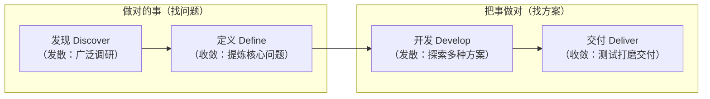

> 原文：宝玉 [@dotey](https://x.com/dotey)，发布于 2026 年 3 月 3 日
> 来源：[Lenny's Podcast](https://www.youtube.com/watch?v=eh8bcBIAAFo)，2026 年 3 月 1 日

**Jenny Wen** 是 Anthropic 的 Claude 设计负责人，目前主导 **Claude Co-work** 的设计工作。加入 Anthropic 之前，她是 **Figma 的设计总监**，主导了 FigJam 和 Slides 两个产品从概念到发布的全过程。更早之前在 Dropbox、Square 和 Shopify 做设计。

这期 **Lenny's Podcast** 聊了五件大事：传统设计流程为什么走到了尽头、在 AI 实验室做设计是什么感受、AI 会不会取代人类的品味和判断力、Co-work 是怎么做出来的、以及现在招什么样的设计师。

完整访谈视频：[YouTube](https://www.youtube.com/watch?v=eh8bcBIAAFo)

## 要点速览

- **传统设计流程"死亡"**：发散 - 收敛 - 发散 - 收敛的经典流程被工程速度倒逼，设计师做设计稿的时间从 60-70% 压缩到 30-40%，多出来的时间用于和工程师配对、甚至自己写代码
- **愿景规划大幅缩短**：时间窗口从 2-5 年缩到 3-6 个月，形式从精美的演示文稿变成能指方向的原型
- **人类价值在于决策和责任**：AI 在品味和判断上会越来越好，但构建软件最难的部分不是构建本身
- **Co-work 的真实故事**："10 天"开发其实是长期探索后的最后冲刺，品牌信任不靠完美发布，靠快速响应反馈
- **三种最值得招的设计师**：方块型强通才、深 T 型专家、有匠心的应届生，第三种最被忽视但在变革期最有价值

## 设计流程已死，不是自己死的，是被工程速度"逼死"的

Lenny 开场第一个问题：AI 时代，设计流程怎么变了？

Jenny 的回答很直接：

> 设计师们被教导的那套设计流程，我们曾经把它当圣经一样遵循，现在基本已经死了。
> （"This design process that designers have been taught—we sort of treat it as gospel—that's basically dead."）

她指的是经典的**双钻石模型**，先做调研和发散，再收敛，再发散，再收敛。

{/* source image: https://pbs.twimg.com/media/HCcIWOoXAAAAesw?format=jpg&name=medium */}

这套方法论在 AI 之前就已经有点撑不住了，但当工程师可以**同时开 7 个 Claude 实例**去造功能时，设计师就彻底没法用老流程来工作了。

Jenny 2025 年 9 月在柏林的 Hatch Conference 做了一场叫"Don't Trust the Design Process"（别信设计流程）的演讲，引发了巨大反响。但那场演讲才过了三四个月，她自己就觉得内容过时了。尤其是 Opus 4.6 发布、大量人在假期期间发现了 Claude Code 之后，设计流程的变化比她预期的还要快。

她把现在的设计工作分成两类。**第一类是支持执行**，工程师在高速出活，任何人都可以提一个想法然后让工程师（或 AI）做一个粗糙版本出来试试，设计师更多是顾问角色，而不是先画设计稿再交付。**第二类是做愿景和方向**，但形态也变了：过去可以做 2 年甚至 10 年的设计愿景，做出精美的故事化演示文稿；现在的愿景通常只能看到 3-6 个月后，形式有时候就是一个能指方向的原型。

> 你最好别挡着他们，让他们放手干。
> （"You're better off not blocking that, letting them cook."）

Lenny 追问：这种变化是所有公司都在经历，还是只有 AI 实验室才这样？

Jenny 说，她柏林演讲的反响之强烈超出预期。产品经理在用 Claude Code 做原型，设计师在用 v0 做开发。但也有不少反对声音：有些设计师在这套流程上投入了整个职业生涯，他们不愿意接受"我们可以不做调研发现"这种说法。

关于"快速发布还是精心打磨"，Jenny 认为要看具体情况。但 AI 产品有一个根本性的理由让快速迭代格外重要：**AI 模型是非确定性的**，你无法在设计稿里模拟所有状态，甚至做不出有意义的可点击原型。你必须用真实模型、看真实用户怎么用，才能发现真正的使用场景。

【注：Non-deterministic 指同样的输入可能产生不同的输出。传统的"画好所有界面状态"的方法在 AI 产品中失效了，因为 AI 的回应本身不可预测。】

## 在 Anthropic 做设计师的一天

Lenny 问了一个很直观的问题：在 AI 实验室做设计，日常到底在干什么？

Jenny 说她花相当多时间在"跟上节奏"上。Anthropic 内部任何时候都有很多团队在做原型、试验新想法，各种代号项目在推进。

> 我们的 Slack 是一座金矿。
> （"Our Slack is a gold mine."）

从模型能力进展到行业走向的内部辩论，她都想跟上。这些信息对她的工作直接有用：她需要预判下一步可能出现什么，才能提前为设计做准备。

除了信息跟进，Jenny 的日常大致是这样的：一部分时间留给传统的设计思考；大量时间用于和工程师一起碰撞，对话、白板、看他们做出来的东西、给反馈；还有一部分时间直接在代码里做打磨。

关于时间分配的变化，她给出了清晰的数字对比：

- **几年前**：60-70% 做设计稿和原型，20% 和工程师配合，10% 开协调会
- **现在**：30-40% 做设计稿和原型，30-40% 和工程师直接配合，还多了一块——自己写代码实现

和工程师合作时，她的重点是**解释"为什么"**。不是说"按钮不该放这里"，而是说"我觉得应该有个按钮，因为用户研究显示不是所有人都知道可以用提示词触发这个功能"。她也会尽量引导工程师用设计系统里现成的组件，因为 Claude 写代码时并不总是会自动使用设计系统。

她的 AI 工具栈：**Claude Chat** 已经基本被 **Claude Co-work** 取代了，因为她的使用场景大多是长时间运行的任务。**Claude Code** 主要在 VS Code 里用，做前端打磨时需要同时看代码和跟 Claude 对话。一个她觉得特别好玩的工作方式：有人在 Slack 里说"这个图标偏了"，@ 一下 Claude，Claude 自动改好代码并提交，她直接合并就完成了。

【注：Claude Co-work 是 Anthropic 于 2026 年 1 月推出的桌面端 AI 智能体产品，可以操作用户电脑上的文件，完成文档生成、数据整理等非编码类知识工作。】

## Figma 还有用吗

鉴于 Jenny 的 Figma 背景，Lenny 直接问了这个很多人关心的问题。

Jenny 说在用，而且认为 Figma 仍然重要，但原因跟以前不太一样了。

代码工具的问题是**太线性了**。你用 Claude Code 做一个方向，就会一直在那个方向上迭代深入。但好的设计需要先想 8-10 种不同做法，把一堆想法甩到墙上，然后筛选和推动自己探索更多可能性。这种**发散式的探索**，Figma 的画布仍然做得最好。

另一个价值是**精细的视觉微调**。不同的排版、字体、样式方向，放在画布上并排比较，比在代码里反复切换高效得多。

Lenny 观察到一个有趣的现象：在工程领域，IDE 正在被命令行和 Agent 取代，工程师觉得 IDE"不酷了"。但对设计师来说，IDE 反而变成了有用的工具，因为有时候直接改一个 CSS 样式比跟 Claude 描述快多了。也许 **IDE 正在变成设计师和产品经理的工具**，而工程师已经往前走了。

## 构建软件最难的部分，不是构建它

Lenny 引用 Lex Fridman 的说法问 Jenny：当 AI 越来越聪明，人类大脑在哪里还有价值？

他提到 Claude Code 负责人 **Boris Cherny** 最近在节目上说的话：Claude Code 已经不只是写代码了，它开始帮他想点子、决定该做什么。这让 Lenny 重新审视了"AI 永远不会像好的产品经理和设计师一样做判断"这种假设。

【注：Boris Cherny 是 Claude Code 的创建者和负责人，在 2026 年 2 月的 Lenny's Podcast 中表示"编码这件事基本已经被解决了"，Claude Code 现在开始扫描反馈、缺陷报告和遥测数据来主动提出改进建议。】

Jenny 认为 AI 在品味和判断上会越来越好，"我们可能在这一点上执念过深了"。但她指出了一个更根本的问题：

> 构建软件最难的部分，其实不是构建它本身。
> （"A lot of the hard parts of building software are actually, like, not building it."）

回想你工作中最难的时刻，往往不是技术实现，而是你和另一个人在争论"这个功能到底该不该做""该做成什么样"。这种**人与人之间的决策分歧**，AI 可以提供参考意见，但不能替你解决。

就像 Claude 现在可以帮工程师写代码，但工程师仍然要为"这段代码对不对""放在产品里合不合适"负责。设计和产品决策也一样，**决策和责任仍然落在人身上**。

Lenny 用放射科的类比补充：AI 可能比放射科医生更擅长诊断，但你还是需要一个人签字，因为得有人在出错时承担责任。

Jenny 也承认，我们可能低估了 AI 在这些方面变好的速度。

## 聊天还是图形界面

Lenny 说没人想到聊天机器人和终端会成为 AI 的持久界面，但它们不仅没有消失，反而越走越远了。

Jenny 认为未来会是**两者结合**：可点击的图形界面加对话。Claude 最近发布了一系列小组件（天气、股票、多选题等），用户反响很好，因为人们仍然喜欢看到 UI、点击它们、和它们互动，这比打字高效得多。

但聊天这个范式打开了一扇巨大的门，它让你有**无限多种方式**来和计算机交流。所以聊天不会消失，但对于特定任务，UI 仍然更直接。未来的趋势可能是：**越来越多的 UI 由模型动态生成**，而不是工程师逐个手写。

Lenny 提到 Kevin Weil 的一个观点：语言是一种跨越所有智能水平的界面，你可以和 IQ 200 的人聊天，也可以和不那么聪明的人聊天，语言都适用。所以随着模型越来越聪明，对话仍然有效。

【注：Kevin Weil 是 OpenAI 的首席产品官，此前在 Instagram 和 Twitter 担任高管。】

## 从总监回到 IC：这一年教会我什么

Jenny 在 Figma 管过 12-15 人的设计团队加上几个设计经理，是正儿八经的设计总监。但她去 Anthropic 的时候选择了做 **IC**（Individual Contributor，个人贡献者）。

她一方面是想在 AI 时代亲手感受工具和流程的变化。另一方面，她对**中层管理的未来**有真实的焦虑，在 AI 改变工作方式的背景下，管理角色是不是会持续存在？

在 Anthropic 的这一年（先做 IC，中间短暂管了几个月团队，又回到 IC），她觉得收获巨大。设计流程在过去一年变化太快，如果她一直在做纯管理，根本不会有时间去习得这些新硬技能。如果将来再管团队，这段经历会让她真正理解团队面临的挑战，而不是隔靴搔痒。

她建议设计管理者也应该做类似工程管理者的"**实操轮岗**"，先花几个月做 IC 理解技术变化，再回去管团队。

Lenny 问她回归 IC 后最不适应什么。Jenny 笑着说：**接受批评**。作为设计师要在团队面前展示工作、接收批评性反馈，这是一个相当脆弱的过程，而管理岗待久了会生疏。

关于管理的未来，Jenny 认为只要有团队就需要管理者。但未来的管理者需要同时能给团队方向和做一部分 IC 工作，纯粹的"人员管理"作为独立角色可能不够了。

## Co-work 背后的真实故事

Boris Cherny 在 Lenny 的节目上说 Co-work 是 10 天做出来的，这个数字在网上传得很广。Lenny 问 Jenny 实际情况是什么。

Jenny 纠正了这个印象：**10 天是从内部版本到外部发布的冲刺时间**。在此之前，团队在不同的 Agent 框架上做过大量原型和探索，待办列表怎么展示、多选问题用什么形式、怎么教用户理解使用场景，都试过很多种方案。

> 这个想法一直在反复出现，然后突然之间，时机到了，感觉就像一直都这么显而易见一样。但走到那一步的旅程很长很长。
> （"The idea kept coming back, and then all of a sudden, it's the right moment, and it feels like it was so obvious all along. But there was a long, long journey to get there."）

关于发布策略，Jenny 说 Co-work 发布时并不完美，但团队在内部用了很多，确信有真实价值，值得让外部用户也体验到。关键在于**发布之后要兑现承诺**。

> 真正损害品牌的，是发布了早期版本后什么都不做。
> （"The way that you really lose trust around quality... is if you release it early and then nothing ever happens."）

Lenny 把这种理念概括为"**通过速度建立信任**"（building trust through speed）。Jenny 补充说不只是速度，还有让用户觉得"我的反馈被听到了、被用上了"。Anthropic 每次发布新版本后，团队成员在 Twitter 上回复用户反馈，快速修复问题，公开展示进展。

Lenny 问她最骄傲 Co-work 的什么。Jenny 说最骄傲的是他们**把它发了**。因为做设计的人看自己的作品，永远只看到缺陷。

Lenny 问 Co-work 该怎么用一句话描述。他自己的说法是"Claude with hands"（长了手的 Claude）。Jenny 说她喜欢这个，但她自己的描述更接地气：Co-work 擅长的是你**把一堆乱七八糟的东西扔给它，它帮你变出一个整齐有用的结果**。

她当前的迭代方向：

- 让 Co-work 的首页更像一个你和 Claude 之间的**共享任务列表**
- 思考 Co-work 是不是永远只活在屏幕上，它能不能**延伸到其他工作界面**

## 三种最想招的设计师

Lenny 问在一切都在变的时代，招设计师看什么。

Jenny 说首先要有**韧性和适应性**，愿意试新方法、学新工具，不能抱着老流程不放。

更具体地说，她现在最感兴趣的是三种人：

**第一种：方块型强通才。** 不是那种什么都沾点但都不深的人，而是在多个维度上都达到了 80 分位水平的人。传统的 T 型人才是一深多浅，方块型是好几个方向都深。这种人在角色边界模糊的时代特别有价值，设计师的工作正在往产品经理和工程师的方向延伸。Jenny 也承认这种人很稀有。

**第二种：深 T 型专家。** T 的竖杠比绝大多数人长得多，在某个领域排到行业前 10%。可能是技术极强、基本等于半个工程师的设计师，也可能是视觉设计或图标设计的顶尖高手。在所有人都能用 AI 做出"还行"的东西时，**深度专长才能做出差异化**。

**第三种：有匠心的应届生。** 早期职业阶段，但成熟度超过年龄，学东西快，没有固化的流程思维。大多数公司都在抢资深人才，但恰恰因为规则在变，一个白纸状态的快速学习者可能比满脑子旧流程的资深人更有优势。

给年轻设计师的建议：**多做东西，别被"经验少"限制住**。Jenny 提到了母校滑铁卢大学的 [Socratica](https://www.socratica.info/) 社区，一个学生造物者社区，每周线下共同工作，做项目然后展示。有人造了 Claude 驱动的机器人，有人往波士顿的公交车上贴了卡通眼睛。这种"我就是要做点什么"的行动力，是让人脱颖而出的东西。

【注：Socratica 是 2022 年在滑铁卢大学创立的学生社区，现已扩展到全球 30 多个城市。】

关于"设计师要不要学代码"，Jenny 的建议务实：不需要从零学 React，但要**把 AI 编码工具纳入自己的工具箱**。随着模型和产品变好，抽象层会继续上移，设计师不需要理解每一行代码怎么运行。

Lenny 问了一个尖锐的问题：Claude 作为设计师有多好？你会雇它吗？

Jenny 很直接：**现在还不够格**。Claude 不符合她提到的三种原型中的任何一种，它做初稿和展示不同方案还行，但没有什么让你觉得"这个很特别、值得雇佣"的东西。不过她也说，过去一年 Claude 在这方面进步了很多。

## 管理者的反直觉智慧

访谈后半段转向了团队管理。Jenny 分享了几个有意思的观点。

### 低杠杆时间

管理培训会教你用 2x2 矩阵分类工作，"只有我能做的"和"别人也能做的"，然后把"低杠杆"的事都砍掉。但 Jenny 观察到，她最尊敬的领导者往往会主动选择做一些"低杠杆"的事情，**而正因为是他们在做，这些事反而变成了高杠杆**。

比如高管自己花大量时间测试产品、复现问题、跟工程师一起看日志抠细节。领导亲自做会建立对产品的深度熟悉感，也给团队传递了"**没有什么事是掉价的**"这个信号。Mike Krieger 亲自提交代码就是一个例子。再比如有领导亲手给员工做一张精心设计的纪念卡，行政可以做这件事，但领导自己做传递的信息完全不同。

【注：Mike Krieger 是 Instagram 联合创始人，2024 年加入 Anthropic 担任首席产品官，2026 年初转入 Anthropic Labs 团队。】

### 互相吐槽的文化

当团队成员愿意互相开玩笑，甚至敢拿管理者开玩笑时，说明他们**不怕你、信任你**。Jenny 之前团队的人会模仿她在设计评审会上的口头禅"OK，下一步是什么？"，这说明他们了解她、不怕她。

但这必须和**高标准并存**。她用"严厉的父母"来比喻：团队知道你不会随意开除他们，但也知道你要求最好的工作。有了心理安全感作为基础，提出高标准反而变得更容易。Lenny 把这总结为**极度坦诚**（Radical Candor）的经典公式：深深关心加直接挑战。

### 可读性矩阵

第三个话题来自 **Evan Tana** 的"可读性矩阵"（Legibility Framework）。矩阵的两个轴是：创始人是否"可读"（别人一看就懂），想法是否"可读"。如果创始人和想法都高度可读，那这个机会大概率已经有人在做了。**最有价值的往往是"想法不可读"的象限**，别人看不懂、但有能量在汇聚的方向。

【注：Evan Tana 是 SPC（South Park Commons，硅谷创业社区和基金）的合伙人。】

{/* source image: https://pbs.twimg.com/media/HCcInzuaAAAYvkO?format=jpg&name=medium */}

Jenny 把这个框架用在了日常工作中：她在 Anthropic 的 Slack 里浏览各种内部原型时，就是在找那些"不可读"但有能量的东西。

一个具体案例。去年 Anthropic 内部有人做了一个叫"Claude Studio"的原型，界面非常密集和复杂，建在某种 Agent 框架上。Jenny 第一眼看到时觉得"我不知道这是什么"。但她注意到研究团队和内部用户对它非常兴奋。她没有忽略这个信号，而是选择深入了解。最终，那个原型里的核心概念，比如 **Skills 框架**（用 Markdown 文件指导 Claude 如何完成特定任务），以及展示 Claude 的计划和待办事项的 UI，都被提取出来放进了 Co-work 的设计中。

Lenny 补充了一个相关的发现：他和风投人 Terrence Rohan 的研究显示，那些很早加入后来成为巨大成功的公司（如 Palantir、Stripe、Linear、OpenAI）的人，看到了三个信号：**想法听起来疯狂、有一些人对它极度兴奋、创始人是前 1% 的人才**。

Jenny 说这和她的体验一致：当你看到一个你不理解但有人在兴奋地投入的东西时，值得深入了解。早期的创造者往往说不清楚自己为什么兴奋，需要有人帮他们把模糊的能量转化为清晰的产品。

## 闪电问答

- **推荐书籍**：《The Power Broker》（Robert Caro 著，讲 Robert Moses 的一生），1100 页。Jenny 说在注意力稀缺的时代读一本跨越数十年的传记特别有价值。另一本是《Insomniac City》（Bill Hayes 著），关于科学家 Oliver Sacks 生命最后时光的回忆录。

- **最近喜欢的电影**：《A Sentimental Value》，挪威导演 Joachim Trier 的新片（他也导了《世界上最糟糕的人》），讲一个家庭与他们住了一辈子的房子之间的关系。还有 The Pit 第二季，看能力极强的人做自己擅长的事，就是好看。

- **最爱产品**：Retro，一个小圈子照片分享 App，只能分享当周的照片，没有社交媒体那套计数和广告。用了两年后可以回看"两年前这一周我在做什么"，变成了一种记录生活的方式。

- **人生座右铭**："It is what it is." 听起来像认命，但 Jenny 说在一切都在变的世界里，这句话能给你需要的轻松感来继续前行。

- **Co-work 最酷用法**：Jenny 把自己多年的笔记（一对一记录、随想、小备忘录、面试笔记）全部丢给 Co-work，让它分析出她评估设计手艺时看重什么。输出是一份她自己都没意识到的评估标准。当 AI 能帮你发现自己隐含的思维模式时，这件事本身就很有价值。

---

Jenny 整期播客的核心线索只有一条：**变化不是从设计界内部发起的，而是工程效率的暴增把设计师推到了必须改变的位置上**。设计师需要从流程的门卡变成引导者，从画设计稿的人变成能在代码里做打磨的人。

一个值得关注的信号是 Jenny 提到 Co-work 的下一步："它是不是永远只活在屏幕上"。这暗示 Anthropic 可能在探索让 AI 智能体触达更多工作界面的方式，而不是把所有交互都塞在一个聊天窗口里。

另一个未解的问题是 AI 在品味和判断上的进化速度。Jenny 承认 Claude 目前不够格被当作设计师雇佣，但她也说"过去一年进步了很多"。这个差距在缩小，没人知道缩小到什么程度就会触发行业的又一次变化。

Anthropic 设计团队正在招人。如果"设计流程已死"这件事让你感到兴奋而不是恐惧，Jenny 说 welcome。
