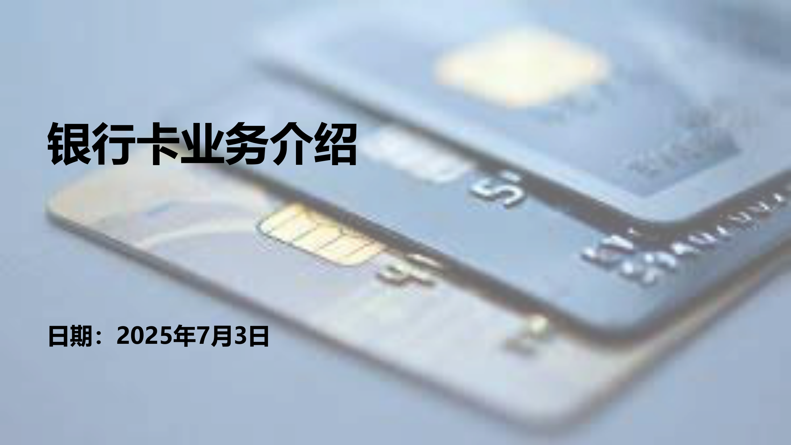
# **银行卡业务介绍**

## **日期：2025年7月3日**

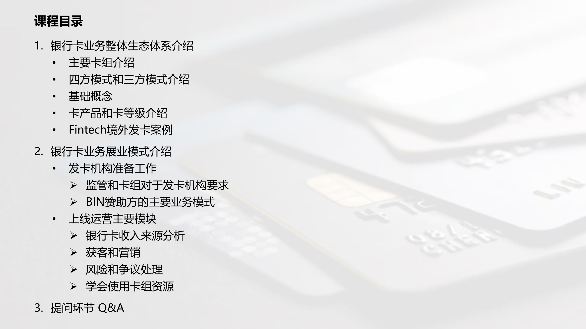
### **课程目录**

#### 1. 银行卡业务整体生态体系介绍 • 主要卡组介绍 • 四方模式和三方模式介绍 • 基础概念 • 卡产品和卡等级介绍 • Fintech境外发卡案例 2. 银行卡业务展业模式介绍 • 发卡机构准备工作 ➢ 监管和卡组对于发卡机构要求 ➢ BIN赞助方的主要业务模式 • 上线运营主要模块 ➢ 银行卡收入来源分析 ➢ 获客和营销 ➢ 风险和争议处理 ➢ 学会使用卡组资源 3. 提问环节Q&A

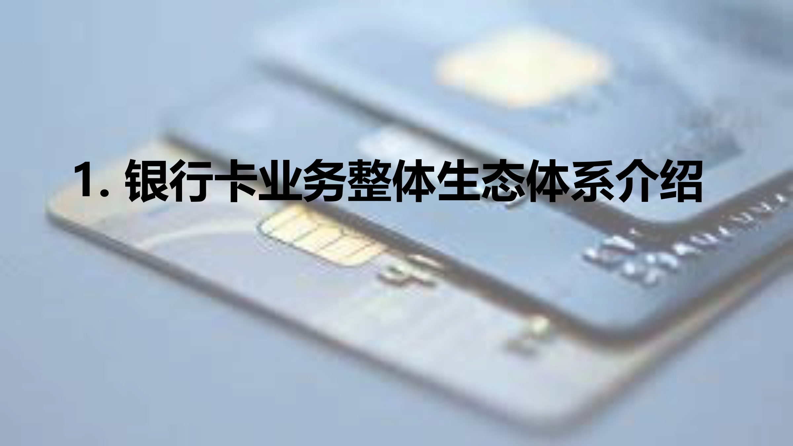
# **1. 银行卡业务整体生态体系介绍**

### **银行卡– 品牌介绍**

|品牌|卡号开头数字|商业模式|全球市场份额 (按交易量)|备注|
|---|---|---|---|---|
|Visa 维萨|4|四方模式|约占50-55%|全球最大卡组织|
|Mastercard 万事达|5|四方模式|约占25-30%|全球第二大卡组织|
|American Express 美国运通|34, 37|三方模式， 四方模式|约占5~10%|基本使用三方模式，小商户可能使 用四方模式|

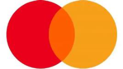

### **银行卡– 品牌介绍**

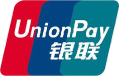

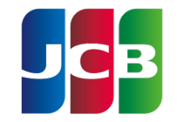

|品牌|卡号开头数字|商业模式|全球市场份额 (按交易量)|备注|
|---|---|---|---|---|
|Unionpay 中国银联|62|四方模式|约占10~15%|于国内占主导地位，近几年在亚洲 和一带一路国家发展迅猛|
|JCB 吉士美|35|三方模式， 四方模式|约占1%|日本国内使用三方模式；但为了扩 大市场份额以引入四方模式|
|Discover 发现卡|6011, 644-649,65|三方模式， 四方模式|约占1-2%|基本使用三方模式，但为了扩大市 场份额以引入四方模式|
|Diners Club 大来卡|300-305, 36, 38-39|三方模式， 四方模式|三方模式， 四方模式|已被Discover收购，继续营运|

### **银行卡– 四方模式**

四方模式涉及四个参与方：持卡人、商户、收单机构、卡组织和发卡机构。

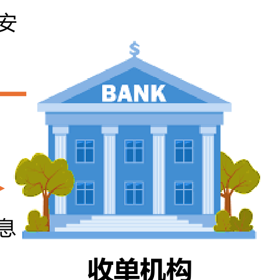

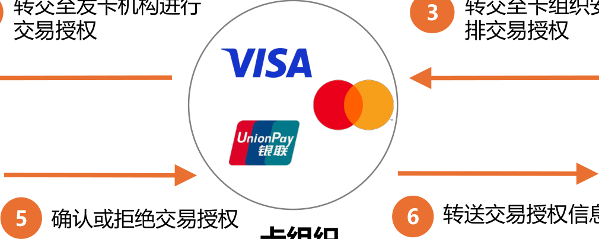

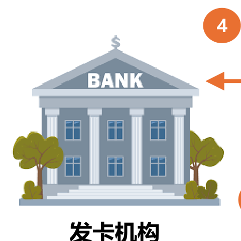

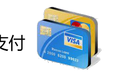

交易授权流程（8步）：

1. 持卡人在商户处刷卡支付
2. 商户发送银行卡信息和金额，进行交易授权
3. 收单机构将交易转交至卡组织安排交易授权
4. 卡组织将授权请求转交至发卡机构
5. 发卡机构确认或拒绝交易授权
6. 卡组织转送交易授权信息
7. 收单机构通知商户交易授权信息
8. 商户完成交易

### **银行卡– 三方模式**

三方模式中，卡组织同时担任发卡机构和收单机构（如美国运通、JCB、大来卡），直接承担卡组织、发卡机构、收单机构三重角色。

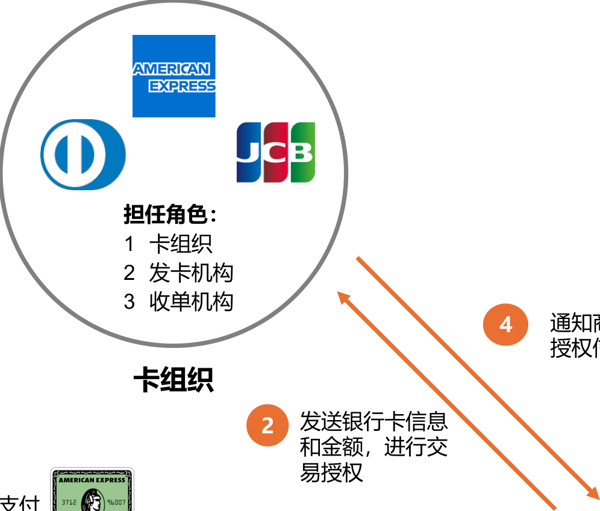

交易流程（5步）：

1. 持卡人在商户处出示卡片完成支付
2. 商户发送银行卡信息和金额，进行交易授权
3. 卡组织（同时作为发卡机构）确认或拒绝交易授权
4. 卡组织通知商户交易授权信息
5. 商户完成交易

### **银行卡– 基础概念**

|用词|具体描述|
|---|---|
|Primary Account Number (PAN) 银行卡号|印刷于银行卡上的卡号|
|Authorization 交易授权|发卡机构验证交易是否可批准（如余额或额度是否足够）|
|Clearing & Settlement 清分和结算|交易完成后资金从发卡机构转移至收单机构的过程|
|Presentment 请款|商户和收单机构将交易提交至发卡机构，请求结算资金的过程|
|Card Present/ Card Not Present 持卡交易/无卡交易|持卡交易通过实体卡（刷卡、插卡、非接）完成交易； 无卡交易则是持卡人无需出示实体卡，仅通过卡号、有效期、CVV码等信息完成交易|
|Liability Shift 责任转移|交易中因欺诈或其他问题导致的损失责任从一方转移至另一方的机制。责任转移通常在下述技术标准被满足 时自动生效：EMV芯片交易，3DS验证，标记化支付。例如：若商户不支持EMV芯片卡，发生芯片卡伪卡欺 诈时需自行承担损失。|
|Merchant Category Code (MCC) 商户类别码|用于标识商户所属行业类别的4位数字代码，由卡组织制定，是支付清算、手续费定价和风控的核心依据之一。 不同行业风险、利润率不同，MCC决定交换费和商户手续费。例如：超市（MCC 5411）费率通常较低；餐 饮（MCC 5812）费率中等；珠宝（MCC 5944）费率较高。|
|EMV|芯片卡技术标准（Europay, Mastercard, Visa），提高交易安全性|
|PCI DSS|支付卡行业数据安全标准，要求商户安全存储和处理卡数据。|
|CVV/CVC Card Verification Value/Code|信用卡安全码（3-4位数字），用于无卡交易验证|

### **银行卡– 基础概念**

|用词|具体描述|
|---|---|
|Merchant Discount Rate (MDR) 商户折扣率|商户因接受银行卡支付而需要支付的手续费，通常按交易金额的一定百分比收取，有时还会附加固定费用。 费用包括由发卡机构收取的交换费、由卡组织收取的网络费和由收单机构收取的处理费。|
|交换费 Interchange Fee|银行卡支付生态中的核心费用机制，由发卡机构所收取的交易处理的费用，用于补偿发卡机构在交易中承担 的成本和风险|
|Tokenization 标记化|用虚拟令牌替代真实卡号，提升支付安全性（如移动支付）|
|3D Secure（3DS） 支付验证技术|交易过程中，添加验证步骤（如Visa Secure、Mastercard Identity Check），以提高交易安全性和确保交易在 持卡人授权下完成。持卡人被重新定向至发卡机构的验证页面（可能表现为：短信验证码，推送通知，生物 识别验证或安全问答）|
|Dispute 差错争议|消费者保护机制，指持卡人对交易产生异议时启动的正式调查流程。持卡人通过发卡机构对账单中的某笔交 易提出质疑，要求发卡机构调查并可能撤销该交易的过程。|
|Chargeback 拒付|是指持卡人对信用卡交易提出异议，要求发卡机构撤销该笔交易并退款的过程。拒付通常是由于持卡人认为 交易存在欺诈、错误或不满意服务等原因而发起的。|
|Arbitration 仲裁|争议流程发起后，发卡机构与收单机构对被质疑交易坚持己见，需要由卡组织介入进行仲裁，以判断裁决， 开展会收取一定费用，通常由败诉方承担|
|Value in Kind (VIK)|指卡组为了鼓励发卡行发卡和持卡人刷卡而给予的奖励费用，目前很少以现金出现，多用于购买卡组的现有 服务，比如积分服务、权益相关和咨询服务。发卡机构可以使用该费用或服务，提成升发卡量和交易量。但 是通常卡组会要求承诺一定发卡量，签约时需注意。|

### **银行卡– 银行识别码 (BIN)**

##### BIN（Bank Identification Number）是支付卡号的前 6或8位数字，用于标识： ⚫ 发卡机构 ⚫ 卡组织 ⚫ 卡类型 ⚫ 发卡国家/地区 BIN的结构解析 ⚫ 第1位：行业标识符 ⚫ 前6位：发卡机构 BIN作用 ⚫ 交易路由：收单机构通过BIN将交易请求发送至对应卡组织 ⚫ 风险控制：高风险BIN拦截（境外盗刷常见BIN） ⚫ 数据统计：分析不同BIN的交易成功率、拒付率

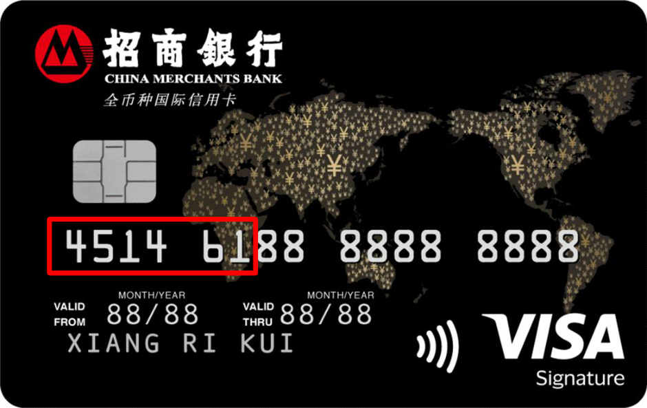
### **银行卡– 规则Rules**

#### 各卡组织都有自身的规则，参与方包括发卡机构，收单机构和商户都需要遵守，以确保业务能够正常运转。

|项目|Visa规则|Mastercard规则|
|---|---|---|
|交易授权|所有交易需经发卡机构授权；支持Visa Token, Visa Secure|所有交易需授权；使用Mastercard Identity Check（3D Secure）|
|争议解决|使用Visa Claims Resolution (VCR)，流程自动化、高 效|以传统流程为主，人工处理多，逐步引入自动化工具 （如Mastercom)|
|拒付原因分类|主要分为4 类：欺诈、授权、处理错误、消费者异议|类似划分：欺诈、重复、未授权、服务未提供等|
|拒付时效|通常120天内，某些情形可达540天|多数为120天，少数可延长|
|仲裁|提供仲裁流程，仲裁失败方需支付高额费用|同样有仲裁流程与费用，败诉方支付更高费用|
|清算结算|使用Visa汇率，快速结算|使用Mastercard汇率，结算方式类似|
|欺诈预防|强调Visa Secure，基于EMV 3DS协议，责任转移明确|强调Mastercard Identity Check，也使用3DS协议|
|品牌展示|商户需清楚展示Visa标志，不得设最低消费额|同样要求标志展示，禁止最低消费限制|
|数据安全|强制PCI DSS合规，强调标记化与加密传输|也强制PCI DSS，提供Security Token方案|
|违规处理|可暂停机构权限、罚款、终止合作；违规追踪系统严格|类似结构，违规可能导致商户黑名单或被封卡|

### **银行卡– 业务规则**

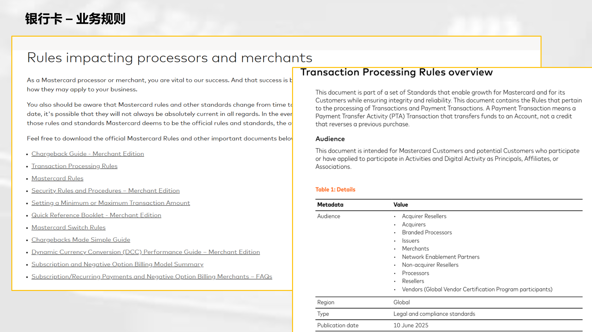

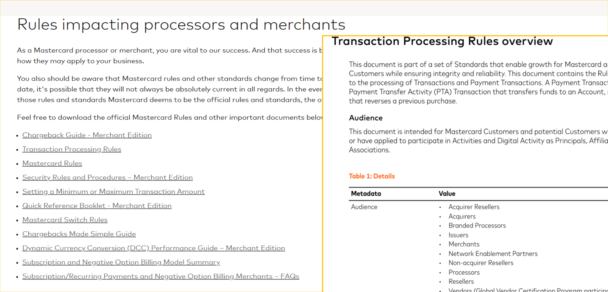

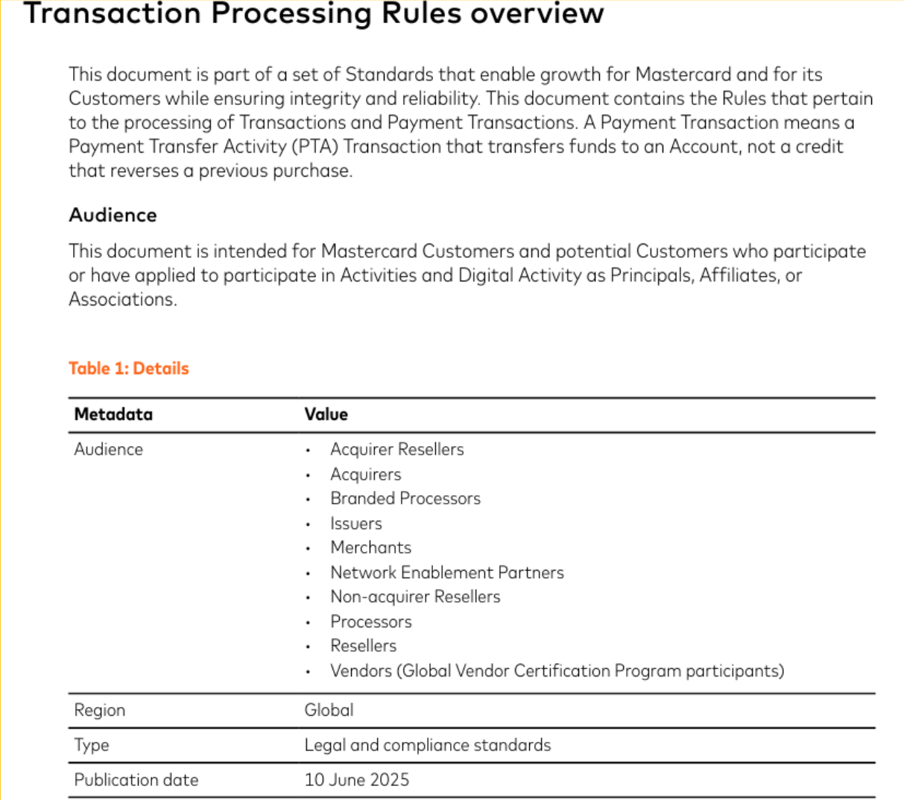
### **银行卡– 单信息vs双信息**

|Col1|单信息|双信息|
|---|---|---|
|定义|交易请求和清算在同一报文中完成|交易请求（授权）和清算分两个独立报文完成|
|处理流程|一次性发送交易信息，实时完成授权和清算|先发送授权请求，后续再发送清算请求|
|适用场景|实时清算场景（如ATM取现，部分借记卡交易）|需要延迟清算的场景（如信用卡消费，离线交易）|
|网络负载|单次通信，网络负载较低|需两次通信，网络负载较高|
|交易速度|更快，实时完成|授权快，但清算可能延迟（如批量处理）|
|风险控制|依赖实时风控，清算不可逆|授权阶段可风控，清算前可调整（如退货，争议处理）|
|典型卡种|借记卡、预付卡|信用卡、部分借记卡（如签名交易）|

注：无论现在使用的单信息和双信息报文都是基于ISO8583报文格式。

### **银行卡– 银行卡种类**

|对比维度|借记卡|信用卡|预付卡|
|---|---|---|---|
|资金来源|直接关联银行账户（储蓄/支票账户）|银行授予的信用额度（先消费后还 款）|预先充值（无银行账户关联）|
|授权验证|需账户余额充足|需信用额度充足|需卡内余额充足|
|结算时效|实时扣款（交易时立即扣除账户余 额）|延迟结算（账单日后还款）|实时扣款（交易时扣除卡内预存 余额）|
|手续费和利息|较低（部分国家受监管限制）|较高（含利息、年费等）|可能收取充值费、年费（依发行 机构）|
|拒付与争议处理|卡组有完善规则，按照卡组规则执 行即可|卡组有完善规则，按照卡组规则执 行即可，满足卡组要求3Ds等，则 可进行责任转移|卡组有完善规则，按照卡组规则 执行即可|
|结算流程|银行账户→卡组织→收单行→商户|发卡行垫付→持卡人还款|卡内余额→收单行→商户|
|特点|实时结算，无负债风险|全球受理，消费保障强，可累积信 用|无银行账户需求，适合预算控制|

### **银行卡– 信用卡等级**
#### 信用卡通常按发卡标准、权益福利和目标客群分为不同等级（Tiers），不同卡组织（Visa、Mastercard、银联 等）的命名可能不同，但核心逻辑相似。以下是全球主流信用卡等级体系：

|等级|目标客群|核心权益|
|---|---|---|
|Visa Infinite|超高净值客户|机场贵宾厅无限次、 专属VIP礼宾|
|Visa Signature|高端客户|免费贵宾厅、旅行保 险、酒店优惠|
|Visa Platinum|中高端客户|基础保险、消费折扣|
|Visa Gold|普通优质客户|基础权益（如免年费 优惠）|
|Visa Classic|大众客户|基础功能，无附加权 益|

##### 信用卡等级的核心差异

|等级|目标客群|核心权益|
|---|---|---|
|World Elite|超高净值客户|全球机场贵宾厅 专属VIP礼宾|
|World|高端客户|酒店升级、旅行险|
|Platinum|中高端客户|基础保险和优惠|
|Gold|普通优质客户|低年费或免年费|
|Standard|大众客户|基础功能（无权益）|

|维度|高端卡|中端卡|基础卡|
|---|---|---|---|
|年费|高（通常刚性年费）|可免（消费达标）|免年费或极低|
|授信额度|10万人民币起|5万~10万|1万~5万|
|申请门槛|高收入/资产证明|稳定收入（中等）|稳定收入|

### **银行卡– 实体卡vs虚拟卡**

|Col1|实体卡|虚拟卡|
|---|---|---|
|定义|实体银行卡是由银行或发卡机构发行的，具有物理 形态的卡片。它通常由塑料或特殊金属制成，上面 印有卡号、持卡人姓名、有效期、发卡银行标志等 信息。实体银行卡是传统银行卡的主要形式，广泛 应用于各类金融交易场景。|银行卡虚拟卡是一种没有实体形态的银行卡，它以电子数据 的形式存在于银行的系统或用户的电子设备中。虚拟卡的信 息（如卡号、有效期等）存储在云端服务器或本地设备中， 并通过网络进行交易验证和处理。|
|特点和适用场景|1. 物理存在，便于携带；安全性较高，芯片采用 了先进的加密技术，可以有效防止卡片信息被 复制或篡改。同时，卡片表面的印刷工艺也包 含多种防伪特征，如激光防伪标识、凸字印刷 等 2. 适用场景广泛，覆盖各个线下场景，包含银行 柜台、ATM、POS机及各类终端机消费等|1. 无实体卡，便捷性高，有网络即可消费和交易，且可以 快速生成和管理；安全性上主要依赖于网络加密技术和 电子设备的安全性 2. 主要覆盖网上支付和手机支付，若绑定钱包交易也可完 成线下当面支付|

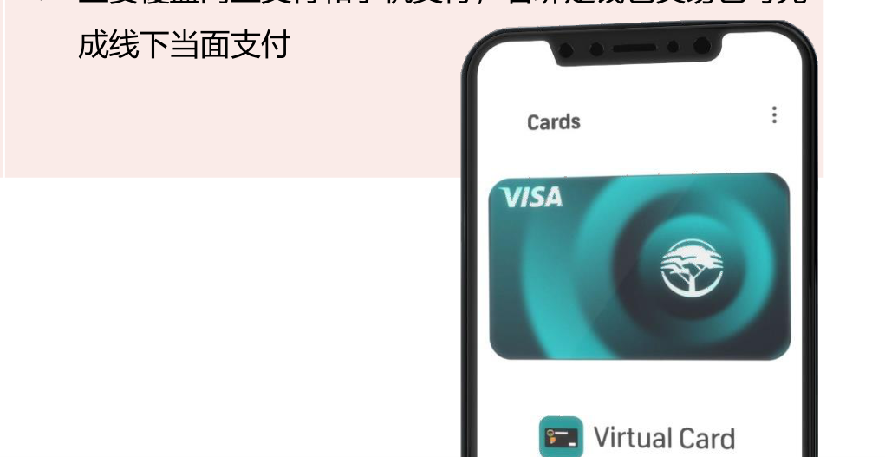
### **银行卡– 实例：Atome Card**

|Col1|具体描述|
|---|---|
|Fintech公司简介|• 金融服Atome是东南亚领先的数字金融服务平台，提供“先享后付”和多元化的金融服务|
|发卡模式|• **合作模式**：Atome作为发卡机构（通过BIN赞助方形式），与万事达卡合作，于2022年在菲律宾推出了Atome card，未来将覆盖亚太更多区域 • Atome Card为**信用卡**，持卡人最高可申请到20万菲律宾比索（约合人民币24,500元）的信用额度，用户最长 可以在45天后还款 • **数字化申请与管理**：用户可以通过Atome APP或官网进行资质申请，审核通过后即可正式申请Atome Card， 不需要提供收入证明，并且提供虚拟卡和实体卡的选择|
|目标客群|• **未被传统银行充分服务的客户**：Atome Card主要面向这些尚未被传统银行服务到的客户群体即没有银行账户 体系的客户，如年轻、自主创业者或自由职业者，他们需要灵活的信贷解决方案来满足日常生活中的财务需求。|
|产品特点|• **先享后付服务**：用户可以在结账时出示Atome Card，使用Atome提供的信用额度完成支付，享受先消费后付 款的便利 • **灵活的支付与还款**：Atome Card支持在任何接受万事达卡的商家使用，无论是线上购物还是线下消费。同时， 用户可以通过Atome APP轻松查看及管理还款时间表，方便用户合理安排自己的财务 • **无年费和注册费**：Atome Card不收取年费、注册费或其他隐藏费用，降低了用户的使用成本|
|可能盈利点|• **利息收入** ➢ Atome Card为用户提供分期付款服务，虽然部分交易提供利率的优惠，但用户在选择分期付款时，通常 需要支付一定的利息或手续费 ➢ 对于逾期还款的用户，Atome会收取逾期罚息，这也是其盈利的一部分 • **I**nterchange fee收入 • **其他间接收入**：积累用户数据可以交叉销售其他Atome的产品，同时可以将数据模型打包出售给其他金融机 构提供风险和数据服务获取收入|

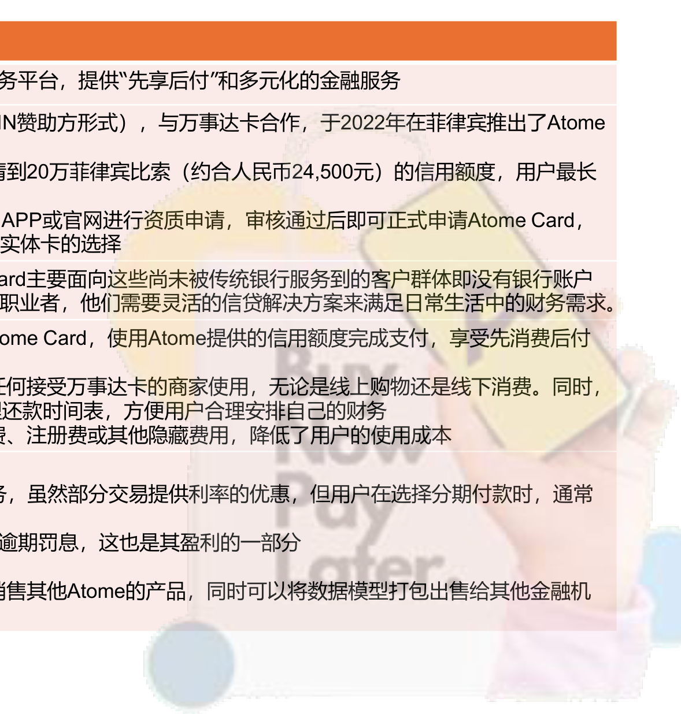
### **银行卡– 实例：World Card**

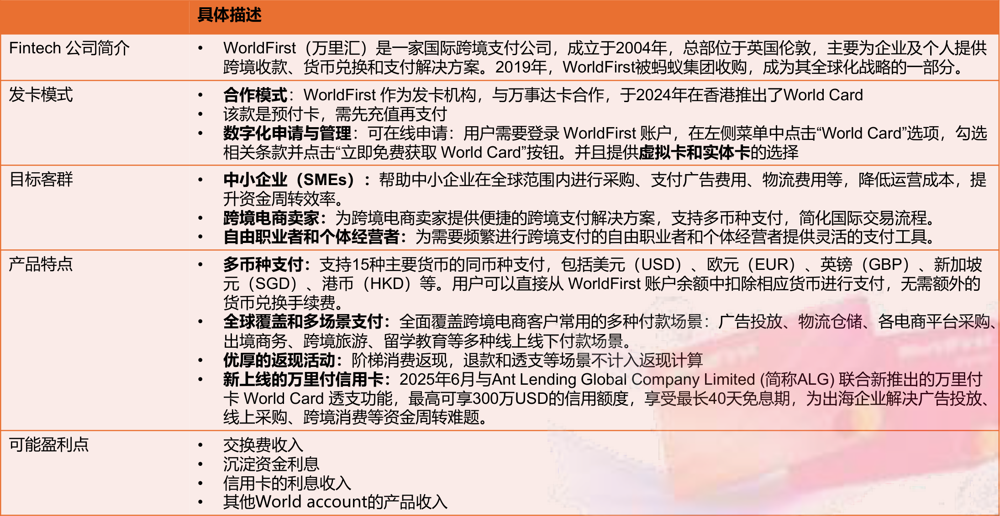

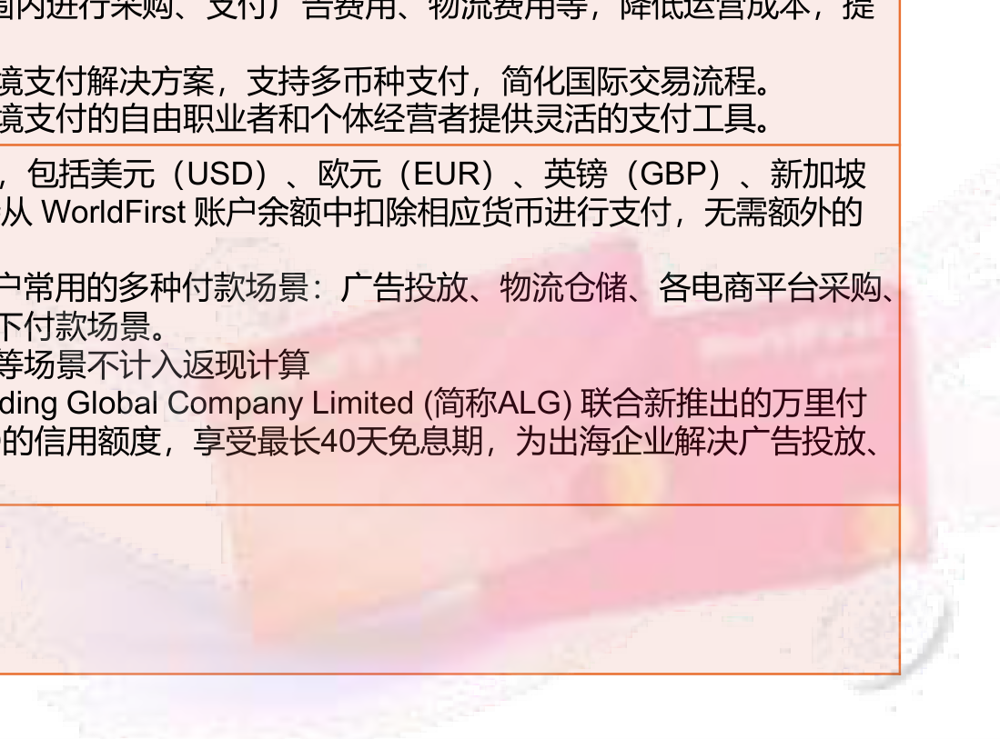
### **银行卡– 实例：World Card**

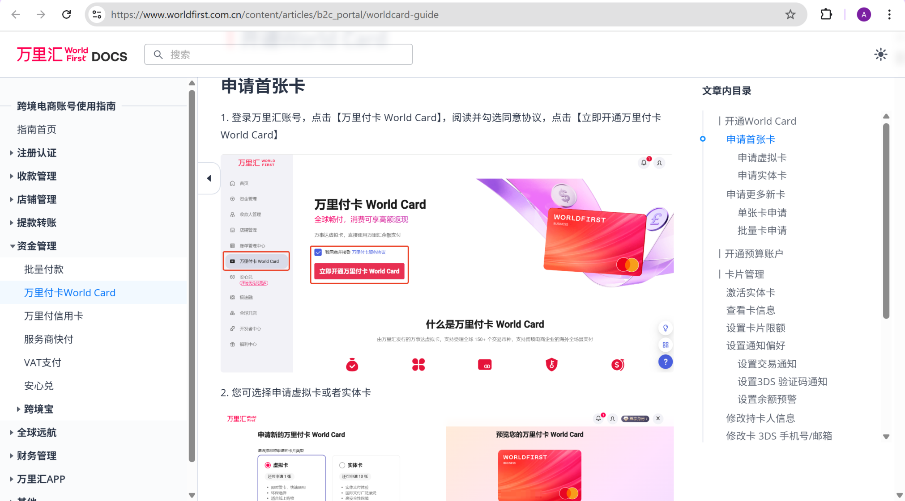
### **银行卡– 实例：World Card**

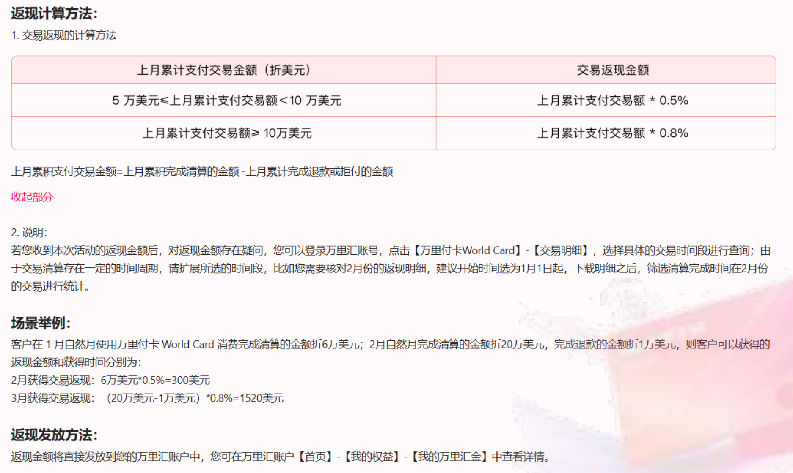

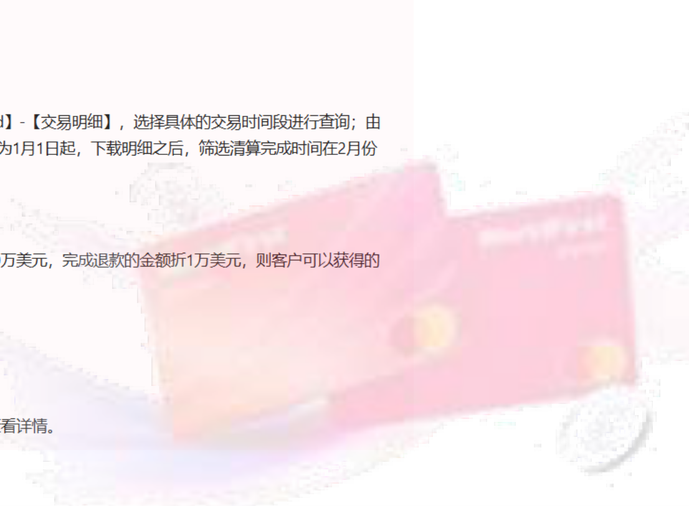
### **银行卡– 实例：World Card**

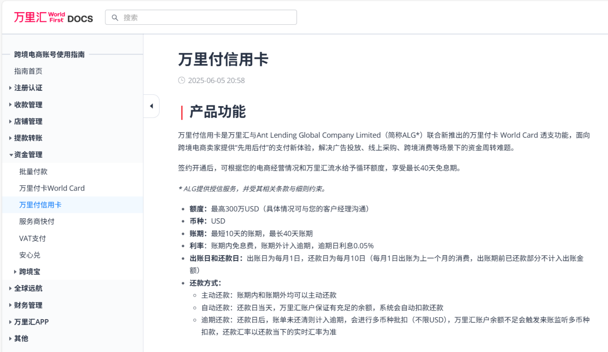
### **银行卡– 实例：World Card**

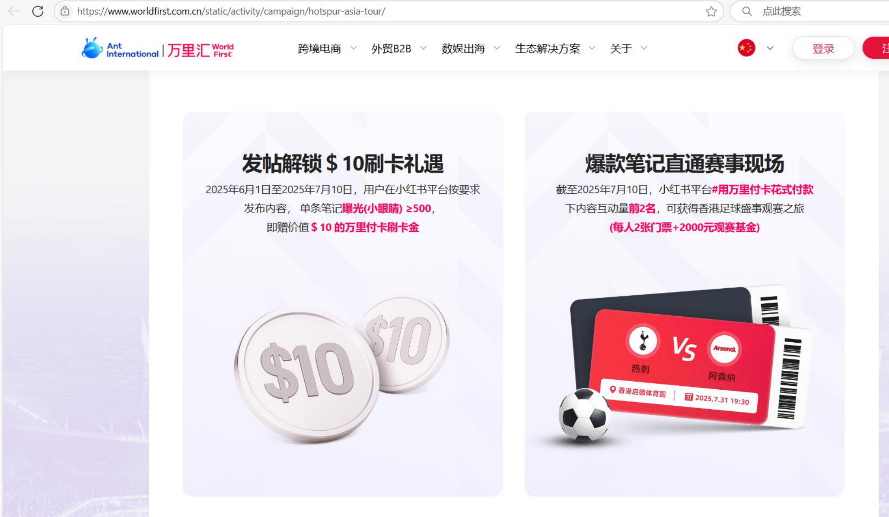
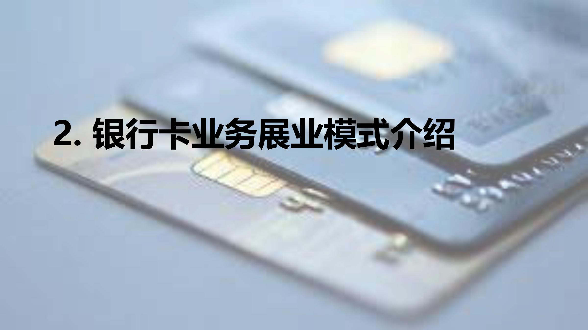
# **2. 银行卡业务展业模式介绍**

### **银行卡– 发卡机构准备工作**

#### 作为计划进入银行卡行业的全新发卡机构，下列是各项主要工作内容供参考：

|任务类别|具体任务|详细说明|相关方/备注|
|---|---|---|---|
|监管合规与牌照|申请相关支付牌照|根据业务范围申请相应牌照（如中国需银监会/央行批准，国际 需PCI DSS认证）|国家/地区的监管机 构、PCI SSC|
|监管合规与牌照|遵守《支付业务许可证》要求|确保符合反洗钱（AML）、KYC（客户身份识别）等法规|法律顾问、合规团 队|
|卡组织入网|加入卡组织（Visa/Mastercard/银联等 |） 签订发卡协议，获取BIN号段（前6/8位卡号标识）|卡组织、技术对接 团队|
|卡组织入网|通过卡组织技术认证（如EMV标准）|确保芯片卡、交易报文符合国际标准（如ISO 8583）|卡组织认证实验室|
|银行与清算合作|选择清算银行（收单行/结算行）|与银行合作处理资金清算|商业银行、清算机 构|
|银行与清算合作|开保证金账户|按照卡组要求开设保证金账户，并在指定时间放置好保证金|商业银行|
|技术系统搭建|支付系统|部署发卡、账户管理、交易处理系统|技术服务商或自身 技术团队|
|技术系统搭建|支付网关与交易处理|支持实时授权、清算、拒付处理（需兼容EMV 3DS安全协议）|支付网关供应商或 自身技术团队|
|技术系统搭建|标记化（Tokenization）与风控系统|通过PCI DSS认证，集成欺诈检测（如FICO Falcon）。|技术服务商或自身 技术团队|

### **银行卡– 发卡机构准备工作**

#### 作为计划进入银行卡行业的全新发卡机构，下列是各项主要工作内容供参考：

|任务类别|具体任务|详细说明|相关方/备注|
|---|---|---|---|
|卡片生产与交付|选择制卡商（Card Manufacturer）|定制卡面设计、芯片（EMV）及卡号印刷（需符合卡组织规范）|金雅拓、G&D等制 卡商|
|卡片生产与交付|物流与激活管理|确保卡片安全寄送，并支持线上/线下激活（如短信验证、APP 激活）|物流公司、客服团 队|
|产品设计|确定卡等级与权益（普卡/金卡/白金卡|）设计年费、积分计划、保险权益（如旅行险、购物保障）|市场部、卡组织|
|产品设计|定价策略（利率、手续费）|设定透支利率、跨境交易费、取现手续费等（需符合监管上限）|财务部、合规部|
|客户服务与运营|搭建客服中心（电话/在线）|处理开卡咨询、盗刷投诉、账单查询（需支持多语言）|外包客服或自身客 服团队|
|客户服务与运营|开发移动端APP/网页|提供账单查询、还款、挂失等功能（需通过PCI PA-DSS安全认 证）|技术开发团队|
|市场推广|品牌定位与渠道合作|与商户合作（如消费折扣）、线上推广|市场部、合作商户|
|市场推广|发卡渠道（线上/线下）|通过银行网点、代理商或线上申请（需集成身份验证OCR+活体 检测）|渠道合作伙伴|

### **银行卡– 发卡机构准备工作**

#### 作为计划进入银行卡行业的全新发卡机构，下列是各项主要工作内容供参考：

|任务类别|具体任务|详细说明|相关方/备注|
|---|---|---|---|
|风险管理|建立风控模型（申请反欺诈、交易监 控）|监控异常交易（如大额跨境消费）、设置交易限额|风控团队、第三方 服务|
|风险管理|数据安全与灾备|通过PCI DSS认证，部署数据加密（如HSM）、异地灾备中心|信息安全团队|
|测试与上线|沙盒环境测试|模拟交易流程（授权、清算、拒付），确保系统稳定性|卡组织、技术团队|
|测试与上线|试点发卡（Pilot Launch）|小范围测试（如员工内测），收集反馈并优化流程|内部团队、潜在用 户|

##### **关键注意事项** 1 时间周期：从筹备到正式发卡通常需6-12个月（依赖牌照审批和技术对接）。 2 合作方依赖：卡组织、银行、技术供应商需提前签约。

### **银行卡– 监管和卡组织对发卡机构的要求**

#### **监管**
##### • 发卡机构需要为持牌机构，如新加坡需持有MPI，香港需持有MSO

#### **卡组织– 入网申请**
##### • 需要由第三方律所对牌照和整体业务模式出具legal opinion • 对申请机构的 Audited Financial Report 有要求，需要连续3年的Audited Financial Report；同时需 要申请机构准备 Business plan，预估至少三年的发卡量 等；这两部分都会对保证金评估有影响 • 若处理交易，一般都会有PCI DSS认证的要求，认证时间为3~6个月，项目评估时需要估算这部分时间 • 卡组的申请材料中对AML和风控政策会有细节问题，按照卡组织要求准备即可

### **银行卡– 监管和卡组织对发卡机构的要求**

#### **卡组织– Compliance Program**
##### 卡组会监控发卡、收单和商户整体的风险和Chargeback Rate，如果发现数值异常会联系发卡机构进行进一 步整改；通常对收单行和商户有专门的compliance program，比如Mastercard有Extensive Chargeback Program(拒付监控计划），Extensive Fraud Merchant Program(欺诈监控计划）等

#### **卡组织– Regular Reporting**
##### 业务数据reporting，登录MC Connect/Visa Net ，在卡组织的门户网站上直接上传，一般以季度或月度 为频率，上传包含发卡量，交易量和交易金额等业务数据；

#### **卡组织– 规则更新**
##### 每个月/季度会发布更新的规则，需要自行进入卡组织门户网站下载有关通告和解析规则，由发卡或收单内 部拆分相关内容来判断是仅影响业务规则还是需要进行技术变更。 提示：卡组织一般会至少提前半年发布大型变更，会给成员机构预留好足够的时间进行技术改造和内部培训， 同时卡组会开展季度规则变更的培训，确保成员机构了解并理解该次变更。 一般会有专门的角色处理和对接 **卡组织的规则变更**

### **银行卡– BIN赞助方**

#### 作为计划进入银行卡行业的全新发卡机构，除了直接向卡组织申请入网之外，也可考虑采用与BIN赞助方进行合作。

##### **选择BIN赞助方的原因** ⚫ 降低门槛 – 避免直接申请卡组织入网的高成本和严格要求 ⚫ 快速发卡 – 缩短上线时间（自主申请BIN需时6至12个月） ⚫ 合规便利 – 赞助方协助满足PCI DSS、反洗钱等监管要求 **赞助方的角色** ⚫ 分配BIN号段 – 赞助方将自己的BIN范围中尚未使用的BIN，分配给合作机构使用 ⚫ 处理交易清算 – 作为中间方，处理交易路由和资金结算，合作模式需要双方协商以明确分工 ⚫ 合规管理 – 确保合作机构符合卡组织和监管要求（如反洗钱） **赞助方的合作模式** ⚫ 全托管模式 ⚫ 部分托管模式

### **银行卡– BIN赞助方的主要业务模式**

|Col1|全托管模式（proposed）|部分托管模式（proposed）|
|---|---|---|
|定义|赞助方承担全部技术、合规和运营责任，合作方仅提供用户 或场景入口|赞助方负责核心支付功能，合作方参与部分运营（如权益发 放、用户分层）|
|适合场景|追求快速上线|需灵活运营用户但核心支付能力|
|特点|⚫ 技术托管：卡号生成、交易路由、清算均由赞助方完成 ⚫ 快速上线：完全依赖赞助方，适合刚接触卡的公司 ⚫ 合作方重点在获客端，即进行流量引入，获客和线上申请|⚫ 技术分工：赞助方处理交易清算，合作方通过API管理附加 功能（如积分、优惠券） ⚫ 有限BIN控制：赞助方分配子BIN段，合作方可动态生成卡 号|
|卡号生成|赞助方统一分配|赞助方分配主BIN，合作方生成子卡号|
|交易路由|直接由赞助方处理|赞助方路由核心交易，合作方拦截附加请求|
|风控|完全依赖赞助方|赞助方基础风控+合作方规则|
|数据权限|合作方仅获交易结果|合作方可获部分交易明细|

### **银行卡– 采用BIN赞助的主要工作项**

|主要工作项|具体描述|
|---|---|
|1）选择合适的BIN赞助方|潜在赞助方类型： ⚫ 商业银行，拥有卡组织会员资质的银行 ⚫ 持牌支付机构（如拥有发卡牌照的第三方支付公司） 选择标准 ⚫ 是否支持目标卡组织（Visa或Mastercard） ⚫ 手续费结构（BIN使用费，交易清算费，月费等） ⚫ 是否提供完整的发卡、清算、合规支持|
|2）签订BIN赞助协议|BIN使用范围：赞助方分配的子BIN段 **价格和费率: 相关费用的约定** 品牌展示：卡面是否需显示赞助方Logo（如“由XX银行提供支持”） **业务模式的约定：需明确托管模式**，若为半托管，也需明确各项工作分工，比如交易路由哪方处理，卡组集成如 何完成，KYC和AML由哪方完成等|
|3）技术对接与系统开发|需对接的系统 ⚫ 发卡系统：生成卡号、CCV、有效期（需符合PCI DSS安全标准） ⚫ 交易路由：通过网关处理交易（如POS刷卡、线上支付） ⚫ 账户管理：用户充值、月查询、交易记录同步 常见技术方案 ⚫ API对接：直接调用赞助方的发卡和交易接口（适合拥有技术能力） ⚫ SaaS平台：使用赞助方或其他技术供应商所提供的预制系统或方案|

### **银行卡– 采用BIN赞助的主要工作项**

|主要工作项|具体描述|
|---|---|
|4）银行卡发行与运营|发卡方式 ⚫ 实体卡：通过合作制卡厂印制（卡面需符合卡组织规范） ⚫ 虚拟卡：直接生成数字卡号（用于APP或线上支付） 资金流程 ⚫ 用户充值：资金进入指定银行账户 ⚫ 用户消费：交易路由至卡组织 ⚫ 清算周期：向商户结算，并扣除手续费 客服支持 ⚫ 设立沟通渠道，如400热线和电邮信箱，以处理用户查询或问题|
|5）合规与风险管理|⚫ 银行卡业务需符合当地监管机构的合规要求 ⚫ 银行卡业务需符合入网卡组如Visa或Mastercard的相关规则|

### **银行卡– 收入来源分析**

以持卡人通过信用卡消费100元为例：

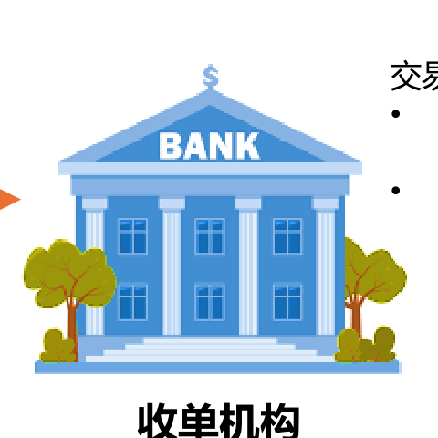

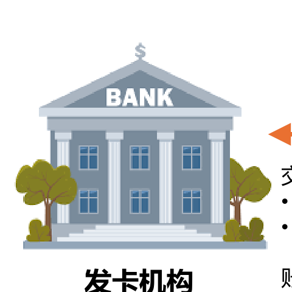

**资金流向：**

- 持卡人收到账单后缴付 **100元**（可能产生逾期利息）
- 转账交换费 **1.8元** → 发卡机构
- 转账处理费 **0.9元** → 收单机构
- 收取网络费 **0.3元** → 卡组织
- 商户扣减所有手续费后，**净收入97元**

假设：
1. 交换费：交易金额 × 1.8%（发卡机构收取）
2. 网络费：交易金额 × 0.3%（卡组织收取）

### **银行卡– 获客和营销**

#### 作为发卡机构，常用的银行卡营销工具：

|类别|方式|使用场景|具体解释|
|---|---|---|---|
|积分类|积分兑换|提升刷卡使用|包含航空里程兑换 各类实物和礼券兑换 各类视频or购物平台会员兑换|
|积分类|加速积分|提升刷卡使用和获新|在指定商家指定渠道，三倍积分（限时，比如每周三）|
|权益类|高铁/机场贵宾厅+高铁/机 场专车接送|提升刷卡使用和获新|对于常旅类客户的便捷权益|
|权益类|酒店类权益|提升刷卡使用和获新|指定酒店免费升房、住两间夜送一间夜、优惠价格定酒店等|
|权益类|餐饮类权益|提升刷卡使用和获新|指定餐厅消费打折或者满减|
|权益类|商超类权益|提升刷卡使用和获新|指定超市或购物平台或网站消费打折或者满减|
|权益类|医疗类权益|提升刷卡使用和获新|免费体检、免费洗牙、三甲专家优先挂号等|
|权益类|保险类权益|提升刷卡使用和获新|飞机延误险，出行意外险，家财险等|
|权益类|亲子类权益|提升刷卡使用和获新|全球迪斯尼门票、环球影城票等|
|现金和费用类|各类费用减免|提升刷卡使用和获新|限时申请，免年费，特别是白金卡年费； 信用卡提现手续费减免 借记卡年费减免|
|现金和费用类|返现、刷卡金和立减|提升刷卡使用和获新|可以面对一般客户，多用于海外刷卡场景 用于获新场景可以提升返现比例（比如前三个月返现10%）|

注：上述的营销方式可以通过VIK换购，但需要留意与卡组织的协议和发卡数量要求。

### **银行卡– 营销方式**

##### Member Get Member（MGM） 是一种通过现有客户推荐新客户的方式，通常通过提供激励措施（如折扣、奖励、积分 等）来鼓励现有客户邀请他们的朋友、家人或同事加入。这种营销方式利用了客户的社交网络和信任关系，以实现业务增长, 是高质量客户获客的有效手段。 **优势** 有效提高客户的参与度和推荐率。

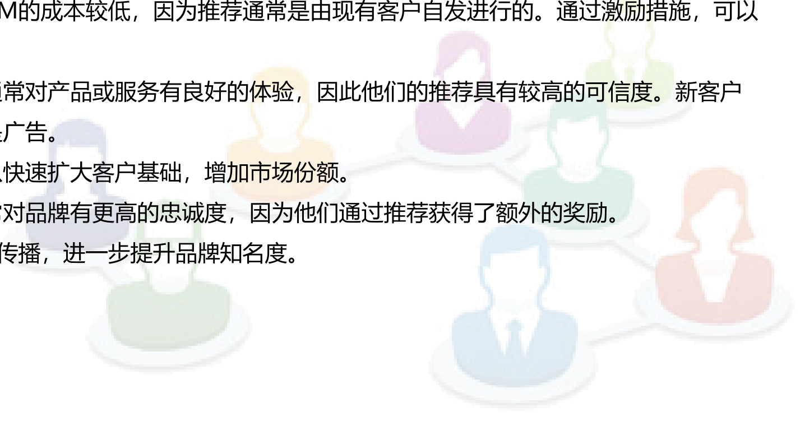
### **银行卡– 营销方式**

#### ZA bank的客户推荐计划

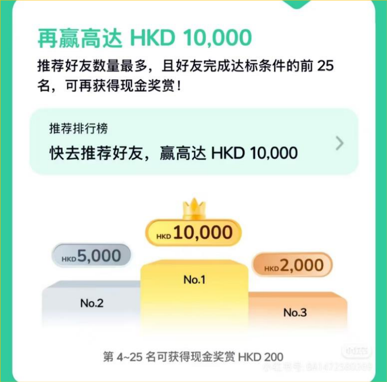

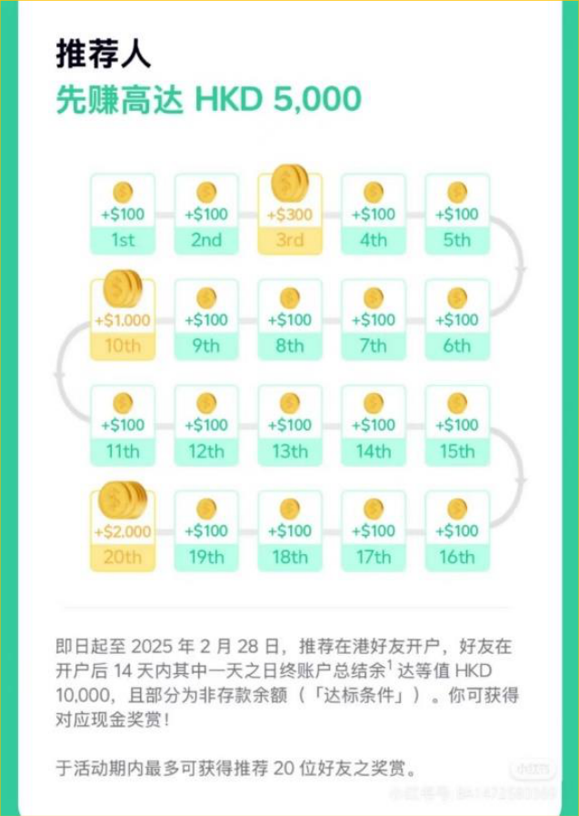

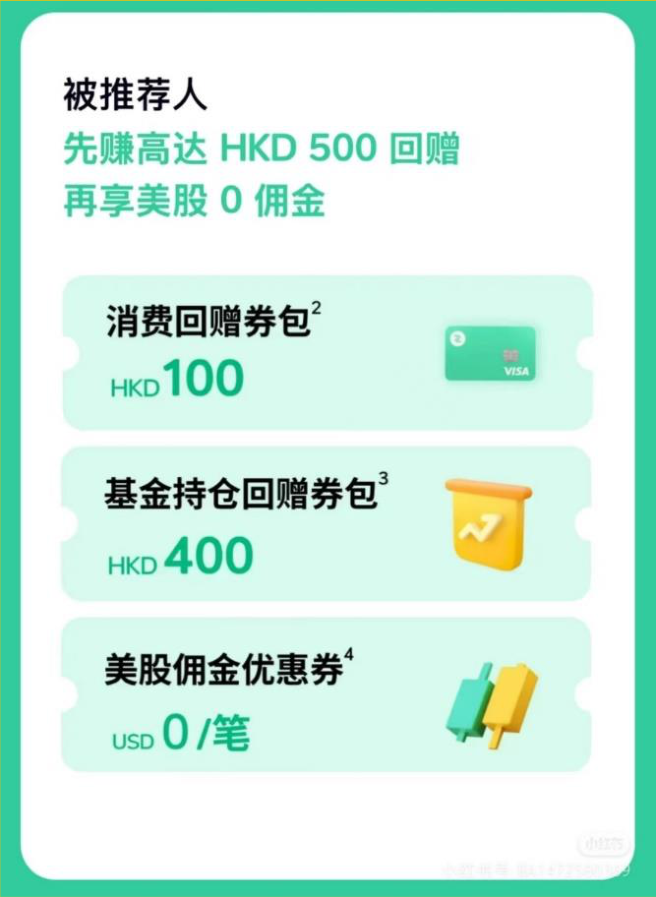
### **银行卡– 风险**

##### 作为发卡机构，业务中面临的主要风险点：

|风险类型|具体风险项|风险说明|
|---|---|---|
|信用风险|持卡人违约|持卡人逾期还款或恶意透支，导致坏账损失。|
|信用风险|集中度风险|单一客户/行业授信过高（如房地产行业联名卡），经济下行时违约率飙升。|
|欺诈风险|伪卡欺诈|伪造实体卡盗刷（如磁条卡复制）。|
|欺诈风险|无卡欺诈（CNP）|线上交易盗用（如钓鱼、数据泄露）。|
|欺诈风险|申请欺诈|虚假身份或冒用他人资料办卡。|
|操作风险|系统故障|核心交易系统宕机，导致交易失败或数据丢失。|
|操作风险|人为错误|审批流程疏漏（如误批高风险客户）。|
|合规风险|反洗钱（AML）违规|未识别可疑交易（如大额拆分交易），面临监管处罚。|
|合规风险|数据隐私违规|违反《个人信息保护法》（如用户数据泄露）。|
|市场风险|利率波动|央行利率调整影响信用卡分期收益。|
|市场风险|汇率风险|外币信用卡消费因汇率波动导致结算损失。|
|流动性风险|资金错配|短期负债（客户存款）与长期资产（贷款）期限不匹配，引发挤兑压力。|
|声誉风险|客户投诉激增|因收费不透明或服务差导致品牌形象受损。|
|声誉风险|负面舆情|社交媒体曝光大规模盗刷事件，引发公众恐慌。|
|战略风险|市场竞争失利|新兴支付方式（如数字钱包）替代信用卡，市场份额下降。|

### **银行卡– 争议处理**

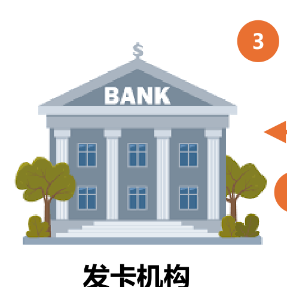

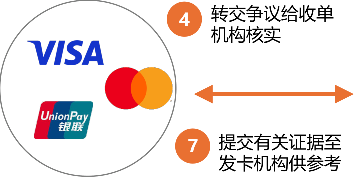

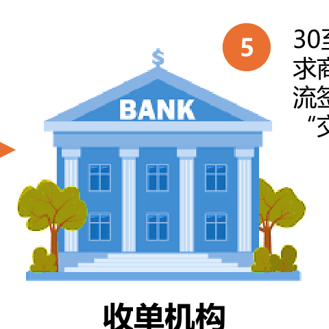

争议处理流程（9步）：

1. 持卡人发现商品未送达，联系商户要求退换，但商户拒绝
2. 持卡人向发卡机构提交争议申请，理由："未收到商品"
3. 发卡机构审查争议，若成立则向卡组织提出拒付
4. 卡组织转交争议给收单机构核实
5. 收单机构联系商户，要求提交"凭证"和"持卡人声明"
6. 商户提交有关证明材料（如有）给收单机构
7. 收单机构提交有关证据至发卡机构供参考
8. 发卡机构裁定争议是否成立；如成立，则要求收单机构退款
9. 通知持卡人该争议是否成立

注：
1. 如双方未能对争议达成一致意见，可重新发起另一轮的争议申请，进行证据收集和提交来判断是否成立。
2. 如另一轮争议申请也未能达成一致意见，可要求卡组织介入做出最终裁决。

### **银行卡– 学会使用卡组织资源**

##### 卡组织的Academy门户网站有很多eLearning和Open Course，可以在成为成员机构后，进入MC Connect进行搜索， 里面有很多基础且实用的培训！ 卡组也会定期发送邮件邀请成员机构参加相关培训，比如新产品，规则更新等，这些都可以帮助新的成员机构更好的了 解卡组和熟悉卡组规则。

### **银行卡– 学会使用卡组织资源**

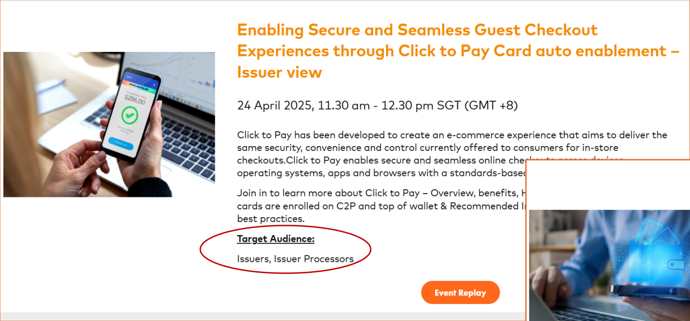

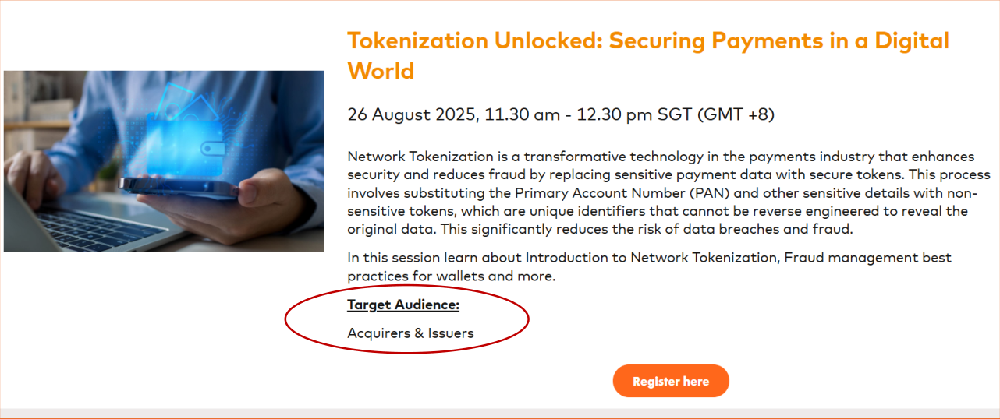

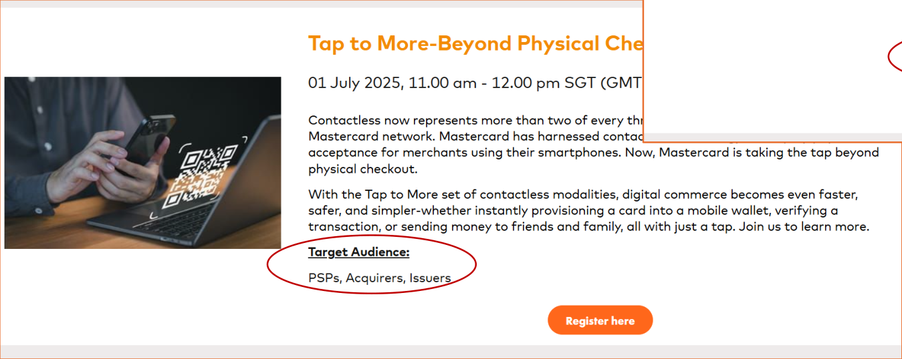

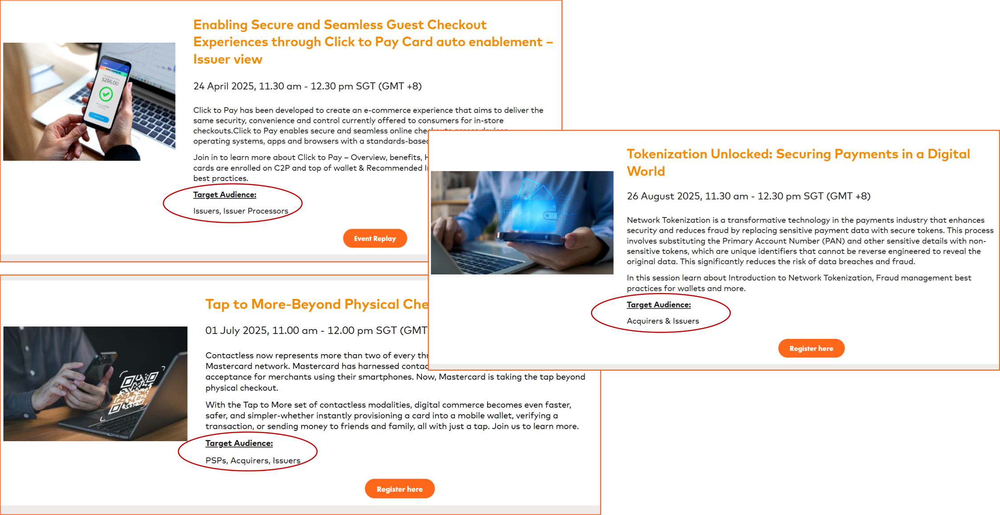
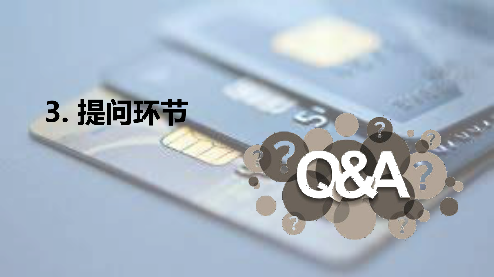
# **3. 提问环节**

---

来源文件：resources/fintech/银行卡业务介绍.pdf
