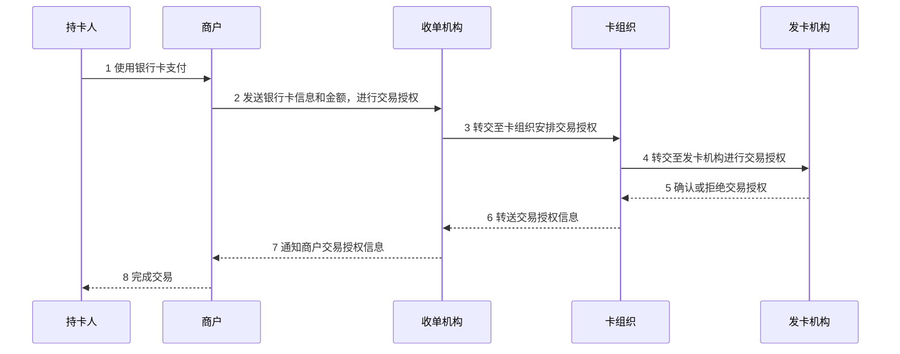
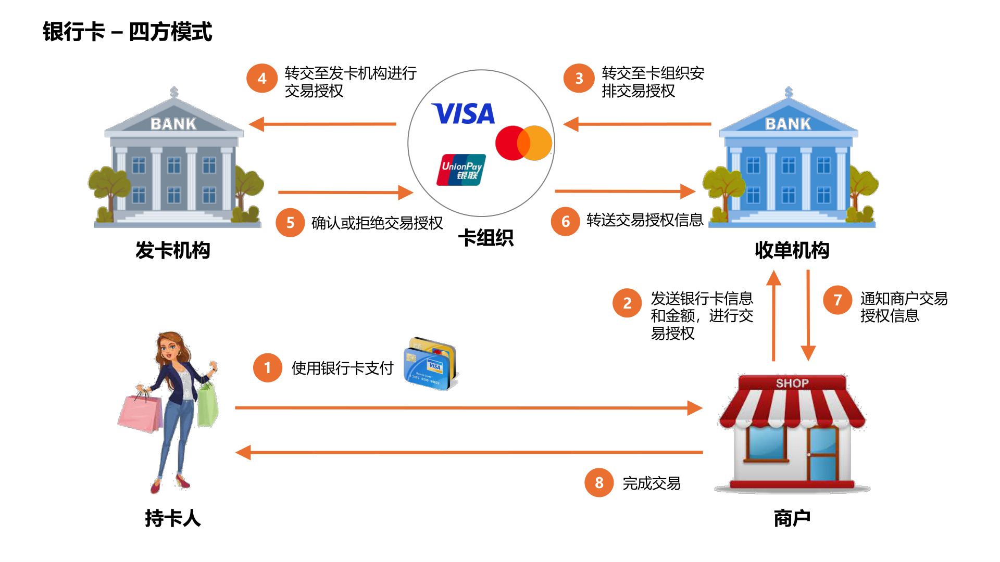
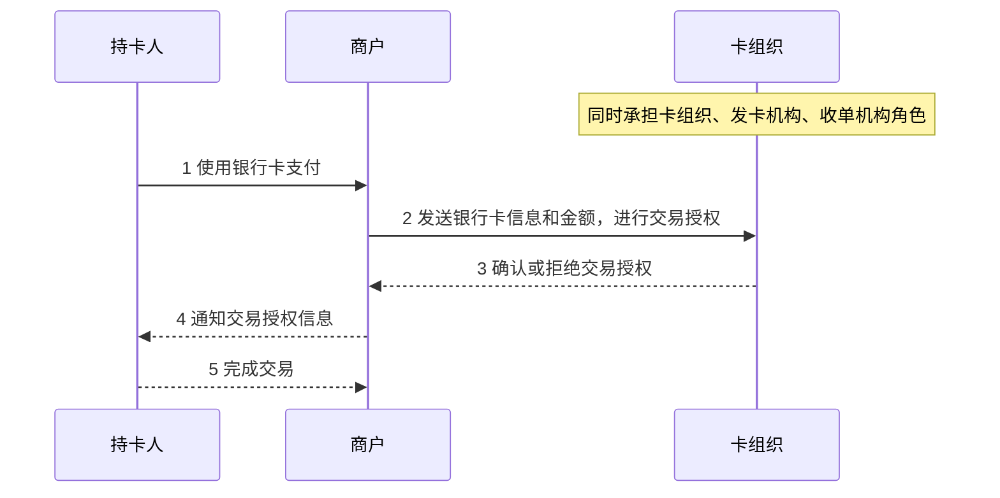
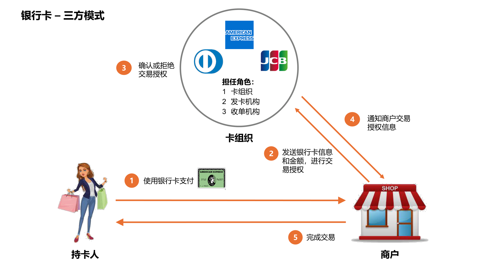
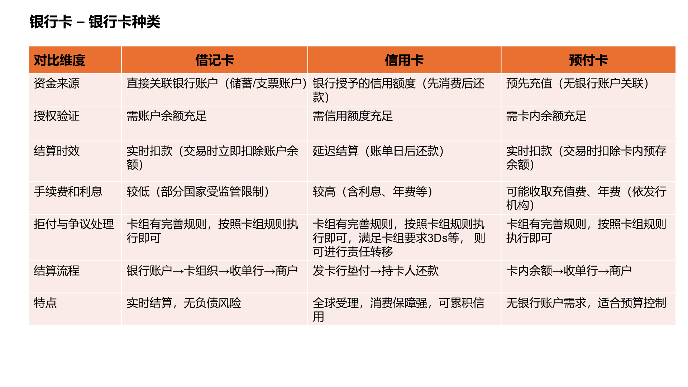
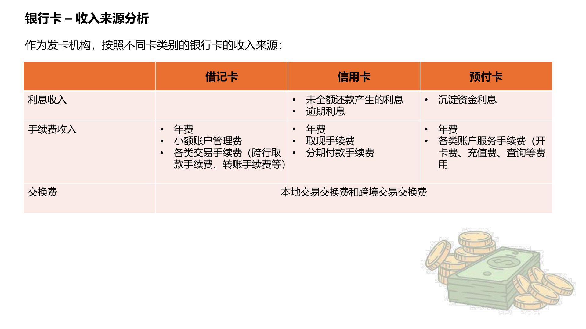
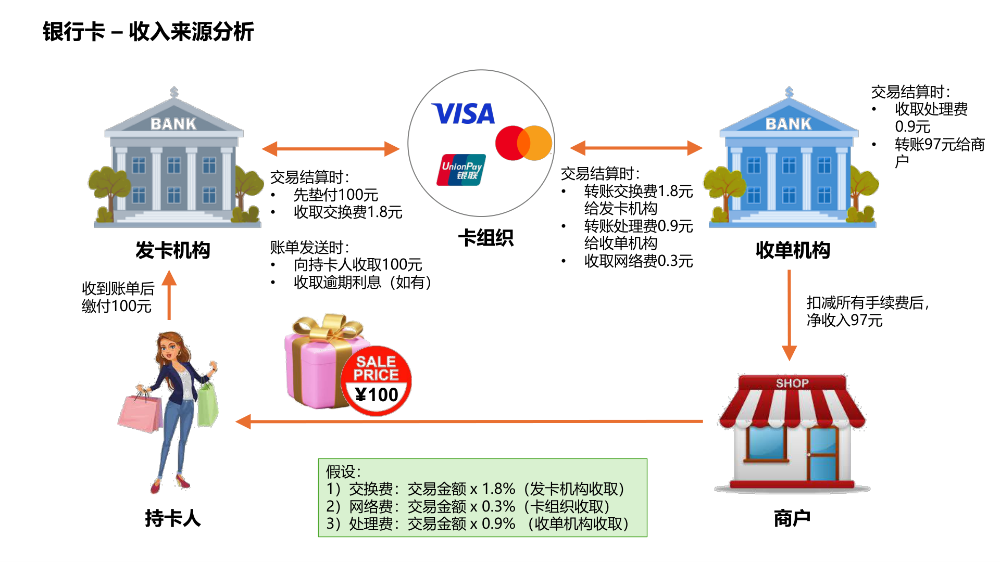
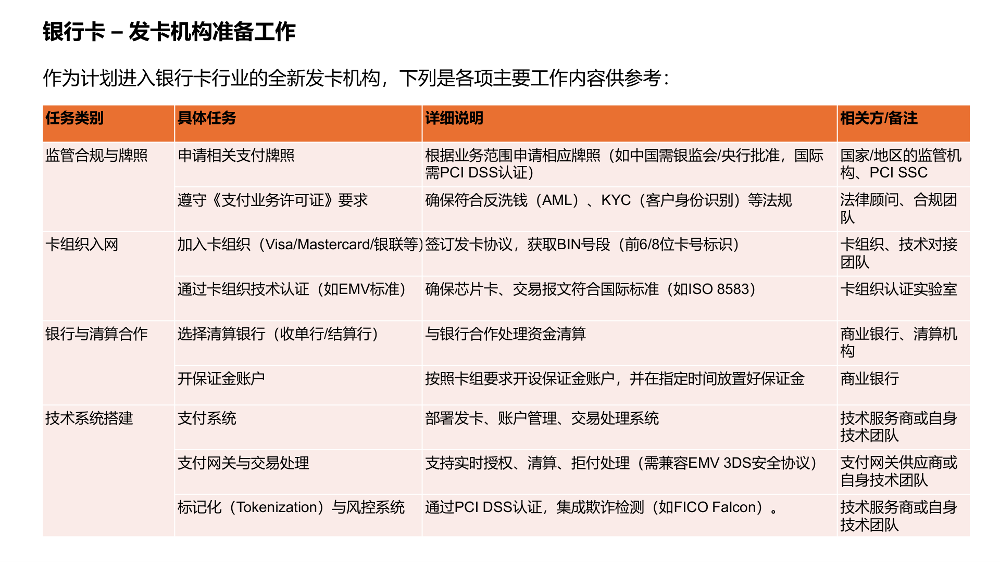
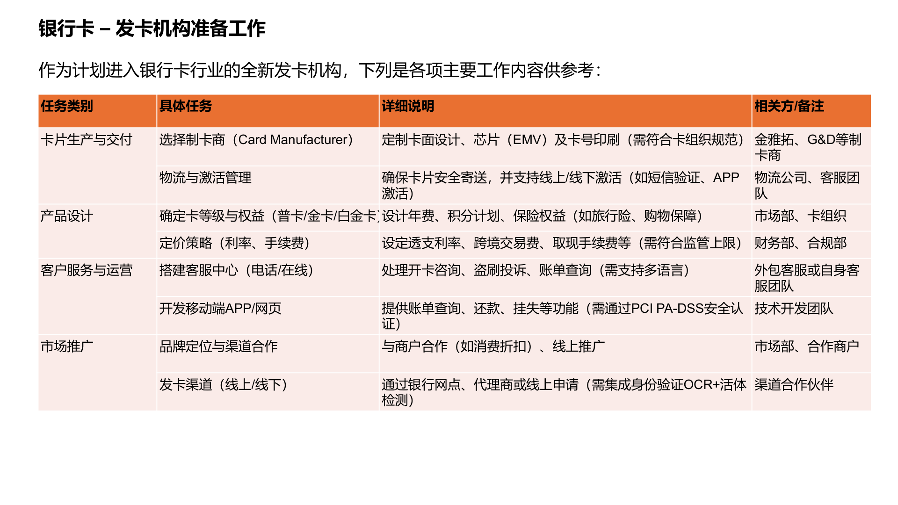
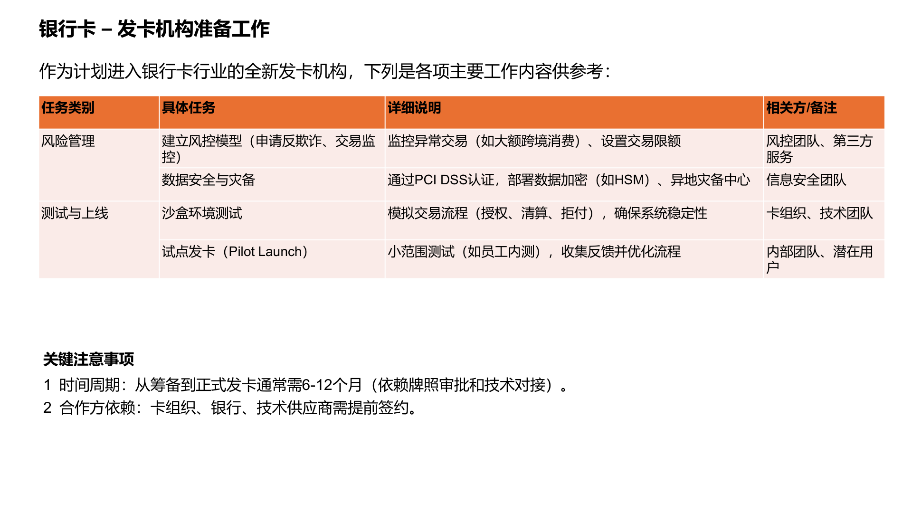

# 银行卡业务介绍

本文仅保留四个核心主题，顺序如下：

1. 三方模式与四方模式
2. 卡产品
3. 收入来源
4. 发卡准备

## 三方模式与四方模式

### 四方模式

四方模式的核心参与方是：

- 持卡人
- 商户
- 收单机构
- 发卡机构

卡组织不计入“四方”本身，但负责连接收单机构和发卡机构，并提供网络与规则体系。

原始图：

### 三方模式

三方模式里，卡组织同时承担：

- 卡组织
- 发卡机构
- 收单机构

因此交易链路比四方模式更短。

原始图：

## 卡产品

### 借记卡、信用卡、预付卡

| 对比维度 | 借记卡 | 信用卡 | 预付卡 |
| --- | --- | --- | --- |
| 资金来源 | 直接关联银行账户（储蓄/支票账户） | 银行授予的信用额度（先消费后还款） | 预先充值（无银行账户关联） |
| 授权验证 | 需账户余额充足 | 需信用额度充足 | 需卡内余额充足 |
| 结算时效 | 实时扣款（交易时立即扣除账户余额） | 延迟结算（账单日后还款） | 实时扣款（交易时扣除卡内预存余额） |
| 手续费和利息 | 较低（部分国家受监管限制） | 较高（含利息、年费等） | 可能收取充值费、年费（依发行机构） |
| 拒付与争议处理 | 按卡组规则执行即可 | 按卡组规则执行，满足 3DS 等要求时可发生责任转移 | 按卡组规则执行即可 |
| 结算流程 | 银行账户 -> 卡组织 -> 收单行 -> 商户 | 发卡行垫付 -> 持卡人还款 | 卡内余额 -> 收单行 -> 商户 |
| 特点 | 实时结算，无负债风险 | 全球受理强，消费保障强，可积累信用 | 无银行账户需求，适合预算控制 |

原始图：

### 信用卡等级

#### Visa 常见等级

| 等级 | 目标客群 | 核心权益 |
| --- | --- | --- |
| Visa Infinite | 超高净值客户 | 机场贵宾厅无限次、专属 VIP 礼宾 |
| Visa Signature | 高端客户 | 免费贵宾厅、旅行保险、酒店优惠 |
| Visa Platinum | 中高端客户 | 基础保险、消费折扣 |
| Visa Gold | 普通优质客户 | 基础权益，如免年费优惠 |
| Visa Classic | 大众客户 | 基础功能，无附加权益 |

#### Mastercard 常见等级

| 等级 | 目标客群 | 核心权益 |
| --- | --- | --- |
| World Elite | 超高净值客户 | 全球机场贵宾厅、专属 VIP 礼宾 |
| World | 高端客户 | 酒店升级、旅行险 |
| Platinum | 中高端客户 | 基础保险和优惠 |
| Gold | 普通优质客户 | 低年费或免年费 |
| Standard | 大众客户 | 基础功能，无额外权益 |

#### 等级差异的核心维度

| 维度 | 高端卡 | 中端卡 | 基础卡 |
| --- | --- | --- | --- |
| 年费 | 高，通常为刚性年费 | 可免，常见为消费达标免年费 | 免年费或极低 |
| 授信额度 | 10 万人民币起 | 5 万至 10 万 | 1 万至 5 万 |
| 申请门槛 | 高收入或资产证明 | 稳定收入（中等） | 稳定收入 |

## 收入来源

### 不同卡种的主要收入来源

| 卡种 | 利息收入 | 手续费收入 | 其他收入 |
| --- | --- | --- | --- |
| 借记卡 | 通常不以利息为主 | 年费、小额账户管理费、跨行取款手续费、转账手续费等 | 本地交易交换费和跨境交易交换费 |
| 信用卡 | 未全额还款利息、逾期利息 | 年费、取现手续费、分期付款手续费 | 本地交易交换费和跨境交易交换费 |
| 预付卡 | 沉淀资金利息 | 开卡费、充值费、查询费等账户服务手续费 | 本地交易交换费和跨境交易交换费 |

原始图：

### 100 元信用卡交易示例

以下示例假设：

- 交换费：交易金额 x 1.8%
- 网络费：交易金额 x 0.3%
- 处理费：交易金额 x 0.9%

对应资金流：

- 持卡人收到账单后缴付 100 元
- 发卡机构获得 1.8 元交换费
- 收单机构获得 0.9 元处理费
- 卡组织获得 0.3 元网络费
- 商户扣减手续费后净收入约 97 元

原始图：

## 发卡准备

### 发卡机构准备工作的总体清单

| 任务类别 | 具体任务 | 详细说明 | 相关方/备注 |
| --- | --- | --- | --- |
| 监管合规与牌照 | 申请相关支付牌照 | 根据业务范围申请相应牌照，并满足 AML、KYC 等要求 | 国家或地区监管机构、合规团队 |
| 卡组织入网 | 加入 Visa、Mastercard、银联等 | 签订发卡协议，获取 BIN 号段，并通过 EMV、ISO 8583 等技术认证 | 卡组织、技术对接团队 |
| 银行与清算合作 | 选择清算银行 | 处理资金清算，并按卡组要求安排保证金账户 | 商业银行、清算机构 |
| 技术系统搭建 | 发卡、账户、交易处理系统 | 覆盖支付系统、支付网关、交易处理、风控和标记化能力 | 技术服务商或自研团队 |
| 卡片生产与交付 | 制卡、物流、激活管理 | 完成卡面设计、芯片方案、制卡和安全寄送激活流程 | 制卡商、物流、客服团队 |
| 产品设计 | 卡等级、权益、定价策略 | 设计年费、积分、保险、利率、跨境费、取现费等 | 市场部、财务部、合规部 |
| 客户服务与运营 | 客服中心、App / 网页 | 提供账单查询、还款、挂失等能力，并支持多语言服务 | 客服团队、技术团队 |
| 市场推广 | 品牌与发卡渠道 | 对接线上线下渠道，并集成 OCR、活体检测等身份验证流程 | 市场部、渠道合作伙伴 |
| 风险管理 | 反欺诈与交易监控 | 监控异常交易、设置交易限额，建设数据安全与灾备能力 | 风控团队、信息安全团队 |
| 测试与上线 | 沙盒测试、试点发卡 | 验证授权、清算、拒付流程，并通过小范围试点优化流程 | 卡组织、技术团队、内部团队 |

关键注意事项：

- 从筹备到正式发卡通常需要 6 至 12 个月。
- 卡组织、银行、技术供应商需要尽早签约。

原始图：

### 采用 BIN 赞助的主要工作项

| 主要工作项 | 具体描述 |
| --- | --- |
| 1）选择合适的 BIN 赞助方 | 候选方通常包括具有卡组织会员资质的商业银行或持牌支付机构。筛选标准包括是否支持目标卡组织、手续费结构、是否提供完整的发卡、清算和合规支持。 |
| 2）签订 BIN 赞助协议 | 明确子 BIN 使用范围、价格和费率、卡面品牌展示要求，以及托管模式下的职责分工，例如交易路由、卡组集成、KYC、AML 由哪一方负责。 |
| 3）技术对接与系统开发 | 对接发卡系统、交易路由、账户管理等模块。常见路径是直接 API 对接，或采用赞助方/第三方提供的 SaaS 平台。 |
| 4）银行卡发行与运营 | 覆盖实体卡和虚拟卡发行、资金流、清算周期和客服支持。 |
| 5）合规与风险管理 | 同时满足本地监管要求和 Visa、Mastercard 等卡组规则。 |

### 全托管与部分托管模式对比

| 维度 | 全托管模式 | 部分托管模式 |
| --- | --- | --- |
| 定义 | 赞助方承担全部技术、合规和运营责任，合作方主要提供用户或场景入口 | 赞助方负责核心支付功能，合作方参与部分运营，如权益发放、用户分层 |
| 适合场景 | 追求快速上线 | 需要灵活运营用户，但核心支付能力仍由赞助方承接 |
| 卡号生成 | 赞助方统一分配 | 赞助方分配主 BIN，合作方生成子卡号 |
| 交易路由 | 由赞助方直接处理 | 核心交易由赞助方处理，合作方可拦截附加请求 |
| 风控 | 完全依赖赞助方 | 赞助方基础风控 + 合作方自定义规则 |
| 数据权限 | 合作方通常仅获取交易结果 | 合作方可获取部分交易明细 |

来源文件：`resources/fintech/银行卡业务介绍.pdf`
