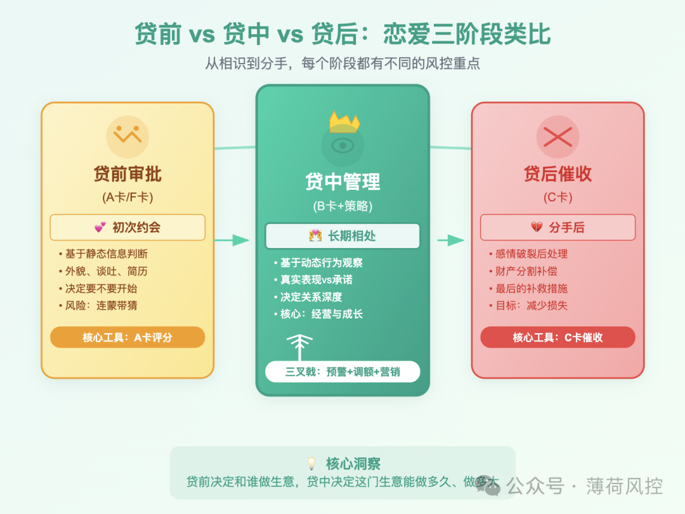
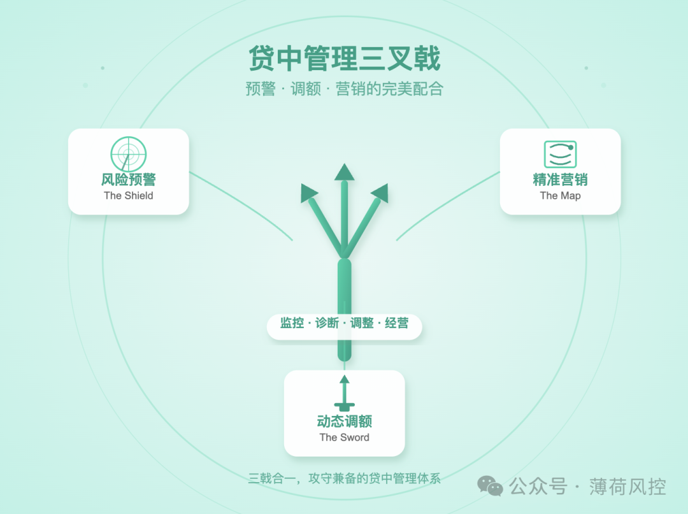
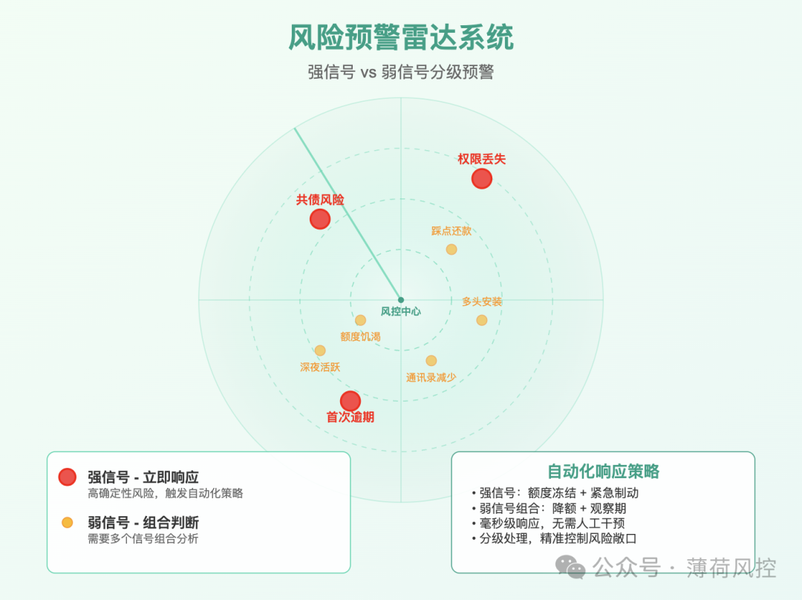
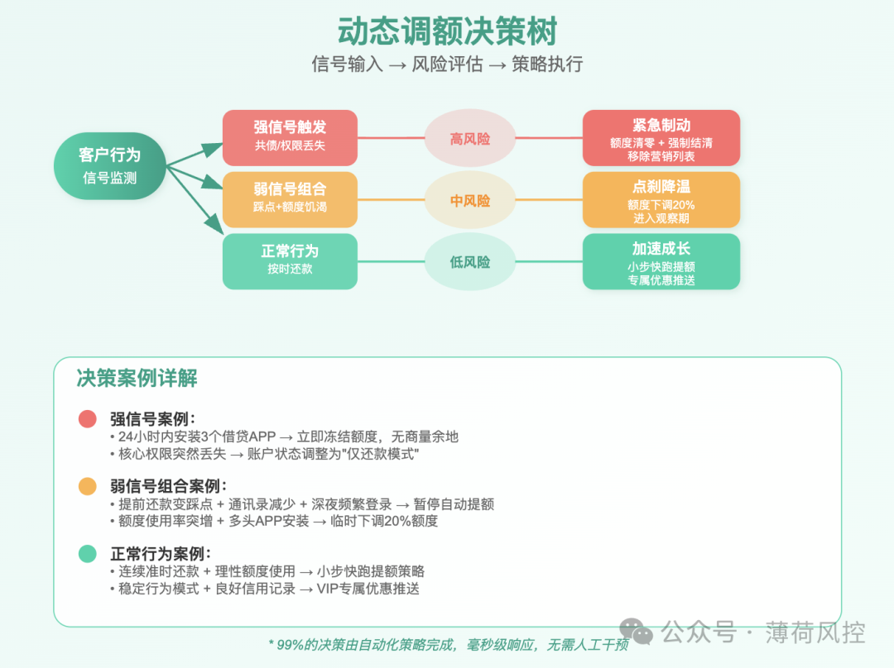
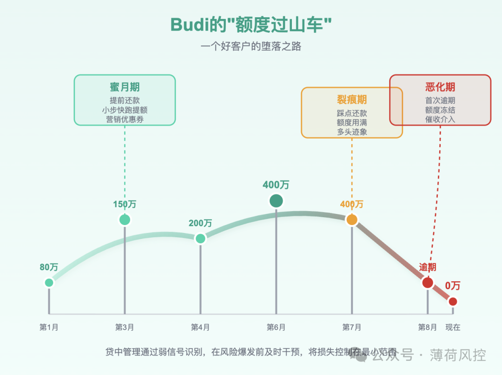

### **之前，我们一起扒了扒“ABCF卡”这个风控黑话，聊了聊它们各自的身份。**

文章发出去之后，后台收到了很多朋友的私信。

其中有一条，让我印象特别深：

> ❝
> 
> “原来B卡这么牛，看来贷中管理的核心，就是把B卡模型做好就行了？”

看到这个问题，我愣了一下  

温度计（B卡）当然重要，它告诉你病人的体温。

但真正让病人活下来的，是背后那一整套由心电监护、呼吸机、输液泵和医生护士组成的、24小时运转的**生命维持系统**。

这个系统，就是**贷中管理**。

B卡，只是这个庞大系统暴露在外的，一个最直观的读数而已。

今天，我想和你深入聊聊贷中管理这场“无声的战争”到底是怎么打的。

这不仅关乎风险，更关乎增长，关乎一家信贷公司的生死存亡。

* * *

### **为什么说贷中，才是风控的重头戏？**

在很多人的认知里，风控的重头戏在贷前。

毕竟，把坏人挡在门外，是风险管理的第一道，也是最重要的一道防线。

这个观点，没错。

但它只说对了一半。

如果把信贷业务比作一场恋爱：

*   **贷前审批（A卡/F卡）**，是你在茫茫人海中，决定要不要和这个人开始约会。
    
    你依据的是他的外貌、谈吐、简历（静态信息）。
    
*   **贷后催收（C卡）**，是你们感情破裂，分手后，讨论财产分割和补偿的问题。
    
    这是最后的补救措施。
    

而**贷中管理**，则是你们确定关系后，那段漫长的、充满变数的**相处过程**。

这个人是不是真的像他当初说的那样？

他的财务状况是变好了还是变坏了？

你们的关系是应该“加大投入”还是“及时止损”？

这些，才是决定这段关系最终走向的关键。

尤其是在印尼、墨西哥这样的新兴市场，贷前能获取的信息极其有限。

A卡的判断，很大程度上是“连蒙带猜”。

在这种环境下，贷中管理的重要性，被无限放大了。

> ❝
> 
> **贷前决定了我们和谁做生意，而贷中决定了这门生意能做多久、做多大。**

贷中管理，不仅仅是“防守”，它更是“经营”。

它是一个集**监控、诊断、调整、经营**于一体的动态闭环。

它决定了你的用户生命周期价值（LTV）是10美金，还是1000美金。

可以说，贷中，才是整个信贷风控宇宙的重头戏。

* * *

### **贷中管理的“三叉戟”：预警、调额、营销**

说了这么多贷中的重要性，那它具体是怎么运作的？

在我看来，一个成熟的贷中管理体系，就像海神波塞冬手中的三叉戟。

它由三个紧密配合、缺一不可的部分组成：

1.  **风险预警（The Shield）：** 风险的“雷达”与“盾牌”。
    
2.  **动态调额（The Sword）：** 奖优罚劣的“利剑”。
    
3.  **精准营销（The Map）：** 驱动增长的“地图”。
    

下面，我们一根一根地，把这三根“神戟”拆开来看。

#### **第一根神戟：风险预警 · 不仅仅是B卡分数**

风险预警，是贷中管理的基石。

它的任务，是在客户“暴雷”之前，尽可能早地发现危险信号。

B卡分数是预警系统最核心的产出，但它不是全部。

一个B卡分数，背后是成百上千个特征变量在共同作用。

作为模型工程师，我们更关注的，是那些构成B卡分数的“领先指标”（Leading Indicators）。

这些信号，按照紧急程度，可以分为“强信号”和“弱信号”。

*   **强信号：高确定性的危险警报**
    

强信号，就像是战场的“狼烟”，一旦出现，就意味着敌人已经兵临城下。

它直接、明确，指向一个大概率会发生的坏结果。

在印尼做现金贷时，我们最头疼的就是“共债”风险。

一个客户，可能在短短一周内，从5-10个不同的平台借钱。

他的总负债已经远远超出了他的还款能力。

他不是不想还，是根本还不起。

怎么发现这种“共债”行为？在用户授权的前提下，我们会分析他手机里的APP列表。

如果我们的系统监测到，一个客户在过去24小时内，新安装了3个以上我们已知的、同类型的借贷APP。

> ❝
> 
> 这是一个极其强烈的**共债强信号**。
> 
> 这时候，B卡分数可能还没来得及更新，但这个行为本身，已经足够触发高级别的警报。

再比如，我们发现，有一批客户在准备“跑路”前，会直接卸载APP，或者关闭所有的网络和权限。

于是，“**核心权限在贷后周期内突然丢失**”，也成了一个强信号。

强信号的特点是：**宁可错杀，不可放过**。

一旦触发，必须有自动化策略立刻响应，比如马上冻结额度。

*   **弱信号：需要组合判断的蛛丝马迹**
    

如果说强信号是火灾报警器，那弱信号就是空气中那一丝烧焦的味道。

它本身不致命，但多个弱信号组合在一起，就构成了危险的图景。

> ❝
> 
> **真正的高手，闻到味道就开始行动了。**

我举几个我们曾经用过的弱信号：

1.  **还款行为的微小变化：** 一个一直提前3天还款的优质客户，这个月突然变成了踩着还款日最后一小时才还。
    
    这说明什么？他的现金流，可能开始紧张了。这是一个弱信号。
    
2.  **通讯录的异常变动：** 我们发现，一些高风险客户，在逾期前，通讯录联系人数量会“恰好”减少。
    
    他们可能在手动删除一些重要联系人，以躲避催收。这又是一个弱信号。
    
3.  **深夜的活跃行为：** 一个客户，总是在凌晨2点到4点之间，频繁登录APP，查看自己的额度，或者反复尝试借款。
    
    这往往是赌徒或者财务极度困难的人才会有的行为。这还是一个弱信号。
    

单一的弱信号，我们可能只会默默记上一笔。

但如果：

> ❝
> 
> “一个客户，从提前还款变成了踩点还款（弱信号1）
> 
> 同时我们发现他的通讯录少了20个人（弱信号2）
> 
> 并且他最近总是在半夜刷我们的APP（弱信号3）

当这三个弱信号同时出现，系统就会将它们组合，升级为一个“中等强度”的预警事件。

可能不会立刻冻结他的额度，但会把他放进一个“重点观察名单”里。

风险预警，就是这样一门通过解读“信号”来预测未来的艺术。

_**它需要模型，但更需要对人性的洞察。**_

#### **第二根神戟：动态调额 · 风控的缰绳与利剑**

如果说风险预警是“看”，那么动态调额就是“做”。

它是贷中管理体系里，最直接、最有效的干预手段。

**额度，是风控的生命线，也是增长的发动机。**

> ❝
> 
> 额度是风控的缰绳，拉得太紧会勒死增长，放得太松会被风险拖下悬崖。

动态调额，包含两个方向：**提额**和**降额**。

*   **提额：增长的艺术**
    

不要以为贷中只有风控，贷中同样是驱动增长的核心。

_**一个健康的信贷业务，一定是老客户的复购和额度提升，贡献了绝大部分的利润。**_

怎么提额？这绝对不是简单地“B卡分高了就提”。

在印尼，我们采用的是一种“**小步快跑**”的策略。

一个新客户，初始额度可能只有50万印尼盾（约合200多人民币）。

当他第一次准时还款后，B卡分上升，系统可能会自动给他提升到70万印尼盾。

我们在观察，给他更多的钱，他会不会“变坏”？

如果他在70万的额度上，又连续两次准时还款，并且额度使用率保持在健康水平。

OK，系统会判定他是一个理性的、有成长潜力的客户。

下一次，额度可能会提升到120万印尼盾。

通过这种小额、高频的互动，我们筛选出了一大批忠诚且优质的客户。

这种持续的正向反馈，也极大地提升了用户的黏性。

*   **降额/冻结：风险的刹车**
    

降额，是动态调额的另一面，是风控最硬核的手段。

它必须像外科手术一样，精准、快速、果断。

什么时候降？降多少？这背后是一套复杂的矩阵式规则策略。

这套策略，会把我们前面提到的“强弱信号”作为输入。

> ❝
> 
> **强信号 = 紧急制动。**
> 
> 比如，一旦触发了“多头借贷”的强信号，系统会立即执行“**额度清零，强制结清**”的策略。
> 
> 也就是，他的可用额度瞬间变为0，并且在还清当前这笔欠款之前，无法再发起任何借款。这是最严厉的惩罚，没有任何商量的余地。

> ❝
> 
> **弱信号组合 = 点刹降温。**
> 
> 比如，当“踩点还款 + 通讯录减少”这两个弱信号组合出现时，系统可能不会一刀切地冻结额度。它会执行一个临时性额度下调20%的策略。
> 
> 同时，系统会给他打上一个“观察期”标签。如果他在下一个借款周期内，行为恢复正常，额度可以自动恢复。如果行为继续恶化，那么降额幅度会进一步加大。

这套动态调额的策略，就像一个经验丰富的老司机。

面对不同的路况（客户风险信号），他知道什么时候该踩油门（提额），什么时候该点刹车（降额），什么时候该拉手刹（冻结）。

而这一切，99%都是由自动化策略完成的，毫秒级响应，无需人工干预。

#### **第三根神戟：精准营销 · 让好客户如沐春风**

你可能会觉得奇怪，营销不是市场部的事吗？

怎么也成了贷中风控的一部分？

这恰恰是很多人最大的误区。

**贷中和营销，从来都不是两张皮。**

贷中管理产生的海量行为数据和风险标签，是进行精准营销和用户运营，最宝贵的“金矿”。

_**最好的风控，是让好客户觉得如沐春风，让坏客户觉得寸步难行，而这一切都发生在悄无声息之间。**_

怎么做到？

*   **对优质客户（高B分，行为稳定）：**
    

*   **推送“专属”利率优惠券：** “尊敬的VIP客户，感谢您一直以来的信任，现赠送您一张8折利率优惠券，复借时可使用。”
    
*   **开放新产品白名单：** 当我们推出一个新的、额度更高、周期更长的分期产品时，第一批受邀体验的，一定是这些经过贷中体系验证的优质客户。
    

*   **对“沉睡”客户（曾经使用，但近期未复借）：**
    

*   **触发式唤醒：** 一个客户，3个月前还清了所有借款，至今没有再来。贷中系统会给他打上“沉睡可唤醒”的标签。
    
    运营同学可以配置策略，给这类用户推送一条：“Hi，老朋友，好久不见，我们给您准备了一份免息券，回来看看吧？”
    

*   **对“边缘”客户（B分中等，行为摇摆）：**
    

*   **谨慎触达，以稳为主：** 对这类客户，我们不会用高额度去诱惑他，也不会用大力度优惠去刺激他。营销策略会非常保守。
    

*   **对高风险客户（B分持续走低）：**
    

*   **营销“拉黑”：** 这是最重要的一点。一旦一个客户被贷中预警系统标记为高风险，他必须被立刻移出所有的营销活动列表！
    

一个好的贷中体系，必然是风控和业务深度绑定的。

_**风控的产出，直接指导了业务的精细化运营，形成了一个完美的增长飞轮。**_

* * *

### **实战复盘：Budi的“额度过山车”，一个“好客户”的堕落之路**

理论说了这么多，可能还是有些抽象。下面，我给你讲一个更经典、更具代表性的贷中故事（虚构）。

这个故事里没有惊天动地的团伙欺诈，只有一个普通印尼客户，在我们的贷中体系里，坐上了一趟真实的“额度过山车”。

这，才是贷中管理最日常，也最真实的模样。

故事的主人公，我们叫他Budi。

Budi是我们眼中最典型的那种印尼年轻客户：25岁，在雅加达一家中型公司做销售，月收入不算高，但胜在年轻，有活力，对数字金融产品接受度很高。

#### **第一阶段：蜜月期 · “小步快跑”的增长飞轮**

Budi第一次来到我们平台，A卡给他的分数中等偏上。

资料真实，没有明显的欺诈疑点，但也没有亮眼的资产证明。

按照标准流程，我们给了他一个非常谨慎的初始额度：**80万印尼盾**（约合人民币350元）。

这个额度很小，对我们来说，风险极低。它像是一个“试探气球”，我们想看看Budi的真实表现。

Budi的表现，堪称完美。

*   **第一次借款：** 借了60万，用了15天，**提前3天**还款。
    
*   **第二次借款：** 第一次还款后，他的B卡分立刻有了一次小幅上涨。系统自动将他的额度提升至**100万印尼盾**。
    
    同时，营销系统给他推送了一张“复借9折利率券”。Budi很快再次借款，这次，他**提前2天**还款。
    
*   **第三、四、五次借款：** 这个正向循环持续了下去。Budi每次都准时或提前还款，行为记录非常干净。
    
    我们的贷中系统，像一个耐心的园丁，不断地给他“浇水施肥”。
    
    他的额度也遵循着“**小步快跑**”的原则，从100万 -> 150万 -> 200万印尼盾，稳步提升。
    

在贷中系统眼里，Budi被打上了一系列闪亮的标签：【高价值潜力】、【早鸟还款】、【利率敏感】。

他成了营销部门的“宠儿”，专属优惠券、提额提醒、新产品优先体验的推送，一个接一个。

到第六个月时，Budi的额度已经达到了**400万印尼盾**。他从一个“路人甲”，成长为了我们的“准VIP客户”。

这一切，都是自动化策略的功劳。

贷中系统通过观察他的良好行为，主动用“提额”和“优惠”这根胡萝卜，将他牢牢地拴在了我们的增长战车上。

如果没有后续的变故，这本该是一个完美的LTV（用户生命周期价值）增长故事。

但风险，总是在你最意想不到的时候，悄悄敲门。

#### **第二阶段：裂痕期 · 来自弱信号的“窃窃私语”**

从第七个月开始，Budi的行为模式，出现了一些我们肉眼难以察觉，但数据却能捕捉到的微小变化。

贷中预警系统的“雷达”上，开始出现一些微弱的“信号点”。

1.  **还款“踩点”：** 那个总是提前还款的Budi消失了。他开始踩着还款日的最后几个小时还款。
    
    这本身不违约，但这个行为模式的**突变（Sharp Change）**，是一个值得警惕的弱信号。它说明，Budi的现金流，可能不像以前那么充裕了。
    
2.  **额度“饥渴”：** 以前，Budi借款通常只使用额度的60%-70%，非常克制。
    
    但现在，他连续两次，都把400万的额度**一次性用满**。这说明他的资金需求，突然变得非常迫切。
    
3.  **多头迹象：** 在用户授权下，我们的数据接口发现，Budi的手机里，最近新安装了2个我们认识的、规模较小的现金贷APP。
    
    这又是一个弱信号，表明他可能在“货比三家”，或者，他现有的额度已经无法满足他的需求。
    

这三个弱信号，任何一个单独出现，都不足以触发警报。

但我们的贷中策略引擎，会将它们组合起来。

> ❝
> 
> **当【还款踩点】+【额度用满】+【多头安装】这三个弱信号同时命中一个客户时，系统判定：该客户的风险等级，需要从“低”调整为“中”。**

于是，贷中“三叉戟”开始调整姿态。

*   **营销（The Map）**：系统自动将Budi从“VIP营销列表”中移除。
    
    那些诱人的8折利率券、提额活动推送，都悄悄地停止了。
    
    我们不想再用任何“胡萝卜”去刺激他，让他陷得更深。
    
*   **调额（The Sword）**：系统暂停了对Budi的“自动提额”资格。
    
    当他这次还清400万借款后，系统没有像往常一样给他提升额度，而是将额度**维持在400万不变**。
    

这是一种“**保守观察**”策略。我们没有一棒子打死他，但已经悄悄地收紧了缰绳。

我们想看看，在没有额外激励的情况下，Budi接下来的行为是会改善，还是会继续恶化。

#### **第三阶段：恶化期 · 强信号拉响“红色警报”**

Budi的行为，没有像我们期望的那样好转。

第八个月，他再次借走了400万。

这一次，最糟糕的情况发生了。

在还款日当天，他没有还款。**他逾期了。**

这是他与我们平台建立关系以来，第一次逾期。

> ❝
> 
> **“首次逾期（First Payment Default）”，这是一个威力巨大的强信号。**
> 
> 它像一颗重磅炸弹，瞬间将Budi的B卡分数，从一个健康的高位，炸到了不及格的区域。

贷中系统立刻被激活，执行了更激进的“**紧急制动**”策略。

1.  **额度冻结：** Budi的账户额度，被系统**瞬间清零**。
    
    他的账户状态被调整为“**仅还款模式（Repay-Only）**”。
    
    这意味着，即使他现在立刻还清这笔逾期欠款，他也一分钱都借不出来了。
    
    我们必须在他还清后，进入一个长达数月的“冷静期”，重新评估他的风险。
    
2.  **催收联动：** Budi的名字，立刻被推送到了C卡（催收评分卡）模型。
    
    C卡模型结合他逾期前的种种弱信号（踩点、额度饥渴、多头），给出了一个很低的催收分数。
    
    这意味着，他被判定为“**高风险失联人群**”，需要经验更丰富的催收员，立即进行电话跟进，而不是仅仅发一条短信提醒。
    

果然，催收员联系上Budi后，他才在电话里支支吾吾地承认，自己前段时间买了一辆新摩托车，分期付款的压力很大，导致资金链断裂。

他在逾期后的第十天，终于凑够钱还上了这笔借款。

#### **故事的结局**

Budi还清欠款后，发现自己的额度变成了0。

他曾经是我们最喜欢的“好客户”，但现在，他在贷中系统里的画像，已经是一个【高风险】、【有逾期史】、【多头负债】的“坏客户”。

他需要很长一段时间的良好信用行为（比如在其他金融机构的），才有可能重新获得我们的信任。

而对于我们平台来说，Budi这个案例，是**一次成功的贷中风险管理**。

我们损失了吗？

是的，我们损失了三天的罚息收入（如果他一直不还，会损失本金），更重要的是，我们损失了一个曾经高价值的客户。

但我们成功了吗？

**非常成功。**

因为，如果没有贷中系统那一连串从“暂停营销”、“维持额度”到“紧急冻结”的递进式操作，Budi的额度很可能已经自动涨到了600万、800万。

当他资金链断裂时，我们面临的，将是一个两倍于此的风险敞口，和一个更加难以挽回的坏账损失。

_**贷中管理的核心，不是杜绝所有损失，而是在风险的“温水煮青蛙”过程中，及时跳出来，将损失控制在最小的范围内。**_

Budi的“额度过山车”，每天都在我们数以万计的客户中上演。

这背后，没有硝烟，没有搏斗。

只有数据在无声地流淌，策略在冷静地执行。

这，就是贷中管理的真实战场。

* * *

### **写在最后**

贷中管理，是一个永远没有最优解的战场。

因为你的对手——风险，永远在变化。

今天你防住了“共债”，明天可能就会出现新的“套现”手法。

它要求我们，必须像一个永不停歇的雷达，持续地扫描、学习、进化。

它也要求我们，必须打破部门墙，让数据在风控、市场、产品、运营之间，真正地流动起来。

希望今天这篇超长的分享，能让你对贷中管理这座“冰山”，有一个更立体、更深入的认识。

如果你觉得这篇文章，让你对风控的理解，又深入了一些，请**点赞、在看、转发、一键三连**。

咱们下期见。

【往期内容】

[聊聊我们是怎么赚钱的？](https://mp.weixin.qq.com/s?__biz=Mzk2NDUzNzUwNw==&mid=2247484160&idx=1&sn=54be6ce0e6dad2ac6321a24e8feba825&scene=21#wechat_redirect)

[风控圈黑话“A B C F卡”，到底是个啥？](https://mp.weixin.qq.com/s?__biz=Mzk2NDUzNzUwNw==&mid=2247484102&idx=1&sn=ec96759ff5f1120e1e6ed307dc2750d4&scene=21#wechat_redirect)

[聊聊？我们招人。](https://mp.weixin.qq.com/s?__biz=Mzk2NDUzNzUwNw==&mid=2247484024&idx=1&sn=bf7003c39bdfe290b6884a22474116d0&scene=21#wechat_redirect)

---

原文链接：https://mp.weixin.qq.com/s/qxG_0vR2UYnWLX6u8UCAQw
