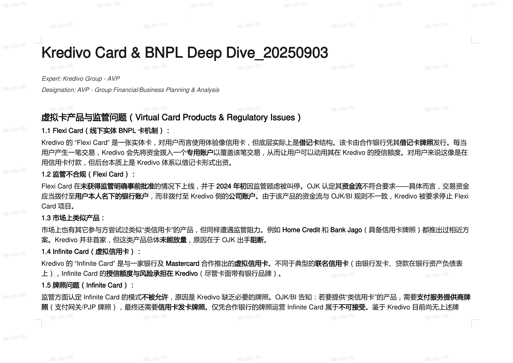
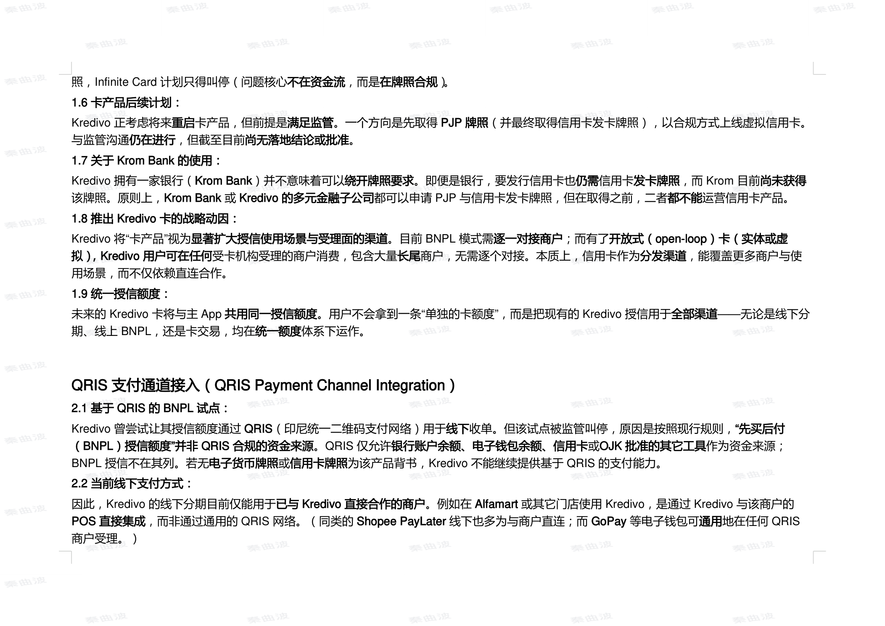
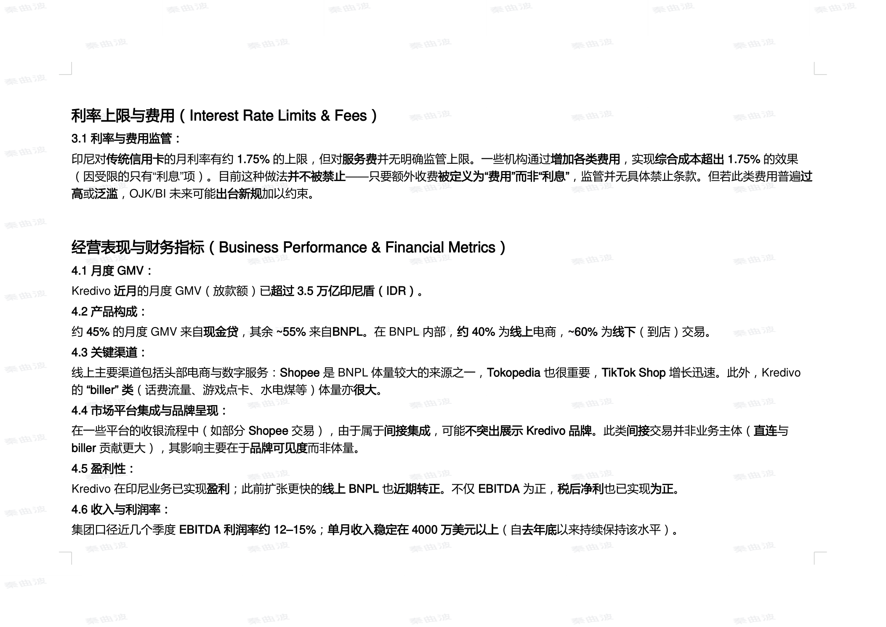
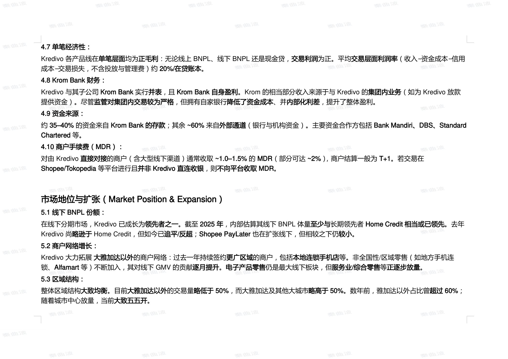
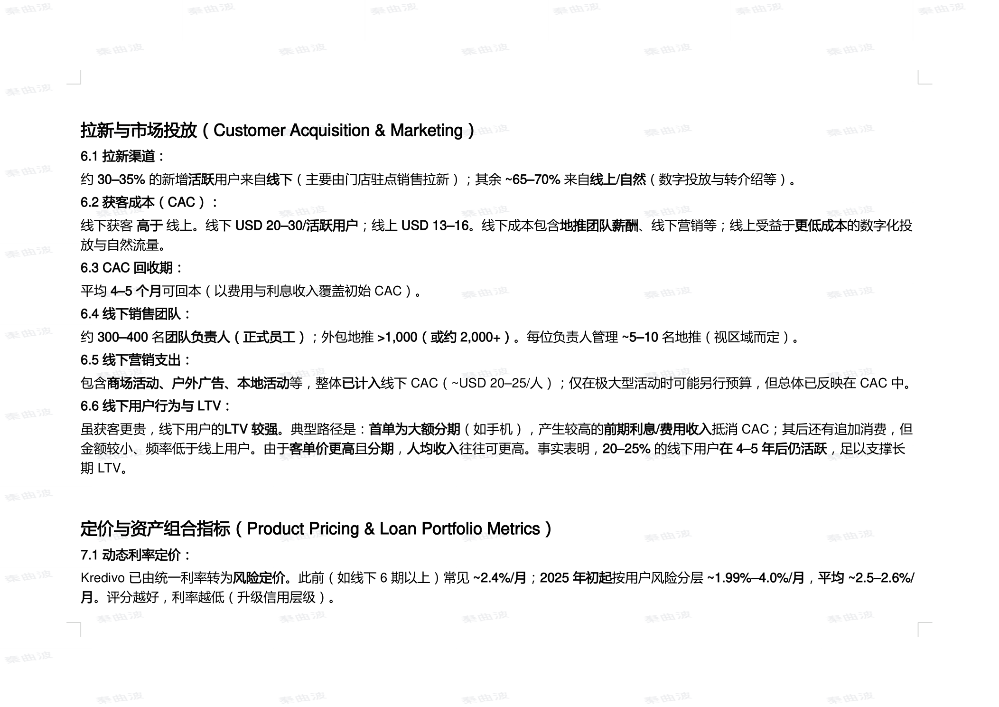
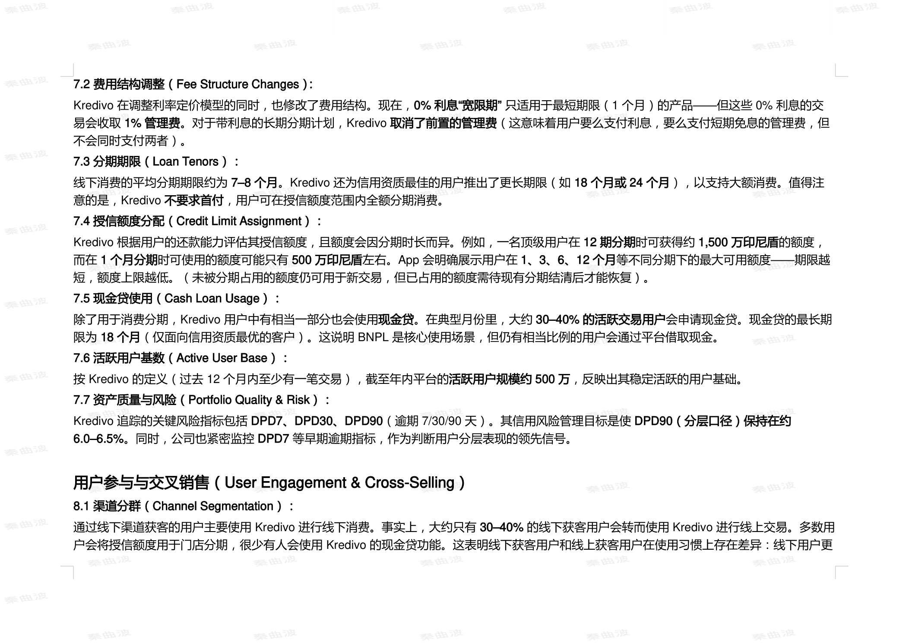
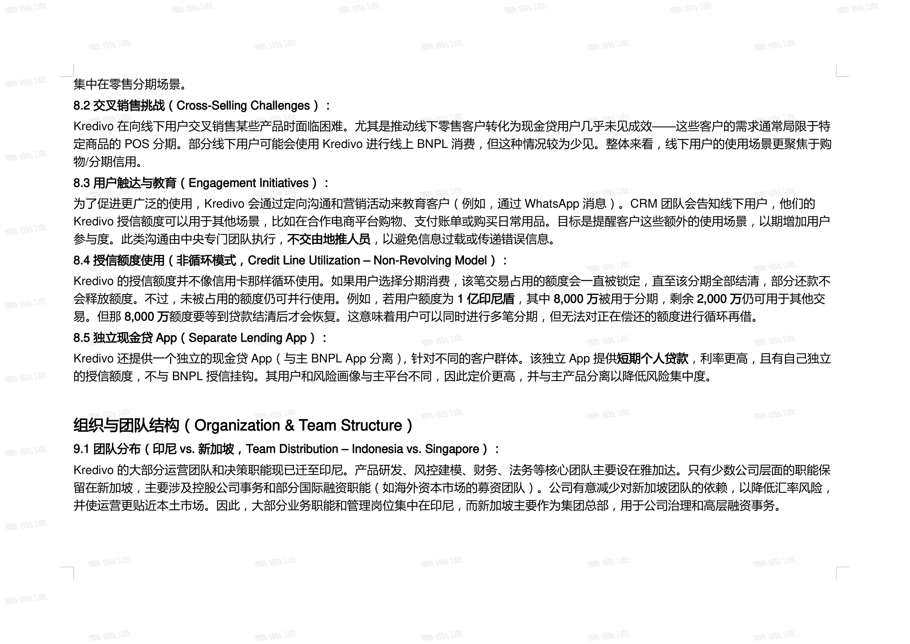

# **Kredivo Card & BNPL Deep Dive_20250903**

Expert: Kredivo Group - AVP

Designation: AVP - Group Financial/Business Planning & Analysis

## **虚拟卡产品与监管问题（Virtual Card Products & Regulatory Issues）**

**1.1 Flexi Card（线下实体 BNPL 卡机制）：**

Kredivo 的 “Flexi Card” 是一张实体卡，对用户而言使用体验像信用卡，但底层实际上是 **借记卡** 结构。该卡由合作银行凭其 **借记卡牌照** 发行。每当
用户产生一笔交易，Kredivo 会先将资金拨入一个 **专用账户** 以覆盖该笔交易，从而让用户可以动用其在 Kredivo 的授信额度。对用户来说这像是在
用信用卡付款，但后台本质上是 Kredivo 体系以借记卡形式出资。

**1.2 监管不合规（Flexi Card）：**

Flexi Card 在 **未获得监管明确事前批准** 的情况下上线，并于 **2024 年初** 因监管顾虑被叫停。OJK 认定其 **资金流** 不符合要求——具体而言，交易资金
应当拨付至 **用户本人名下的银行账户** ，而非拨付至 Kredivo 侧的 **公司账户** 。由于该产品的资金流与 OJK/BI 规则不一致，Kredivo 被要求停止 Flexi
Card 项目。

**1.3 市场上类似产品：**

市场上也有其它参与方尝试过类似“类信用卡”的产品，但同样遭遇监管阻力。例如 **Home Credit** 和 **Bank Jago** （具备信用卡牌照）都推出过相近方
案。Kredivo 并非首家，但这类产品总体 **未能放量** ，原因在于 OJK 出手 **阻断** 。

**1.4 Infinite Card（虚拟信用卡）：**

Kredivo 的 “Infinite Card” 是与一家银行及 **Mastercard** 合作推出的 **虚拟信用卡** 。不同于典型的 **联名信用卡** （由银行发卡、贷款在银行资产负债表
上），Infinite Card 的 **授信额度与风险承担在 Kredivo** （尽管卡面带有银行品牌）。

**1.5 牌照问题（Infinite Card）：**

监管方面认定 Infinite Card 的模式 **不被允许** ，原因是 Kredivo 缺乏必要的牌照。OJK/BI 告知：若要提供“类信用卡”的产品，需要 **支付服务提供商牌**
**照** （支付网关/PJP 牌照），最终还需要 **信用卡发卡牌照** 。仅凭合作银行的牌照运营 Infinite Card 属于 **不可接受** 。鉴于 Kredivo 目前尚无上述牌

照，Infinite Card 计划只得叫停（问题核心 **不在资金流** ，而是 **在牌照合规** ）。

**1.6 卡产品后续计划：**

Kredivo 正考虑将来 **重启** 卡产品，但前提是 **满足监管** 。一个方向是先取得 **PJP 牌照** （并最终取得信用卡发卡牌照），以合规方式上线虚拟信用卡。
与监管沟通 **仍在进行** ，但截至目前 **尚无落地结论或批准** 。

**1.7 关于 Krom Bank 的使用：**

Kredivo 拥有一家银行（ **Krom Bank** ）并不意味着可以 **绕开牌照要求** 。即便是银行，要发行信用卡也 **仍需** 信用卡 **发卡牌照** ，而 Krom 目前 **尚未获得**
该牌照。原则上， **Krom Bank** 或 **Kredivo 的多元金融子公司** 都可以申请 PJP 与信用卡发卡牌照，但在取得之前，二者 **都不能** 运营信用卡产品。

**1.8 推出 Kredivo 卡的战略动因：**

Kredivo 将“卡产品”视为 **显著扩大授信使用场景与受理面的渠道** 。目前 BNPL 模式需 **逐一对接商户** ；而有了 **开放式（open-loop）卡（实体或虚**
**拟），Kredivo 用户可在任何** 受卡机构受理的商户消费，包含大量 **长尾** 商户，无需逐个对接。本质上，信用卡作为 **分发渠道** ，能覆盖更多商户与使
用场景，而不仅依赖直连合作。

**1.9 统一授信额度：**

未来的 Kredivo 卡将与主 App **共用同一授信额度** 。用户不会拿到一条“单独的卡额度”，而是把现有的 Kredivo 授信用于 **全部渠道** ——无论是线下分
期、线上 BNPL，还是卡交易，均在 **统一额度** 体系下运作。

## **QRIS 支付通道接入（QRIS Payment Channel Integration）**

**2.1 基于 QRIS 的 BNPL 试点：**

Kredivo 曾尝试让其授信额度通过 **QRIS** （印尼统一二维码支付网络）用于 **线下** 收单。但该试点被监管叫停，原因是按照现行规则， **“先买后付**
**（BNPL）授信额度”并非 QRIS 合规的资金来源** 。QRIS 仅允许 **银行账户余额、电子钱包余额、信用卡** 或 **OJK 批准的其它工具** 作为资金来源；
BNPL 授信不在其列。若无 **电子货币牌照** 或 **信用卡牌照** 为该产品背书，Kredivo 不能继续提供基于 QRIS 的支付能力。

**2.2 当前线下支付方式：**

因此，Kredivo 的线下分期目前仅能用于 **已与 Kredivo 直接合作的商户** 。例如在 **Alfamart** 或其它门店使用 Kredivo，是通过 Kredivo 与该商户的
**POS 直接集成** ，而非通过通用的 QRIS 网络。（同类的 **Shopee PayLater** 线下也多为与商户直连；而 **GoPay** 等电子钱包可 **通用** 地在任何 QRIS

商户受理。）

## **利率上限与费用（Interest Rate Limits & Fees）**

**3.1 利率与费用监管：**

印尼对 **传统信用卡** 的月利率有约 **1.75%** 的上限，但对 **服务费** 并无明确监管上限。一些机构通过 **增加各类费用** ，实现 **综合成本超出 1.75%** 的效果
（因受限的只有“利息”项）。目前这种做法 **并不被禁止** ——只要额外收费 **被定义为“费用”而非“利息”** ，监管并无具体禁止条款。但若此类费用普遍 **过**
**高** 或 **泛滥** ，OJK/BI 未来可能 **出台新规** 加以约束。

## **经营表现与财务指标（Business Performance & Financial Metrics）**

**4.1 月度 GMV：**

Kredivo **近月** 的月度 GMV（放款额）已 **超过 3.5 万亿印尼盾（IDR）** 。

**4.2 产品构成：**

约 **45%** 的月度 GMV 来自 **现金贷** ，其余 **~55%** 来自 **BNPL** 。在 BNPL 内部， **约 40%** 为 **线上** 电商， **~60%** 为 **线下** （到店）交易。

**4.3 关键渠道：**

线上主要渠道包括头部电商与数字服务： **Shopee** 是 BNPL 体量较大的来源之一， **Tokopedia** 也很重要， **TikTok Shop** 增长迅速。此外，Kredivo
的 **“biller” 类** （话费流量、游戏点卡、水电煤等）体量亦 **很大** 。

**4.4 市场平台集成与品牌呈现：**

在一些平台的收银流程中（如部分 **Shopee** 交易），由于属于 **间接集成** ，可能 **不突出展示 Kredivo 品牌** 。此类 **间接** 交易并非业务主体（ **直连** 与
**biller** 贡献更大），其影响主要在于 **品牌可见度** 而非体量。

**4.5 盈利性：**

Kredivo 在印尼业务已实现 **盈利** ；此前扩张更快的 **线上 BNPL** 也 **近期转正** 。不仅 **EBITDA** 为正， **税后净利** 也已实现 **为正** 。

**4.6 收入与利润率：**

集团口径近几个季度 **EBITDA 利润率约 12–15%** ； **单月收入稳定在 4000 万美元以上** （自 **去年底** 以来持续保持该水平）。

**4.7 单笔经济性：**

Kredivo 各产品线在 **单笔层面** 均为 **正毛利** ：无论线上 BNPL、线下 BNPL 还是现金贷， **交易利润** 为正。平均 **交易层面利润率** （收入−资金成本−信用
成本−交易损失，不含投放与管理费）约 **20%/在贷账本** 。

**4.8 Krom Bank 财务：**

Kredivo 与其子公司 **Krom Bank** 实行 **并表** ，且 **Krom Bank 自身盈利** 。Krom 的相当部分收入来源于与 Kredivo 的 **集团内业务** （如为 Kredivo 放款
提供资金）。尽管 **监管对集团内交易较为严格** ，但拥有自家银行 **降低了资金成本** 、并 **内部化利差** ，提升了整体盈利。

**4.9 资金来源：**

约 **35–40%** 的资金来自 **Krom Bank 的存款** ；其余 **~60%** 来自 **外部通道** （银行与机构资金）。主要资金合作方包括 **Bank Mandiri、DBS、Standard**
**Chartered** 等。

**4.10 商户手续费（MDR）：**

对由 Kredivo **直接对接** 的商户（含大型线下渠道）通常收取 **~1.0–1.5%** 的 **MDR** （部分可达 **~2%** ），商户结算一般为 **T+1** 。若交易在
**Shopee/Tokopedia** 等平台进行且 **并非 Kredivo 直连收银** ，则 **不向平台收取 MDR** 。

## **市场地位与扩张（Market Position & Expansion）**

**5.1 线下 BNPL 份额：**

在线下分期市场，Kredivo 已成长为 **领先者之一** 。截至 **2025 年** ，内部估算其线下 BNPL 体量 **至少与** 长期领先者 **Home Credit** **相当或已领先** 。去年
Kredivo 尚 **略逊于** Home Credit，但如今已 **追平/反超** ； **Shopee PayLater** 也在扩张线下，但相较之下仍 **较小** 。

**5.2 商户网络增长：**

Kredivo 大力拓展 **大雅加达以外** 的商户网络：过去一年持续签约 **更广区域** 的商户，包括 **本地连锁手机店** 等。非全国性/区域零售（如地方手机连
锁、 **Alfamart** 等）不断加入，其对线下 GMV 的贡献 **逐月提升** 。 **电子产品零售** 仍是最大线下板块，但 **服务业/综合零售** 等 **正逐步放量** 。

**5.3 区域结构：**

整体区域结构 **大致均衡** 。目前 **大雅加达以外** 的交易量 **略低于 50%** ，而大雅加达及其他大城市 **略高于 50%** 。数年前，雅加达以外占比曾 **超过 60%** ；
随着城市中心放量，当前 **大致五五开** 。

## **拉新与市场投放（Customer Acquisition & Marketing）**

**6.1 拉新渠道：**

约 **30–35%** 的新增 **活跃** 用户来自 **线下** （主要由门店驻点销售拉新）；其余 **~65–70%** 来自 **线上/自然** （数字投放与转介绍等）。

**6.2 获客成本（CAC）：**

线下获客 **高于** 线上。线下 **USD 20–30/活跃用户** ；线上 **USD 13–16** 。线下成本包含 **地推团队薪酬** 、线下营销等；线上受益于 **更低成本** 的数字化投
放与自然流量。

**6.3 CAC 回收期：**

平均 **4–5 个月** 可回本（以费用与利息收入覆盖初始 CAC）。

**6.4 线下销售团队：**

约 **300–400** 名 **团队负责人（正式员工）** ；外包地推 **>1,000（或约 2,000+）** 。每位负责人管理 **~5–10** 名地推（视区域而定）。

**6.5 线下营销支出：**

包含 **商场活动、户外广告、本地活动** 等，整体 **已计入** 线下 CAC（~USD 20–25/人）；仅在极大型活动时可能另行预算，但总体已反映在 CAC 中。

**6.6 线下用户行为与 LTV：**

虽获客更贵，线下用户的 **LTV 较强** 。典型路径是： **首单为大额分期** （如手机），产生较高的 **前期利息/费用收入** 抵消 CAC；其后还有追加消费，但
金额较小、频率低于线上用户。由于 **客单价更高** 且 **分期** ， **人均收入** 往往可更高。事实表明， **20–25%** 的线下用户 **在 4–5 年后仍活跃** ，足以支撑长
期 LTV。

## **定价与资产组合指标（Product Pricing & Loan Portfolio Metrics）**

**7.1 动态利率定价：**

Kredivo 已由统一利率转为 **风险定价** 。此前（如线下 6 期以上）常见 **~2.4%/月** ； **2025 年初起** 按用户风险分层 **~1.99%–4.0%/月** ， **平均 ~2.5–2.6%/**
**月** 。评分越好，利率越低（升级信用层级）。

**7.2 费用结构调整（Fee Structure Changes）：**

Kredivo 在调整利率定价模型的同时，也修改了费用结构。现在， **0% 利息“宽限期”** 只适用于最短期限（1 个月）的产品——但这些 0% 利息的交
易会收取 **1% 管理费** 。对于带利息的长期分期计划，Kredivo **取消了前置的管理费** （这意味着用户要么支付利息，要么支付短期免息的管理费，但
不会同时支付两者）。

**7.3 分期期限（Loan Tenors）：**

线下消费的平均分期期限约为 **7–8 个月** 。Kredivo 还为信用资质最佳的用户推出了更长期限（如 **18 个月或 24 个月** ），以支持大额消费。值得注
意的是，Kredivo **不要求首付** ，用户可在授信额度范围内全额分期消费。

**7.4 授信额度分配（Credit Limit Assignment）：**

Kredivo 根据用户的还款能力评估其授信额度，且额度会因分期时长而异。例如，一名顶级用户在 **12 期分期** 时可获得约 **1,500 万印尼盾** 的额度，
而在 **1 个月分期** 时可使用的额度可能只有 **500 万印尼盾** 左右。App 会明确展示用户在 **1、3、6、12 个月** 等不同分期下的最大可用额度——期限越
短，额度上限越低。（未被分期占用的额度仍可用于新交易，但已占用的额度需待现有分期结清后才能恢复）。

**7.5 现金贷使用（Cash Loan Usage）：**

除了用于消费分期，Kredivo 用户中有相当一部分也会使用 **现金贷** 。在典型月份里，大约 **30–40% 的活跃交易用户** 会申请现金贷。现金贷的最长期
限为 **18 个月** （仅面向信用资质最优的客户）。这说明 BNPL 是核心使用场景，但仍有相当比例的用户会通过平台借取现金。

**7.6 活跃用户基数（Active User Base）：**

按 Kredivo 的定义（过去 12 个月内至少有一笔交易），截至年内平台的 **活跃用户规模约 500 万** ，反映出其稳定活跃的用户基础。

**7.7 资产质量与风险（Portfolio Quality & Risk）：**

Kredivo 追踪的关键风险指标包括 **DPD7、DPD30、DPD90** （逾期 7/30/90 天）。其信用风险管理目标是使 **DPD90（分层口径）保持在约**
**6.0–6.5%** 。同时，公司也紧密监控 **DPD7** 等早期逾期指标，作为判断用户分层表现的领先信号。

## **用户参与与交叉销售（User Engagement & Cross-Selling）**

**8.1 渠道分群（Channel Segmentation）：**

通过线下渠道获客的用户主要使用 Kredivo 进行线下消费。事实上，大约只有 **30–40%** 的线下获客用户会转而使用 Kredivo 进行线上交易。多数用
户会将授信额度用于门店分期，很少有人会使用 Kredivo 的现金贷功能。这表明线下获客用户和线上获客用户在使用习惯上存在差异：线下用户更

集中在零售分期场景。

**8.2 交叉销售挑战（Cross-Selling Challenges）：**

Kredivo 在向线下用户交叉销售某些产品时面临困难。尤其是推动线下零售客户转化为现金贷用户几乎未见成效——这些客户的需求通常局限于特
定商品的 POS 分期。部分线下用户可能会使用 Kredivo 进行线上 BNPL 消费，但这种情况较为少见。整体来看，线下用户的使用场景更聚焦于购
物/分期信用。

**8.3 用户触达与教育（Engagement Initiatives）：**

为了促进更广泛的使用，Kredivo 会通过定向沟通和营销活动来教育客户（例如，通过 WhatsApp 消息）。CRM 团队会告知线下用户，他们的
Kredivo 授信额度可以用于其他场景，比如在合作电商平台购物、支付账单或购买日常用品。目标是提醒客户这些额外的使用场景，以期增加用户

参与度。此类沟通由中央专门团队执行， **不交由地推人员** ，以避免信息过载或传递错误信息。

**8.4 授信额度使用（非循环模式，Credit Line Utilization – Non-Revolving Model）：**

Kredivo 的授信额度并不像信用卡那样循环使用。如果用户选择分期消费，该笔交易占用的额度会一直被锁定，直至该分期全部结清，部分还款不

会释放额度。不过，未被占用的额度仍可并行使用。例如，若用户额度为 **1 亿印尼盾** ，其中 **8,000 万** 被用于分期，剩余 **2,000 万** 仍可用于其他交
易。但那 **8,000 万** 额度要等到贷款结清后才会恢复。这意味着用户可以同时进行多笔分期，但无法对正在偿还的额度进行循环再借。

**8.5 独立现金贷 App（Separate Lending App）：**

Kredivo 还提供一个独立的现金贷 App（与主 BNPL App 分离），针对不同的客户群体。该独立 App 提供 **短期个人贷款** ，利率更高，且有自己独立
的授信额度，不与 BNPL 授信挂钩。其用户和风险画像与主平台不同，因此定价更高，并与主产品分离以降低风险集中度。

## **组织与团队结构（Organization & Team Structure）**

**9.1 团队分布（印尼 vs. 新加坡，Team Distribution – Indonesia vs. Singapore）：**

Kredivo 的大部分运营团队和决策职能现已迁至印尼。产品研发、风控建模、财务、法务等核心团队主要设在雅加达。只有少数公司层面的职能保
留在新加坡，主要涉及控股公司事务和部分国际融资职能（如海外资本市场的募资团队）。公司有意减少对新加坡团队的依赖，以降低汇率风险，
并使运营更贴近本土市场。因此，大部分业务职能和管理岗位集中在印尼，而新加坡主要作为集团总部，用于公司治理和高层融资事务。

---

来源文件：resources/fintech/Kredivo Card & BNPL Deep Dive_20250903.pdf
