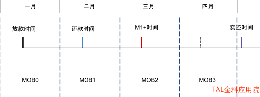

葡萄酒的品质随着时间的推移，品质会慢慢上升。酿酒公司常把酿酒的年份记录下来并追踪不同年份的酒随时间变化时的品质变化。

这是vintage分析最早的使用。信贷业务非常类似葡萄酒的储存，需要追踪不同时期借出去的资金，监控逾期率的变化情况。

通常对于一笔借款，我们需要记录借款金额，借款时间，到期时间，逾期天数（例如M1+时间），还款时间这些关键信息。

借款金额给用户放款的金额1000元放款时间资金给到客户手中的时间2020-04-01到期时间客户应该还款的截止时间2020-05-01M1+时间逾期30天及其以上2020-05-31还款时间用户实际的还款时间2020-07-25

Vintage分析会按照每一笔借款所在的月份作为统计的基准，然后追踪这个放款月份里在贷资金在接下来几个月中，发生逾期的比率。

我们把放款的月份叫做基准月，之后追踪的每个月称为Month on Book (MOB)，也就是这笔资金在账本上记录了几个月了。

统计的逾期比率就是在第k个MOB上处于逾期状态借据的剩余本金占基准月的放款额的比率。

逾期率 = 第k个MOB月逾期M1+的剩余本金 / 基准月放款额

由于需要追踪不同时期逾期比率的变化，那么观测的时间点就尤为重要，根据选取观测时间的不同可以将Vintage分为以下两种口径：

1.  统一在每个月末时点观测（Month end）
2.  在每笔借款的到期还款日后第一天观测，每笔借款的观测日是不一样的（Cycle end）

通用的方式为第一种，本文将详细讲述第一种的计算方式（第二种cycle end在业务发展中后期可以更精准的统计分析MOB&Vintage）。

这种类型的Vintage计算，我们需要记录借款金额，观测时间，逾期天数三个要素。

单笔借款情况

---

原文链接：https://zhuanlan.zhihu.com/p/192879721
