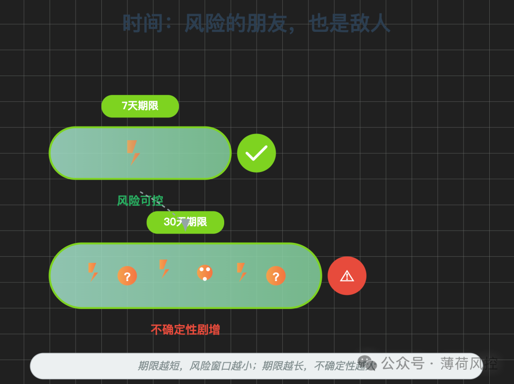
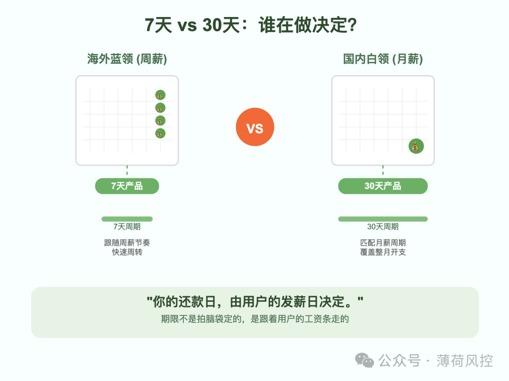
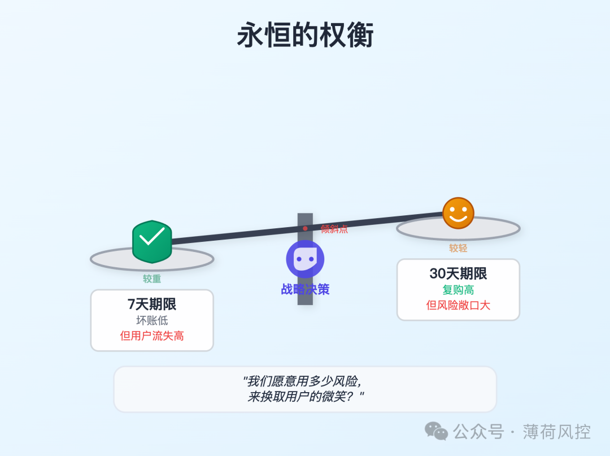
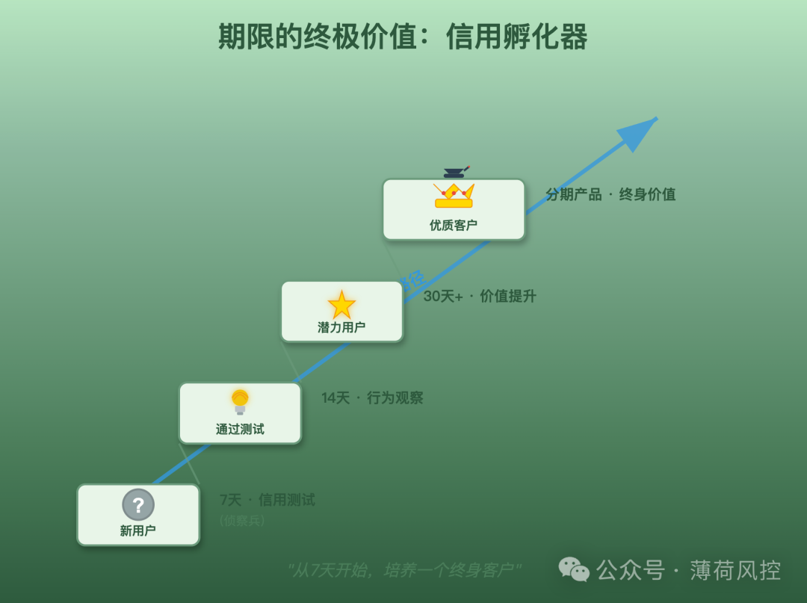

有一次在印尼项目上，业务团队为了提升用户体验

想把我们主打的7天现金贷产品，全面升级成15天。

他们的理由很充分：

> ❝
> 
> “7天也太短了！用户刚拿到钱，屁股还没坐热就得还款，体验太差了！
> 
> 我们这样搞，用户留存怎么做得起来？”

当时我听着，觉得很有道理。

作为用户，我当然也喜欢更长的期限。

但我们风控策略的负责人，一个在墨西哥和东南亚市场泡了十几年的老炮儿，当时就一句话怼了回去：

> ❝
> 
> “你给新用户15天，就是在赌他这半个月里不会失业、不会生病、不会被老婆赶出家门。
> 
> 你敢赌，我不敢。”

全场沉默。

也就是从那一刻起，我才真正开始思考，**「期限」** 这个看似简单的数字背后，到底藏着怎样的惊涛骇浪。

今天，我就以一个模型工程师的视角，把我这段时间的学习和思考，原原本本地分享给你。

* * *

### **第一部分：期限，到底解决了什么核心业务问题？**

在搞模型的时候，我总觉得，风控的核心是“识人”，是把好人坏人分开。

只要我的模型够准，把那些可能逾期的用户都拦在门外，不就万事大吉了吗？

后来我发现，我错了。

**风控的核心，不仅仅是“识人”，更是“管理不确定性”。**

你面对的，不是一个非黑即白的世界，而是一大片深不见底的灰色地带。

一个在雅加达开“摩的”（Gojek）的小哥

或者一个在墨西哥城街头卖玉米饼（Taco）的大叔

你几乎没有任何数据能判断他下周的还款能力。

他没有信用卡记录，没有稳定的工资流水

甚至可能连银行账户都是刚开的。

这时候，模型能做的很有限。

**而「期限」，就是我们管理这种“不确定性”最简单、最粗暴，也最有效的工具。**

_**期限不是一个简单的数字，它是我们和风险之间的一场拔河比赛**_

_**绳子的长度，决定了我们摔倒时会不会粉身碎骨。**_

它主要解决了两个核心问题：

**1\. 匹配用户的“现金流脉搏”**

想象一下那个雅加达的摩的师傅。

他为什么来借钱？

很可能不是为了什么宏大的理财计划，而是手机坏了要修，或者摩托车爆胎了要换。

这是“救急”的钱。

他的收入特点是什么？

日结，或者周结。

他每周都能拿到一笔相对固定的收入。

那么，一个7天的贷款产品，就完美地踩在了他的现金流节点上。

这周借钱修车，下周发钱了，正好还款。

整个逻辑是闭环的。

但如果你给他一个30天的产品呢？

这一个月里，变数太大了。

他可能会接到一个去远方亲戚家的活儿，一去半个月；

也可能因为雨季影响，连续一周没多少生意；

更可能因为手上突然多了点“闲钱”，先去满足了其他更迫切的消费需求，把还款这事儿抛到了脑后。

**期限的核心作用之一，就是让我们的还款要求，和用户的收入周期，保持同频共振。**

频率对上了，还款就顺理成章。频率错位了，违约风险就指数级上升。

**2\. 压缩“风险暴露窗口”**

这是更核心的一点。

对于一个我们完全不了解的次级客群，我们对他的信任度是极低的。

时间，在这里就成了风险的放大器。

*   **时间越长，宏观经济变化的风险越大。**
    
    比如墨西哥比索突然贬值，或者印尼政府突然宣布一个超长的全国假期，支付通道都关了。
    
    这些事在7天内发生的概率，远小于在30天内。
    
*   **时间越长，用户个人情况变化的风险越大。**
    
    这就是我们老大说的那句话，失业、生病、家庭变故……
    
    任何一个微小的生活冲击，都可能在30天这个尺度上，演变成一场还款灾难。
    
*   **时间越长，用户的“欺诈动机”和“遗忘成本”也越高。**
    
    借7天，金额小，他还记在心上。借30天，他可能早就忘了这回事了，或者觉得“反正还早”
    
    等你想起来催收的时候，他已经换了手机卡。
    

所以，对于一个高风险的“陌生人”，我们能做的最理性的事，就是把我们的“风险暴露窗口”压缩到最短。

**给他一个7天的期限，本质上是在说：**

> ❝
> 
> “兄弟，我不了解你，咱们先试一下。你用这笔小钱，解决你的燃眉之急。
> 
> 7天后，你把钱还我，向我证明你的信用。然后，我们再谈下一步。”

这是一种成本极低的“信用试探”。

所以，总结一下，期限这个工具，它解决的核心业务问题就是：

**在信息极度不对称的次级信贷市场，通过“匹配现金流”和“压缩风险窗口”这两个手段，来主动管理和控制不确定性。**

它不是被动地接受风险，而是主动地定义风险。

* * *

### **第二部分：期限是什么，怎么定？海外为啥是7天，国内却是30天？**

聊完了“Why”，我们再来深入聊聊“What”和“How”。

**期限，表面上是借款时长，但它的内在逻辑，是我们对一个客群风险水平的“先验假设”和“定价策略”的结合体。**

它不是一个孤立的数字，而是和 **额度（Amount）**、**利率（Price）** 紧密捆绑在一起的“风控三叉戟”。

这三者互相牵制，共同定义了一个金融产品的风险收益结构。

那么，期限一般是怎么定的呢？

**1\. 核心驱动力：用户画像与工资周期 (The "Paycheck Cycle")**

这是决定期限长短最根本的因素。

我刚开始做海外项目时，也纳闷，为什么产品全是 7天、14天……清一色“7的倍数”？

后来，我跟着本地的同事去雅加达的城中村做用户访谈，才恍然大悟。

我们访谈的一个用户，是在一个小型服装厂工作的女工。

我问她：“你们工资怎么发？”

她用不太流利的英语回答：“Weekly. Every Friday.”（每周，周五发。）

我又问了几个在建筑工地、餐厅做服务员的用户，答案惊人地一致：

**周薪（Weekly）或双周薪（Bi-weekly）**。

这和我们在国内的体验完全不同。

国内大部分企业，尤其是能提供稳定工作的企业，都是月薪制。

**所以，这个问题的答案，一下子就清晰了：**

*   **海外现金贷（尤其东南亚、拉美）之所以是 7天\*N 的产品**
    
    **是因为他们的核心目标客群，就是以周薪/双周薪为主要收入来源的蓝领、灰领和零工经济从业者。**
    
    我们的产品设计，必须贴合他们的“发薪日”，这是他们还款能力最强、还款意愿也最高的时刻。
    
*   **国内现金贷之所以是 30天\*N 的产品居多，是因为其目标客群，主要是月薪制的工薪阶层。**
    
    他们的整个财务规划，都是以“月”为单位的。
    

> ❝
> 
> **海外现金贷的7天周期，不是风控专家拍脑袋定的**
> 
> **是跟着印尼工厂女工和墨西哥建筑工人的工资条走的。**

**2\. 第二驱动力：风险分层与“信用测试”**

对于一个全新的用户，我们对他的了解是“零”。

这时候，我们的策略不是“信任”，而是“测试”。

怎么测试？

**用“小额、短期”的产品。**

*   **小额（比如30美金）**：确保即便他违约了，我们的损失也在可控范围内。
    
*   **短期（比如7天）**：确保我们能以最快的速度得到测试结果。
    

这个用户，申请了我们一个“30美金、7天”的产品。

7天后，他还款了。

好，测试通过。

他在我们系统里的“信任分”就提升了。

下一次，我们就可以给他一个稍微大一点的额度，比如50美金，期限也可以适当放宽到14天。

如果他再次按时还款，他的信任分会继续提升。

几次循环之后，这个原本“面目模糊”的用户，就在我们的系统里建立起了清晰、可信的“行为画像”。

我们就可以放心地给他提供更大额度、更长期限、更低利率的“升级产品”，比如分期贷款。

这个过程，我们内部称之为 **“用户生命周期管理”** 或 **“客户毕业（Graduation）”**。

而7天期限，就是这个漫长“养成游戏”的第一关，也是最关键的筛选关。

**3\. 现实考量：盈利模型与监管环境**

这一点比较敏感，但也很现实。

小额现金贷的客群，风险极高，逾期率动辄20%-30%都是常态。

要做成一门可持续的生意，就必须有足够的利润来覆盖坏账损失和运营成本。

在很多国家，比如印尼，监管对“年化利率（APR）”有上限要求。

如果把利率平摊到365天，可能看起来不高。

但对于一个只借7天的用户来说，他实际支付的“费用”（Fee）占本金的比例，是相当可观的。

较短的期限，使得这种“高费率、短期”的模式在财务上得以成立。

如果拉长到30天甚至更久，在同样的年化利率上限下

单笔贷款的收益会大幅降低，可能就无法覆盖其对应的超高风险了。

所以，定多少期限，不仅是风控问题，也是一道复杂的数学题

需要精算师和财务团队一起，在风险、收益和合规之间，找到一个微妙的平衡点。

* * *

### **第三部分：现实的骨感：期限的局限、挑战与权衡**

好了，说了这么多短期限的好处，你可能会觉得，那我们无脑做7天产品不就行了？

现实，远比理论复杂。

作为策略的制定者和执行者，我们每天都在各种“两难”中做权衡。

**给用户7天，我们风控睡得安稳；**

**给用户30天，用户体验更好。**

**但如果步子迈太大，我们和用户可能就都掉进坑里了。**

短期限的挑战，主要来自以下几个方面：

**1\. 用户体验与留存的“天敌”**

这一点，业务团队的抱怨是完全有道理的。

7天的期限，对用户来说，压力真的很大。

“高频还款”会带来巨大的心理负担和操作成本。

想象一下，你每个星期都要惦记着一笔贷款要还，是不是很烦？

这种糟糕的体验，会直接导致几个问题：

*   **低复购率**：用户还了一次之后，觉得太折腾了，下次宁愿找朋友借，或者去别家体验更好的平台。
    
*   **高用户流失**：我们的目标是“养成”一个长期有价值的客户，但很多人可能在第一关就被“劝退”了。
    
*   **负面口碑**：用户会在社交媒体上抱怨，“这家平台催命一样，刚借就得还！” 这对品牌形象是巨大的伤害。
    

**所以，我们必须在“风控安全”和“用户体验”之间走钢丝。**

在墨西哥，我们曾经尝试过一个AB测试：对一批资质相似的新用户，A组给7天期限，B组给10天期限。

结果发现，B组的首逾率（First Payment Default）确实略有上升

但用户的次月复购率，比A组高了将近15%。

这个结果就逼着我们去思考：我们是愿意承受一点点额外的信用风险，来换取更高的长期客户价值吗？

这种权衡，没有标准答案，它取决于公司在特定阶段的战略重心。

**2\. “债务陷阱”的道德与监管风险**

这是悬在所有小额信贷公司头上的“达摩克利斯之剑”。

短期限、高费率的产品，非常容易让用户陷入“以贷养贷”的恶性循环。

一个用户，借了7天的钱，到了还款日，他手头没钱，怎么办？

他可能会去另一家平台，再借一笔7天的钱，来还我们的贷款。

下周，他就要还两笔贷款的本金和利息。

如此往复，雪球越滚越大，最终债务爆炸，彻底违约。

这种模式，不仅对用户是毁灭性的打击，对我们自己也同样危险。

*   **声誉风险**：一旦被贴上“高利贷”、“暴力催收”的标签，公司的品牌就毁了。
    
*   **监管风险**：在印尼和墨西哥，政府对“掠夺性贷款”的打击力度越来越大。一旦被监管盯上，轻则罚款，重则吊销牌照。
    

所以，一个负责任的金融机构，必须正视这个问题。

我们的做法是，在产品设计中加入“刹车机制”。比如：

*   **限制展期次数**：不允许用户无限次地续借。
    
*   **推动用户“毕业”**：对于表现好的用户，要主动、尽快地为他们提供更长期限、更低利率的分期产品，帮助他们摆脱短期贷的循环。
    

**3\. 运营成本的压力**

一笔30天的贷款，我们只需要在到期时进行一次催收提醒。

但如果拆成四笔7天的贷款，我们的工作量就变成了四倍。

*   **支付成本**：每一笔放款和还款，我们都要给支付通道付费。频率越高，成本越高。
    
*   **催收成本**：更多的还款节点，意味着更多的短信提醒、电话提醒，甚至需要更多的人工催收坐席。
    
*   **客服成本**：用户关于还款日、还款金额的咨询量也会成倍增加。
    

这些都是实打实的运营成本，会侵蚀我们的利润。

因此，在设计期限策略时，我们不仅要听风控和产品团队的

还必须把运营（Operations）团队拉进来，一起算清楚这笔账。

* * *

### **第四部分：期限的价值：风控的“侦察兵”与“孵化器”**

尽管有这么多挑战和权衡，但短期限策略，尤其是在开拓新兴市场时，其创造的价值是无可替代的。

它就像我们深入一片未知丛林时，派出去的“侦察兵”和建立的第一个“前进基地”。

**短期限是风控的“侦察兵”，用最小的代价，探清前方最真实的雷区；**

**它也是用户的“信用孵化器”，把一块块璞玉，雕琢成值得信赖的伙伴。**

它的突出优势，主要体现在三个方面：

**1\. 极致的“数据反馈速度”**

这是我作为一个模型工程师，感受最深的一点。

在金融科技领域，**迭代的速度，就是生命。**

假设我们想测试一个新的反欺诈模型。

*   如果我们的产品是30天期限，我们上线一个新模型，需要等待至少30-45天（一个完整账期+表现期），才能收集到足够的数据来评估模型效果。
    
*   但如果我们的产品是7天期限，我们只需要等待7-10天！
    

**这意味着，我们的学习和纠错速度，是别人的4倍！**

我们可以在一个月内，完成3次模型的迭代优化。而我们的竞争对手，才刚刚做完第一次实验。

这种“代际优势”，在瞬息万变的市场上是致命的。

我记得在印尼，我们曾经为了狙击一个新出现的欺诈团伙，一周内连续上线了三个版本的地址核验策略。

正是因为7天期限带来的快速反馈，我们才得以在损失扩大之前，迅速堵住了漏洞。

**2\. 精准的“风险定价”能力**

短期限产品，为我们提供了一个完美的“风险观测台”。

通过观察一个用户在连续几个7天周期里的还款行为，我们可以得到极其宝贵的，纯粹基于其真实行为的数据。

*   他是不是每次都提前还款？
    
*   他是不是每次都踩着最后期限还款？
    
*   他有没有申请过展期？
    
*   他的还款行为，是否和他的发薪日高度相关？
    

这些“高频行为数据”，比任何静态的申请资料，都更能揭示一个用户的真实信用水平和还款习惯。

有了这些数据，我们就可以对用户进行更精细的“二次定价”。

对于那些表现完美的“天使客户”，我们可以大胆地给他们降价、提额、延长期限

把他们牢牢锁定在我们的平台上。

对于那些总在逾期边缘试探的“高危客户”，我们可以维持甚至提高他们的费率，或者干脆不再续借。

这种动态的、千人千面的风险定价能力，是精细化运营的核心，也是利润的终极来源。

**3\. 构建“客户分层”的阶梯**

这可能是短期限策略最大的战略价值。

它让我们有机会，**把一个原本不可贷的“次级客群”，通过一个精心设计的“阶梯”，逐步培养成一个能够消费分期产品、甚至信用卡产品的“优质客群”。**

想象一下我们在墨西哥的那个卖Taco的大叔。

*   **第一步：7天现金贷。** 帮他解决今天买玉米粉和肉的紧急需求。他按时还了。
    
*   **第二步：14天现金贷。** 额度提高，他可以一次性多进点货，甚至买一把新的遮阳伞。他又按时还了。
    
*   **第三步：1-3个月的小额分期贷。** 经过几个周期的考验，我们对他已经有了足够的信心。
    
    我们给他一笔钱，让他可以买一辆新的三轮餐车。他每个月从自己的盈利中，拿出一部分来还款。
    
*   **第四步：……**
    

你看，通过“期限”这个工具的不断演进，我们不仅做了一笔贷款生意

更是深度参与和赋能了一个小微企业主的成长过程。

我们和他之间，建立的不再是简单的“债权债务关系”，而是一种“共生共荣的伙伴关系”。

这，才是金融科技真正的魅力所在。

我们用风控的手段，实现了普惠金融的理想。

* * *

### **写在最后**

从一个只关心AUC的模型工程师，到开始理解「期限」背后的业务逻辑、人性博弈和战略考量，我花了不少时间，也踩了不少坑。

我慢慢明白，在风控这个领域，没有哪个工具是完美的。

**期限，是我们的朋友，它帮我们抵御未知的风险；**

**期限，也是我们的敌人，它可能伤害用户体验，甚至把我们推向道德的悬崖。**

真正的专家，不是那个能设计出最复杂模型的人

_**而是那个懂得如何在“风险、体验、盈利、合规”这几颗鸡蛋上跳舞，还能不把任何一颗踩碎的人。**_

这很难。

但，这不也正是这份工作最迷人的地方吗？

好了，今天关于「期限」的分享就到这里。

如果觉得这篇文章对你有点启发，别忘了 **点赞、在看、转发** 一键三连。

你的支持，是我继续死磕、继续分享的最大动力。

我们下期再见。

---

原文链接：https://mp.weixin.qq.com/s/ohkq1ABfDOcGCbvDJLAxug?mpshare=1&scene=1&srcid=0815cOohyz5cLqwIo7grwuwH&sharer_shareinfo=ae005c024352376e2a51a905d500be80&sharer_shareinfo_first=ae005c024352376e2a51a905d500be80#rd
