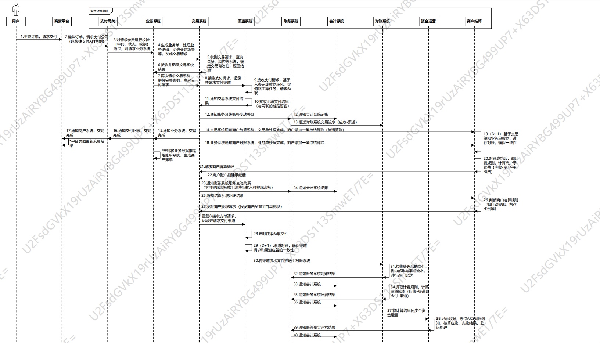

> 作者以全链路的视角，分析整个支付流程系统，包括常用的收单、结算、对账等功能，希望本篇文章能对不同岗位的大家有所帮助。

尊敬的读者好，相信有不少读者是支付行业的从业者（如支付类产品经理、开发等）或支付行业相关从业者（如电商类产品经理、开发等），大家在平时的工作中会接触到支付系统的一个或几个板块，但可能对上下游完整链路接触的比较少。

所以今天就想从全链路视角来讲述，一笔交易自消费者支付到结算给商户的整体流程，通过一图流的形式，让大家能进一步了解“支付公司做了什么”、“经过了哪些系统”、“各系统的职责是什么”等，从而让诸位读者可以对支付系统有一个相对全面的认识。

一、说明
----

首先，这里的支付链路指的是支付公司的支付链路，并不完全适用于电商平台、基金销售平台等有支付场景的非支付公司。因为一般有支付场景的非支付公司，交易只是其系统链路的一部分，甚至是很小的一部分。

以电商平台为例，除了要考虑用户支付成功与否，还需要考虑库存、物流、售后、发票等场景，每个场景都会衍生出一个系统，所以对这些平台而言，仅供借鉴。

其次，不同的支付公司由于需求、体量、架构设计的不同，所以在系统规划、系统职责上也各有不同，有的支付公司体量大、业务场景复杂，甚至愿意帮商户承担一部分的业务逻辑，则系统设计上更加复杂，也更注重系统之间的解耦和原子化能力。

相对的，有的支付公司体量一般，业务场景相对简单，则可以从简设计，成本优先。

二、支付链路图
-------

请您静下心浏览链路图，跟着序号顺序“走”一遍流程。

三、系统说明
------

下面介绍各个系统的作用和定位，同时也会扩充一下图中没有提到的系统：

**1）支付网关**

是与外部系统（商户）发生直接对接的系统，本身承担的业务逻辑很少甚至没有，主要负责商户请求参数的校验、秘钥的检验、加解密等。

**2）业务系统**

该系统承担了绝大多数的业务逻辑，也是对商户支付请求（“业务单”）处理的起点，会将商户入参进行转化、补充，以便于后续系统的处理。

同时商户发起的支付请求（“业务单”）往往有很强的业务属性，业务系统需要将业务单其剥离为更标准更原子化的“交易单”以送给下游的交易系统处理。

商户对订单信息、状态的大量查询请求往往也由该系统承接处理。

**3）交易系统**

是支付公司的核心系统，跟进并处理“交易单”的整个周期，包括把交易送到渠道系统，把扣款成功的交易通知账务，将交易结果同步给结算系统等。

相当于支付中枢，控制一笔交易单与多个关联系统进行交互。从链路图中也可以看到，交易系统与多个其他系统发生了交互。

**4）渠道系统**

家喻户晓的支付渠道，对接银联、网联的相关接口，代付、代收、外部对账，都离不开它。

除了打通两联渠道外，渠道系统还会承担信息记录（商户报备信息、用户绑卡信息等），渠道路由（智能选择成本更低、性能更好的渠道）等职责。

**5）账务系统**

真正管钱的“人”，支付公司的每个用户（开立支付账户）、收单商户、支付公司手续费账户等都会在账务系统中有个账号，这些账号记录了对应主体的账户的状态、余额及变动情况，同时也进一步为后续的对账提供了数据基础。

**6）会计系统**

记录会计分录，其实每一笔“交易单”都会对应一笔会计分录（借：XXX；贷：XXX），当支付场景、支付工具、收款账户、出款账户等要素确定时，这一笔会计分录就已经明确了。

当交易完成、账务记账完成后，则会计分录成立，此时有上游系统通知给会计系统。

**7）对账系统**

这里的对账是指账务变动流水与渠道交易流水的对账，两者互相比对，以判断公司内部有无漏记账（长款）；渠道外部有无漏记账（短款），从而确定支付公司的应收款和渠道未算手续费前的应付款是否相同，由此进一步对渠道流水计算手续费，得出支付公司的应付渠道手续费，以及渠道减去手续费后的应付款。

\*支付公司的对账非常复杂，除了有内部系统和外部系统的信息流对账，还有内部系统与内部系统的信息流对账，以及内部系统与外部系统的资金流对账。

**8）商户结算**

是商户能否拿到待结算款及拿到多少结算款的关键系统。会先对业务单和交易单进行比对，确保业务单和交易单状态的一致性，随后基于流水进行商户手续费计算，于是得出应付款和因收款（应收款即商户手续费，应付款即商户可提现金额，如果商户的结算模式是净额结算，则商户可提现金额会直接扣除手续费划拨至支付公司手续费账户）。

此时，商户账户余额从不可提现转为可提现余额。最后视商户要求，由系统自动发起提现或等待商户自行提现至绑定的对公银行账户。

**9）资金运营**

将支付公司的应收应付，与资金渠道的实收实付进行比较，处理资金流对账、差异。

**补充说明几个在链路图中没有画出的系统，但这些系统一样为支付链路的顺利通畅起到了关键作业：**

① 会员系统

C端个人在支付公司开立支付账户，B端商户与支付公司签立合约成为特约收单商户，都需要提供各类实名信息（9要素、影像件、法人信息、营业执照等等），这些信息被存放在会员系统，同时登录密码、支付密码、账户状态也是该系统的重要功能。

② 计费系统

记录商户、渠道的计费规则，支持多样化的计费规则配置，如按笔、按金额、有无梯度优惠等。每次清算需要计算费用时就得请求它帮忙。

③ 商户配置系统

用来管理商户的权限，比如可以使用哪些支付渠道、哪些支付工具等，同时商户是D0结算还是D1结算，每次结算是否需要有留存资金等等，都是商户配置系统的功能。

④ 账单系统

基于交易数据，为商户定期定时出具交易对账文件或结算对账文件，账单字段可以支持大商户定制，以符合商户内部的对账诉求。

⑤ 运营平台

后端有这么多的系统，对应就会有很多前端的操作平台，以便运营人员处理异常情况或基于业务需要，由运营人工发起退款、代付等流程。

四、结语
----

图片里的流程可以说是支付系统中最简单的流程了，因为一方面没有考虑收银台的情况（会进一步涉及账户联登、支付工具选择等问题）；另一方面没有加入用户退款、对账不平等异常情况。属于用最简单的支付工具走最顺利的流程，但这也是支付公司绝大部分交易的缩影。

正如我开头所言，每个支付公司情况各不相同，所以大家对要完成同一件事情的处理顺序、解决方法、参与系统也会大同小异。

所以，在此也仅能抛砖引玉，读者您可以结合公司的实际业务，系统框架及本文提供链路图来综合理解、思考。毕竟对支付公司来说，不管系统如何设计，“收单”、“清算”、“结算”、“对账”等都是其不变的职责。

以上就是本文的全部内容，非常感谢您能看到此处，如果本文或多或少对您有所受益，还请点赞，收藏，这将是我继续更新的动力。非常感谢！

本文由 @一一一 原创发布于人人都是产品经理。未经许可，禁止转载。

题图来自Unsplash，基于 CC0 协议

该文观点仅代表作者本人，人人都是产品经理平台仅提供信息存储空间服务。

---

原文链接：https://www.woshipm.com/pd/5869232.html
