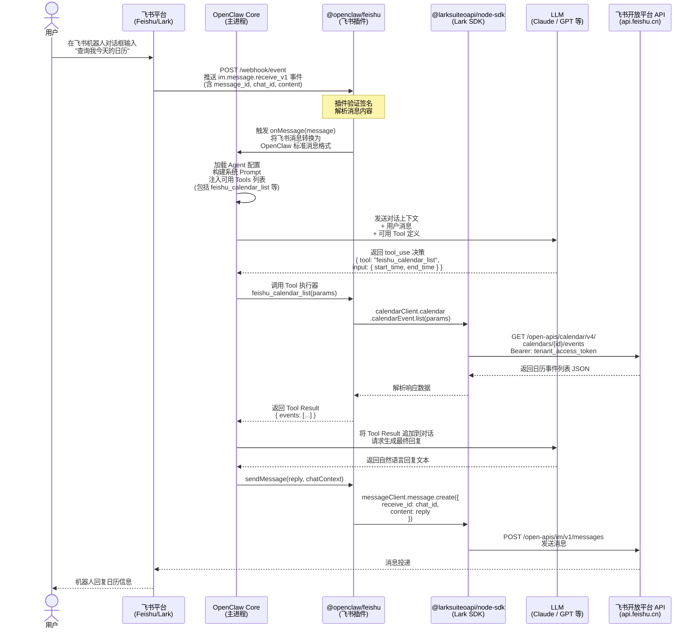

## 1. Node 版本冲突导致安装失败

在新的 Ubuntu 下，通过 Homebrew 安装了 Gemini CLI，依赖了 Node 24+，导致安装 OpenClaw 失败。

**报错原因：**
- `make not found` — 未安装编译工具
- Node 25.6.1 版本过新 — `@discordjs/opus` 没有对应 node-v141 ABI 的预编译二进制

**修复步骤：**

**Step 1 — 安装编译工具**
```bash
sudo apt-get install -y build-essential python3
```

**Step 2 — 切换到 Node LTS（Node 22）**

Homebrew 的 Node 25 是 bleeding edge 版本，会导致原生模块失败，改用稳定 LTS：

```bash
# 通过 nvm 安装 Node 22（推荐）
curl -o- https://raw.githubusercontent.com/nvm-sh/nvm/v0.40.1/install.sh | bash
source ~/.bashrc

nvm install 22
nvm use 22
node --version  # 应显示 v22.x.x
```

**Step 3 — 重新安装 OpenClaw**
```bash
npm install -g openclaw
```

> **原因说明：** `@discordjs/opus@0.10.0` 只有特定 Node ABI 版本的预编译二进制，Node 25 超出了该范围，Node 22 LTS 是 OpenClaw 构建和测试所针对的版本。

---

## 2. Feishu Plugin 冲突导致安装失败

配置飞书 Plugin 时，OpenClaw 自带的 Plugin 与安装行为冲突。
- OpenClaw config 显示需要安装 plugin，但安装失败
- `/home/openclaw/.nvm/versions/node/v22.22.0/lib/node_modules/openclaw/extensions` 中已存在飞书 plugin
- `~/.openclaw/extensions` 下试图再次安装，导致失败

**报错信息：**
```
feishu failed to load from .../extensions/feishu/index.ts:
Error: Cannot find module '@larksuiteoapi/node-sdk'
Require stack:
- .../extensions/feishu/src/client.ts
```

**修复方法：**

bundled plugin 缺少 npm 依赖，直接安装到 openclaw 的 node_modules：

```bash
cd ~/.nvm/versions/node/v22.22.0/lib/node_modules/openclaw
npm install @larksuiteoapi/node-sdk
```

**验证：**
```bash
openclaw plugins info @openclaw/feishu
openclaw plugins enable @openclaw/feishu
openclaw plugins list
openclaw gateway restart
```

---

## 3. OpenClaw 飞书机器人交互逻辑分析



---

## 4. 给 OpenClaw Feishu Plugin 添加日历功能

### A. 飞书开放平台配置

#### 1. 开通日历相关权限（用户身份）

在应用权限里开启以下 scope：

- `calendar:calendar`
- `calendar:calendar.acl:create`
- `calendar:calendar.acl:delete`
- `calendar:calendar.acl:read`
- `calendar:calendar.free_busy:read`
- `calendar:calendar:create`
- `calendar:calendar:delete`
- `calendar:calendar:read`
- `calendar:calendar:readonly`
- `calendar:calendar:subscribe`
- `calendar:calendar:update`

#### 2. 配置 OAuth 重定向 URL

```
https://feishu-oauth.magicefire.com/feishu/oauth/callback
```

#### 3. 首次手动获取 user_access_token（OAuth 授权流程）

**Step 1 — 构造授权 URL，引导用户登录**

在浏览器打开以下 URL：

```
https://open.feishu.cn/open-apis/authen/v1/authorize
  ?app_id=cli_a912b7cb0ab8dcbd
  &redirect_uri=https%3A%2F%2Ffeishu-oauth.magicefire.com%2Ffeishu%2Foauth%2Fcallback
  &scope=calendar%3Acalendar
  &state=random_state_string
```

用户授权后，飞书重定向到回调地址，URL 中携带 `code` 参数（有效期短、一次性）。

**Step 2 — 用 code 换取 access_token**

```bash
read -s FEISHU_APP_SECRET
CODE="<CODE_FROM_CALLBACK>"

curl -sS https://open.feishu.cn/open-apis/authen/v1/access_token \
  -H 'Content-Type: application/json' \
  -d "{
    \"app_id\": \"cli_a912b7cb0ab8dcbd\",
    \"app_secret\": \"$FEISHU_APP_SECRET\",
    \"grant_type\": \"authorization_code\",
    \"code\": \"$CODE\"
  }"
```

响应示例：

```json
{
  "code": 0,
  "data": {
    "access_token": "u-xxx",
    "refresh_token": "ur-xxx",
    "token_type": "Bearer",
    "expires_in": 7200,
    "refresh_expires_in": 2592000
  }
}
```

**Step 3 — 保存 refresh_token 供后续自动刷新**

```bash
echo -n "ur-xxx" > /home/openclaw/.openclaw/secrets/feishu_user_refresh_token
chmod 600 /home/openclaw/.openclaw/secrets/feishu_user_refresh_token
```

> **安全提醒：** 若 app_secret 曾泄露到聊天记录，应立即轮换 secret，并使用 `read -s` 方式输入避免进入 history。

---

### B. Cloudflare / 域名 / Tunnel（回调链路）配置

目标：让飞书 OAuth 能回调到本机的 `/feishu/oauth/callback`。

#### 1. 启动本地回调服务

```js
const http = require('http');
const url = require('url');

const port = 8787;
http.createServer((req, res) => {
  const u = url.parse(req.url, true);
  if (u.pathname !== '/feishu/oauth/callback') {
    res.writeHead(404); res.end('not found'); return;
  }
  const { code, state, error, error_description } = u.query;
  res.writeHead(200, { 'Content-Type': 'text/plain; charset=utf-8' });
  res.end(
    error
      ? `OAuth error: ${error}\n${error_description || ''}\n`
      : `OK. You can close this window.\n\ncode=${code}\nstate=${state}\n`
  );
  console.log('OAuth callback:', u.query);
}).listen(port, '127.0.0.1', () => {
  console.log(`Listening on http://127.0.0.1:${port}/feishu/oauth/callback`);
});
```

#### 2. 创建并配置 Cloudflare Tunnel

```bash
# 1) 登录 Cloudflare（命名 tunnel 必须）
cloudflared login

# 2) 创建命名 Tunnel
cloudflared tunnel create feishu-oauth

# 3) 绑定子域（自动创建 DNS 记录）
cloudflared tunnel route dns feishu-oauth feishu-oauth.magicefire.com

# 验证 DNS
dig +short feishu-oauth.magicefire.com
```

#### 3. 配置 ingress（否则会 503）

创建 `~/.cloudflared/config.yml`（将 `TUNNEL_ID` 替换为第 2 步输出的 UUID）：

```yaml
tunnel: TUNNEL_ID
credentials-file: /home/openclaw/.cloudflared/TUNNEL_ID.json

ingress:
  - hostname: feishu-oauth.magicefire.com
    service: http://127.0.0.1:8787
  - service: http_status:404
```

```bash
# 4) 运行 Tunnel
cloudflared tunnel run feishu-oauth

# 5) 自测回调链路
curl -sS -i "https://feishu-oauth.magicefire.com/feishu/oauth/callback?code=TEST&state=1" | head -n 20
```

#### 4. 常见坑

- **DNS 记录冲突：** 若 `cloudflared tunnel route dns` 提示 `record already exists`，去 Cloudflare 控制台删除/替换同名记录后重跑
- **DNS 必须设为 Proxied（橙云）：** 灰云（DNS only）会导致 curl "Could not resolve host"，切换为橙云才正常

---

### C. 服务器网络 / DNS 稳定性配置

**现象：** dig/nslookup 能解析，但 curl 报 "Could not resolve host"

**环境：** Netplan + NetworkManager（活跃连接：Wired connection 1 / ens18）

```bash
# 临时救急（立即生效）
sudo resolvectl dns ens18 1.1.1.1 8.8.8.8
sudo resolvectl flush-caches

# 持久修复（重启不丢）
sudo nmcli con mod "Wired connection 1" ipv4.ignore-auto-dns yes
sudo nmcli con mod "Wired connection 1" ipv4.dns "1.1.1.1 8.8.8.8"
sudo nmcli con mod "Wired connection 1" ipv4.dns-priority 10
sudo nmcli con down "Wired connection 1" && sudo nmcli con up "Wired connection 1"
sudo resolvectl flush-caches

# 验证（这两条是判断"真的好了"的关键）
getent ahosts feishu-oauth.magicefire.com
curl -I "https://feishu-oauth.magicefire.com/feishu/oauth/callback?code=TEST&state=1"
```

---

### D. OpenClaw / Feishu 插件代码修改

#### 1. 注册新工具：`feishu_calendar`

文件：`openclaw/extensions/feishu/index.ts`

```typescript
import { registerFeishuCalendarTools } from "./src/calendar.js";
// ...
registerFeishuCalendarTools(api);
```

#### 2. 新增日历实现文件：`src/calendar.ts`

路径：`openclaw/extensions/feishu/src/calendar.ts`

**实现内容：**

**(1) Tool：`feishu_calendar`**

- actions：
  - `calendars`：列出日历
  - `events`：按时间范围列事件
  - `create_event`：创建事件（预留）
- 新增参数：
  - `auth_mode: "app" | "user"`
  - `user_access_token`（可选；`auth_mode=user` 时若不传则走本地 refresh_token 自动获取）

**(2) 用户 token 调用方式**

使用 SDK 推荐路径传入 user access token（而非直接在 headers 里写 Bearer）：

```typescript
// 使用 Lark.withUserAccessToken(userAccessToken) 传入请求 options
```

**(3) 本地 refresh_token 存储**

- 默认路径：`/home/openclaw/.openclaw/secrets/feishu_user_refresh_token`
- 权限：文件 `600`，目录 `700`

**(4) 自动 refresh access token（含缓存）**

- 调用接口：`POST https://open.feishu.cn/open-apis/authen/v1/refresh_access_token`
- 缓存策略：`cachedUserAccessToken`（提前 60s 过期）

**(5) 关键修复：refresh_token 轮换**

refresh_token 是一次性的，用后需立即写回：

```typescript
// 从 refresh 接口响应里读取新的 refresh_token
const newRefreshToken = json.data.refresh_token;
// 立即写回到本地文件
await persistRefreshToken(newRefreshToken);  // writeFile(..., mode: 0o600)
```

---

### E. 本地密钥文件（最终状态）

| 文件 | 路径 | 权限 |
|------|------|------|
| refresh_token | `/home/openclaw/.openclaw/secrets/feishu_user_refresh_token` | `-rw-------` |

---

### F. 功能验证结果

- `feishu_calendar (auth_mode=user)` 能列出日历列表（包括 "秦曲波(Bob)"）
- 能拉取本周日程，新增会议后立即可见
- 修复"写回 refresh_token"后，多次重复拉取不再因 token 失效而失败

---

## 5. 本地开发与 Patch 版本管理

工作方式：在 `~/magic/vibe-coding/openclaw` 开发 → 生成 patch → 用脚本应用到全局安装目录。

### Step 0 — 前提：将本地改动压成 1 个 commit

```bash
cd ~/magic/vibe-coding/openclaw
git status
git add -A
git commit -m "your change"

# 如有多次提交想合并成一个：
git reset --soft HEAD~N && git commit -m "your change"
```

### Step 1 — 构建 patch 文件

把最新一次 commit 导出成 patch：

```bash
cd ~/magic/vibe-coding/openclaw
mkdir -p patches
git format-patch -1 HEAD --stdout > patches/feishu-calendar.patch
wc -l patches/feishu-calendar.patch
```

### Step 2 — 本地自检（推荐）

先检查 patch 在全局目录能否 apply（不实际改动）：

```bash
./scripts/apply-local-patches.sh --check
```

### Step 3 — 应用 patch 到运行时

```bash
./scripts/apply-local-patches.sh
```

脚本会自动：
- 找到全局 openclaw：`$(npm root -g)/openclaw`
- `sudo git apply --unsafe-paths` 应用 patch
- `openclaw gateway restart`
- 打印 `openclaw status` 头部做验证

### Step 4 — 官方版本更新后重新应用

```bash
openclaw update
./scripts/apply-local-patches.sh
```
