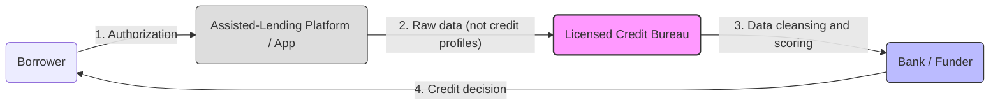
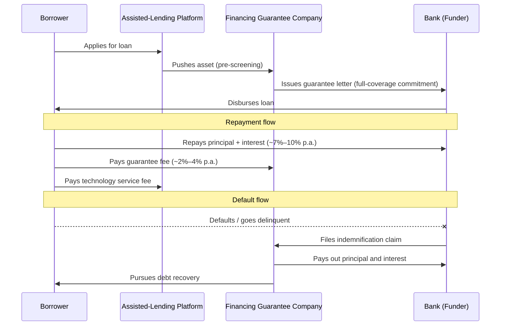
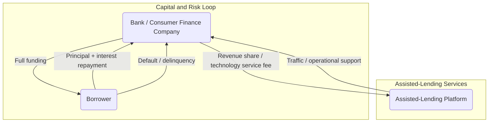

To illustrate how financing guarantee companies (融担), assisted-lending platforms (助贷), and credit bureaus (征信) interact under the compliant architecture, the following three core logic diagrams show how funds, data, and risk flow differently across the two dominant models.

---

## Diagram 1: The Compliance Foundation — Data Flow After "Data Disconnection" (断直连)

This is the underlying data architecture that all assisted-lending businesses must follow. Under the *Credit Reporting Business Management Regulations* (征信业务管理办法), platforms may not directly deliver personal credit profiles to financial institutions. All such data must be "cleansed" and transmitted through a **licensed credit bureau** (such as Baihang Credit or Pudao Credit).

**Core change:** The credit bureau has become the mandatory "master valve" and legal conduit for all data flows. Platforms have lost direct control over risk data.

---

## Diagram 2: The Financing Guarantee Model (融担模式) — Full-Coverage Risk Absorption

This is currently the most common cooperation model for small and mid-sized banks. The key feature is the introduction of a **financing guarantee company** (融资担保公司) to provide a full-coverage indemnification commitment. Under 2025 regulations, all fees combined — including guarantee fees — must not exceed an annualized **24%** APR.

**Key roles:**
- **Financing guarantee company:** The risk "absorber." If bad debt rates spike, the guarantee company is the first to fail.
- **Bank:** The "guaranteed-income" capital provider, earning a fixed return regardless of borrower defaults.

---

## Diagram 3: The Revenue-Sharing Model (分润模式) — Asset-Light / Bank Self-Underwriting

This is the direction regulators are encouraging for the future. Platforms provide no indemnification backstop; banks must have **independent risk control** capability.

> **Note:** In this model, the bank bears the core credit risk. The platform only collects a service commission and does not absorb bad debt.

**Key roles:**
- **Platform:** Returns to the role of a pure "technology service provider." No need for a capital-intensive guarantee license, but customer acquisition quality requirements are extremely high.
- **Bank:** Must possess its own core risk model, capable of independently judging borrower creditworthiness — fully responsible for profits and losses.

---

## Summary: The Key Changes in 2025

In 2025, the relationships among these three models have become tighter and more contentious:

### 1. Hard Rate Ceiling

Under the financing guarantee model, **bank interest + guarantee fee + platform service fee** are jointly capped at **24% annualized**. Given the rigid cost of bank capital (~7%–10%) and unavoidable bad-debt costs, this ceiling severely compresses the profit margins available to guarantee companies and platforms.

### 2. Dual Compliance Requirements

Businesses must simultaneously satisfy:
- **Data compliance:** the "data disconnection" requirement (Diagram 1)
- **Pricing compliance:** the interest rate ceiling (Diagram 2)

This dual pressure is driving a large number of marginal guarantee companies and lower-quality assisted-lending platforms to exit the market.
